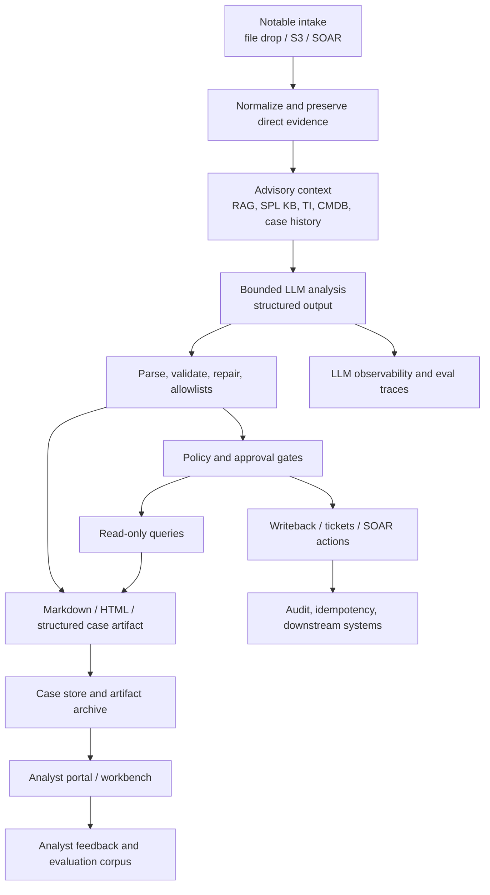

# Notable Analysis End State

## Status

This document is a root-level strategy view for the notable-analysis product line.
It explains how the current on-prem `systemd` analyzer, the AWS
`s3_notable_pipeline`, the browse-only portal idea, and the larger roadmap fit
together.

Detailed architecture and implementation contracts remain in:

- `llm_notable_analysis_onprem_systemd/docs/architecture/feature_enhancements_architecture.md`
- `llm_notable_analysis_onprem_systemd/docs/technical_specs/feature_enhancements_technical_spec.md`
- `llm_notable_analysis_onprem_systemd/docs/delivery_package/EXECUTIVE_ONPREM_WORKFLOW.md`
- `s3_notable_pipeline/docs/delivery_package/EXECUTIVE_AWS_WORKFLOW.md`

This document should not become a second backlog. Use it to explain the target
shape and how capabilities fit.

## Executive Position

The final end state is not just a nicer HTML report or a standalone case
management system. The intended target is a **bounded investigation workbench**:
a system that ingests security notables, produces validated LLM-assisted
analysis, enriches that analysis with approved context, exposes recent and
historical output through a governed UI, and gates any consequential action
through deterministic policy and explicit approval.

Splunk ES, ServiceNow, SOAR, and other enterprise systems can remain the
long-lived systems of record. This stack should be the analysis and
investigation layer that turns one notable into a reviewable, traceable,
policy-safe investigation package.

## Current Product Baseline

### On-prem `systemd` analyzer

The on-prem implementation is a file-drop service with local inference:

- SOAR, SFTP, NFS, or an operator drops one `.json` or `.txt` notable into
  `INCOMING_DIR`.
- `notable-analyzer.service` polls the directory and processes eligible files.
- The service sends a bounded prompt to a local OpenAI-compatible endpoint,
  usually LiteLLM on loopback routing to vLLM.
- The LLM returns structured analysis: alert reconciliation, competing
  hypotheses, evidence versus inference, IOCs, and ATT&CK technique mappings.
- Deterministic code parses, repairs when possible, validates required keys,
  filters ATT&CK technique IDs, and preserves raw output for review when
  validation fails.
- Markdown reports are written to `REPORT_DIR`.
- Optional HTML reports are written next to markdown when `html_reports` is
  enabled.
- Successful inputs move to `PROCESSED_DIR`; failed inputs move to
  `QUARANTINE_DIR`.
- Two-stage retention moves older inputs/reports into `ARCHIVE_DIR`, then
  deletes archived files after the configured retention window.

### AWS `s3_notable_pipeline`

The AWS implementation is the serverless equivalent of the same bounded
analysis idea:

- SOAR or an operator uploads one notable payload to `s3://<input>/incoming/`.
- S3 object creation triggers Lambda.
- Lambda normalizes the object as JSON or text.
- Bedrock produces structured cybersecurity analysis.
- The workflow parses, repairs when possible, validates, filters ATT&CK IDs,
  and preserves raw output for human review when validation fails.
- Markdown is written to an S3 output prefix.
- Optional Splunk REST writeback can post the report back to the originating
  notable.

The AWS path is intentionally narrow today: one upload produces one analysis run
and one report.

## Capability Layers

The capabilities fit best as layers around the same workflow, not as unrelated
features.

| Layer | Current / planned capability | Role |
|---|---|---|
| Intake | File drop on-prem, S3 trigger on AWS, SOAR playbook packaging | Gets one notable into a stable processing contract. |
| Normalization | JSON/text parsing, field preservation, filename/finding correlation | Keeps the original alert facts available without inventing context. |
| Base LLM analysis | Structured prompt, required response keys, repair, ATT&CK allowlist | Produces reviewable analysis while deterministic validators enforce shape. |
| Report artifacts | Markdown reports, optional static HTML dashboard | Provides analyst-readable output. HTML is the first UI surface. |
| RAG/runbooks | `rag` profile, local KB, Postgres/pgvector or SQLite/FAISS fallback | Adds advisory SOC context without turning runbook text into direct evidence. |
| SPL generation | `spl_readonly` profile, second bounded LLM call, optional SPL query RAG | Proposes hypothesis-tied investigation queries with grounding rules. |
| Read-only investigation | Splunk MCP/REST execution, allowlists, row/time/cost caps | Runs bounded searches and records deterministic query-result summaries. |
| Query interpretation | Optional third LLM call over compact query facts only | Explains whether deterministic results support or weaken hypotheses. |
| Writeback and ticketing | Splunk notable comments, ServiceNow draft/create | Sends approved outputs to downstream systems without making the LLM authoritative. |
| Idempotency | File-backed side-effect markers | Prevents duplicate external write/create attempts for replay-prone paths. |
| Browse archive | 90-day portal roadmap, case index, md/html artifact retention | Lets analysts browse prior analysis without creating an action surface. |
| Observability | Structured logs today; Langfuse/OpenTelemetry roadmap | Makes model calls, policy decisions, failures, and traces reviewable. |
| Feedback and evaluation | Analyst disposition and replay roadmap | Creates labeled outcomes for tuning, regression tests, and quality reporting. |
| Policy-gated action | ServiceNow approval today; SOAR playbook roadmap | Allows consequential actions only through catalogs, approvals, and policy gates. |

## Maturity Path

### Tier 0: Report generator

This is the current default shape.

```text
notable -> normalize -> LLM analysis -> validate -> markdown -> processed/quarantine
```

It is intentionally simple and production-shaped for first deployments. It
works well when analysts consume one report at a time through the filesystem,
S3, Splunk comments, or ticket attachments.

### Tier 1: Static dashboard

The `html_reports` capability adds tabbed HTML next to markdown. This is still
artifact generation, not a full app.

```text
notable -> analysis -> markdown + html dashboard
```

This tier is appropriate for local review, SOAR attachments, shared folders, or
simple internal static hosting.

### Tier 2: Browse-only recent archive

This is the 90-day portal discussed in the architecture roadmap.

```text
analysis artifacts -> case metadata index -> read-only portal
```

Key architectural changes:

- Persist one case metadata row per processed notable.
- Decouple case/report retention from raw input retention.
- Serve reports through a separate read-only portal process or AWS read API.
- Keep the analyzer pipeline as the only writer.
- Keep the portal unable to trigger analysis, queries, writeback, ticketing, or
  SOAR actions.

On-prem, this likely means SQLite case index plus `REPORT_DIR` artifacts and a
separate `notable-portal.service`. AWS likely means S3 artifacts plus a DynamoDB
`CaseIndex` table and a read-only API Gateway/Lambda or internal ALB service.

This tier solves "show me what happened today, this week, and the last three
months" without making the UI operationally dangerous.

### Tier 3: Rich archive and search

This is above browse-only.

New requirements appear when analysts need full-text search, faceted filtering,
longer retention, RBAC by team or case type, legal hold, or exportable audit
bundles.

Likely architecture:

- On-prem: Postgres FTS or OpenSearch for search, object/filesystem storage for
  artifacts, corporate SSO, and retention/legal-hold jobs.
- AWS: DynamoDB or Aurora for metadata, S3 for artifacts, OpenSearch for
  full-text search when justified, lifecycle policies for warm/cold storage.

This tier is no longer just "UI"; it is a governed search and archive service.

### Tier 4: Analyst workbench

The UI becomes a controlled collaboration surface:

- Analysts capture disposition, false-positive/true-positive outcomes, notes,
  and corrections.
- Feedback links to the original case, generated report, model trace, and
  downstream ticket/Splunk comment.
- Evaluation jobs can replay prior cases against new prompts, models, RAG
  corpora, or validators.

This tier needs authenticated write APIs, audit logging, feedback schemas, and
role-aware controls. It should still separate direct alert evidence, advisory
context, model inference, and analyst disposition.

### Tier 5: Approval shell for bounded action

This is the high-value operational end state, and it is the line where safety
matters most.

The UI can present proposed actions but does not let the model execute them
directly:

- Approve ServiceNow incident create.
- Approve Splunk writeback where required.
- Approve SOC-defined SOAR playbook runs from a curated catalog.
- Review bounded read-only investigation queries and their deterministic
  results.
- See policy-denied actions with structured reasons.

All consequential behavior must pass through deterministic policy gates,
idempotency checks, allowlists, approval records, and thin adapters. The LLM can
recommend or summarize. It must not enforce policy, invent approvals, or bypass
approval boundaries.

## Target End-State Architecture



The important boundary is the split between:

- **analysis**: LLM-assisted synthesis over bounded facts and advisory context
- **policy**: deterministic validation, allowlists, budgets, approvals, and
  idempotency
- **action**: thin adapters to Splunk, ServiceNow, SOAR, or AWS services
- **presentation**: read-only or approved-action UI surfaces

## On-Prem End State

The on-prem version should remain understandable as a local service stack:

| Component | End-state role |
|---|---|
| `notable-analyzer.service` | Primary writer and orchestrator for file-drop analysis. |
| LiteLLM/vLLM services | Local inference runtime on loopback. |
| RAG storage | Local Postgres/pgvector or SQLite/FAISS for advisory KB retrieval. |
| SPL integration | Bounded Splunk REST/MCP reads with deterministic query policy. |
| Report storage | Markdown, HTML, and optional structured case artifacts under controlled runtime paths. |
| Case index | SQLite for v1 portal; Postgres/OpenSearch only when search scale requires it. |
| `notable-portal.service` | Read-only recent-case portal, preferably behind nginx/SSO. |
| Adapter modules | Thin HTTPS clients for Splunk, ServiceNow, TI, SOAR, CMDB, or identity. |
| Policy modules | Approval, allowlist, budget, and risk-class checks before external effects. |
| Observability | Journald structured logs plus optional self-hosted Langfuse or OpenTelemetry collector. |

On-prem should not bury business logic in systemd units, shell wrappers, or
reverse proxies. Those pieces host and secure the service; they should not own
analysis or policy rules.

## AWS End State

The AWS version should preserve the same application boundaries with AWS-native
storage and orchestration:

| Component | End-state role |
|---|---|
| S3 input bucket | Handoff point for SOAR/operator uploads. |
| Lambda or Step Functions | Analyzer runtime and optional fan-out orchestration. |
| Bedrock | Managed LLM inference. |
| S3 output bucket | Markdown, HTML, and structured case envelopes. |
| DynamoDB `CaseIndex` | Recent-case metadata, pagination, TTL, and portal listing. |
| OpenSearch or Aurora | Optional richer archive/search tier when DynamoDB facets are not enough. |
| API Gateway/Lambda or internal ALB/ECS | Read-only portal API and later approval shell. |
| Secrets Manager/SSM | Secrets and endpoint configuration. |
| IAM | Hard split between writer role, read-only portal role, and action-capable roles. |
| CloudWatch/ADOT/Langfuse | Operational logs, LLM traces, token/latency metrics, and eval linkage. |

AWS should avoid making the portal Lambda or UI role capable of invoking
Bedrock, writing input objects, modifying the case index, or performing
ticket/SOAR actions unless a later approval-shell design explicitly grants those
permissions through separate endpoints and roles.

## How Existing Profiles Map Forward

| Profile / capability | Current meaning | End-state placement |
|---|---|---|
| `core` | File-drop ingest, base LLM analysis, markdown, file movement | Tier 0 foundation. |
| `html_reports` | Static HTML dashboard report | Tier 1 UI artifact and prerequisite for portal detail view. |
| `rag` | Advisory SOC/runbook context | Context layer, never direct evidence by itself. |
| `spl_readonly` | SPL generation and bounded read-only Splunk execution | Policy-gated read-only investigation layer. |
| `ticket_draft` | Local ServiceNow incident draft in reports | Workbench output and analyst review surface. |
| `action_gated` | Splunk writeback, ServiceNow create, idempotency, approval requirement | Approval/action tier, not browse-only UI. |
| `analyst_portal` (roadmap) | 90-day case index plus read-only UI | Tier 2 browse archive. |
| LLM observability (roadmap) | Trace model calls, latency, repair, token use, prompt versions | Cross-cutting engineering and governance layer. |
| SOAR playbook invocation (roadmap) | SOC catalog, policy gate, approval, thin adapter | Tier 5 approval shell. |
| Analyst feedback/evaluation (roadmap) | Dispositions, corrections, replay corpus | Tier 4 workbench and quality loop. |

## System of Record Strategy

The product should be explicit about what it owns:

| Data | Preferred owner |
|---|---|
| Raw notable handoff | Source system plus incoming file/S3 object until processed. |
| Generated analysis artifact | Analyzer output store (`REPORT_DIR` / S3 reports). |
| Recent browse metadata | Case index (`cases.sqlite3` / DynamoDB `CaseIndex`). |
| Long-lived enterprise incident history | Splunk ES, ServiceNow, SOAR, or customer record system. |
| Model traces and quality telemetry | Observability backend and evaluation corpus. |
| Action approvals and side effects | Policy/audit store plus downstream system records. |

The local/AWS case archive can become the searchable corpus for this product,
but it should not silently replace the SIEM or ticketing system as the
enterprise system of record unless a customer explicitly chooses that operating
model.

## Non-Goals

- Do not build an open-ended analyst chatbot as the core operating model.
- Do not let the LLM enforce policy, authorize actions, or decide approvals.
- Do not make the portal the source of truth for Splunk or ServiceNow state.
- Do not trigger SOAR playbooks from freeform model output.
- Do not mix direct evidence, advisory RAG/context, query results, and inference
  into one undifferentiated narrative.
- Do not introduce a generic integration framework before concrete adapters
  prove the need.

## Recommended Next Planning Step

If the team wants to improve beyond the browse-only portal, the next document
should be a dedicated technical spec for one of these bounded blocks:

1. **Portal v1 technical spec**: case schema, retention contract, on-prem
   `notable-portal.service`, AWS `CaseIndex`, and read-only API.
2. **Feedback/evaluation spec**: analyst disposition schema, replay harness, and
   trace linkage.
3. **Approval shell spec**: UI approval records, policy gates, ServiceNow/SOAR
   action boundaries, and audit/idempotency behavior.

The safest sequence is portal v1 first, then feedback/evaluation, then approval
shell. That order builds durable history before adding write paths.
