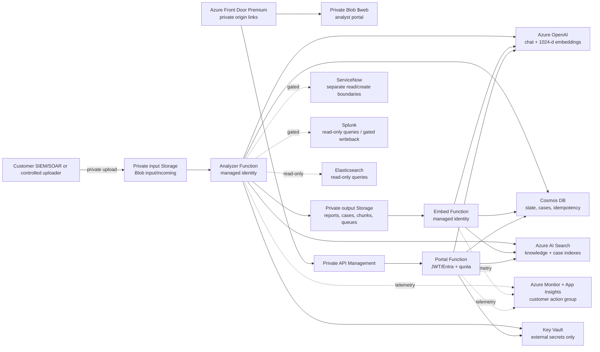

# Azure Government architecture

## Scope and sovereign boundary

This deployment is Azure US Government only. The default qualified region is
`usgovvirginia`; `usgovarizona` is a customer decision that requires separate
live service, model, quota, and private-network qualification. Connect to the
`AzureUSGovernment` cloud and use Government endpoints throughout. Commercial
cloud endpoints, audiences, registries, and DNS are not fallback options.

The application uses customer-owned Azure OpenAI deployments for analyzer,
chat, and embeddings, and Azure AI Search for tenant-scoped hybrid retrieval.
Azure Government service availability and feature behavior must be rechecked
for the customer's subscription and selected region before enablement. See
[Microsoft's Azure Government endpoint comparison](https://learn.microsoft.com/en-us/azure/azure-government/compare-azure-government-global-azure)
and [Foundry in Azure Government](https://learn.microsoft.com/en-us/azure/foundry/concepts/foundry-azure-government).

## Logical architecture

## Boundary rules

| Boundary | Required rule |
| --- | --- |
| Identity | Use a distinct user-assigned managed identity per Function app. Use RBAC for Azure data-plane services. |
| Network | Keep storage, Functions dependencies, `$web`, Search, Cosmos, Key Vault, and model resources on approved private paths with customer private DNS. |
| AI | Azure OpenAI deployment names, API version, content filters, quota, and model qualification are customer inputs. No commercial endpoint substitution. |
| State | Blob is the durable report/case source; Cosmos is transactional state; Azure AI Search is a rebuildable retrieval projection. |
| Evidence | Case evidence, advisory knowledge, and model inference remain visibly separate. Retrieval never becomes current-alert evidence without source attribution. |
| Actions | Splunk writeback and ServiceNow create are disabled by default and require separate capability, approval, identity, secret, and idempotency gates. |
| Recovery | Poison paths are independent and manually reconciled through documented replay procedures. |

## Deployment identity map

Record the following customer values outside the repository: subscription and
tenant IDs, resource group and naming prefix, region, resource IDs, Function
managed-identity object IDs, private endpoint/DNS owners, Azure OpenAI and Search
deployment/index names, Key Vault secret names, action group, on-call, and
approval owners. The reusable source tree contains no customer identities,
tokens, private addresses, or backup artifacts.
