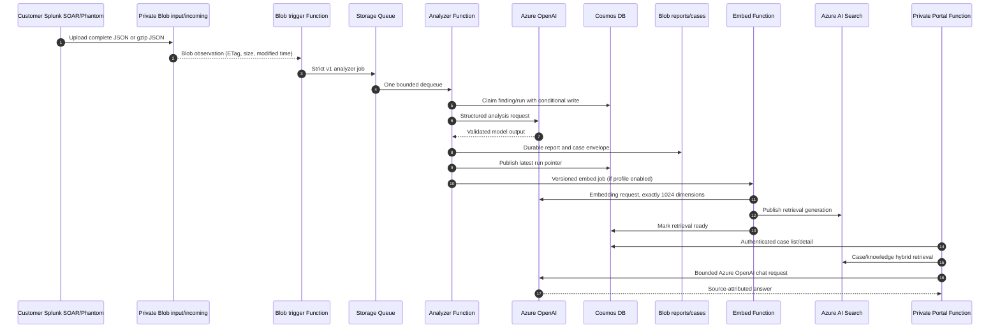

# Azure Government end-to-end workflow

## Intake to analyst result

The normal path is private Blob upload, strict queue publication, bounded
analysis, durable report/case persistence, optional embedding, and authenticated
portal retrieval. Retries are expected. Stable finding identity, Blob ETag, run
identity, Cosmos conditional writes, and side-effect fences prevent duplicate
business outcomes.



## Failure and recovery path

```mermaid
flowchart TD
    start["Work arrives"] --> publish{"Blob publication succeeds?"}
    publish -- no --> poison1["webjobs-blobtrigger-poison"]
    publish -- yes --> analyze{ "Analyzer succeeds within 5 attempts?" }
    analyze -- no --> poison2["notable-analysis-jobs-poison"]
    analyze -- yes --> embed{ "Embedding enabled and succeeds?" }
    embed -- no --> poison3["case-embed-invocations-poison"]
    embed -- yes --> ready["Case/retrieval ready"]
    poison1 --> inspect["Snapshot metadata, inspect durable outcome"]
    poison2 --> inspect
    poison3 --> inspect
    inspect --> fix["Correct cause, preserve evidence"]
    fix --> replay["Replay one validated message"]
    replay --> analyze
    ready --> portal["Authenticated analyst portal"]
    portal --> gate{ "Consequential action approved?" }
    gate -- no --> draft["Read-only result or draft"]
    gate -- yes --> sideeffect["Fenced Splunk/ServiceNow action"]
    sideeffect --> reconcile["Reconcile external and Cosmos state"]
```

No poison queue is automatically replayed. Operators must check for an already
durable outcome before replaying, and must never purge queues to recover service.
