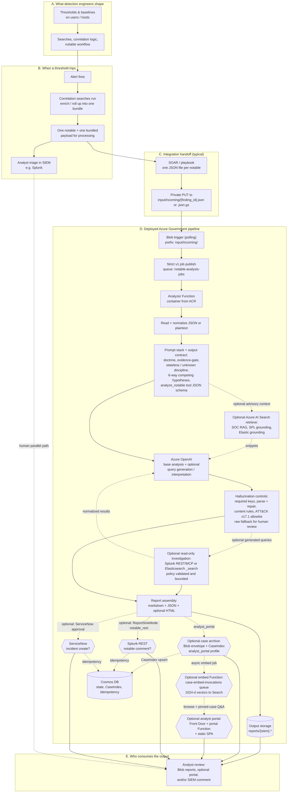
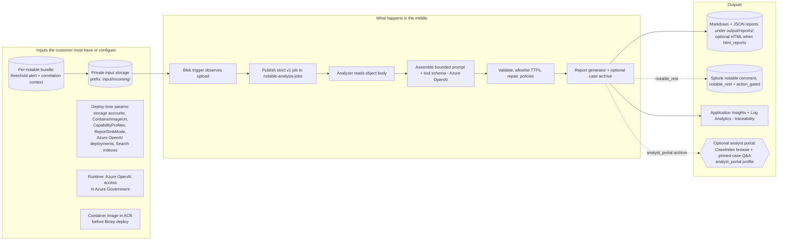
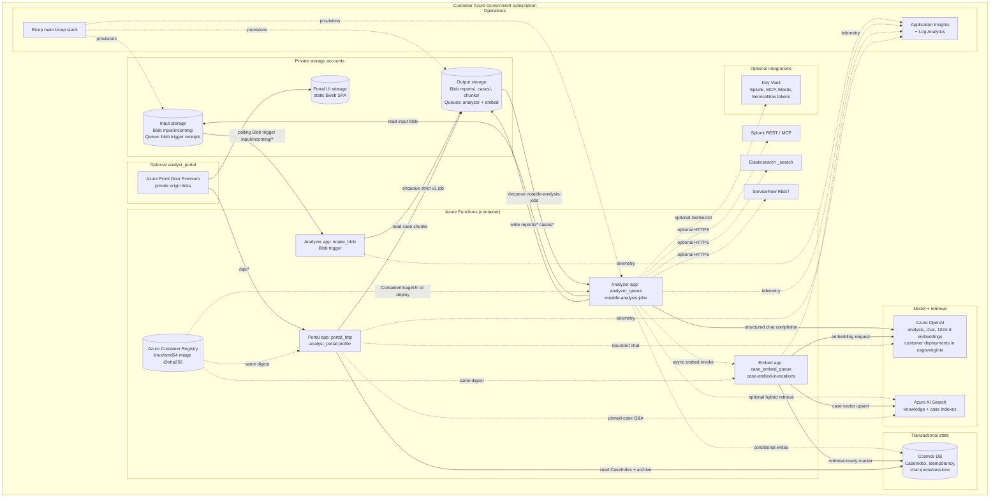
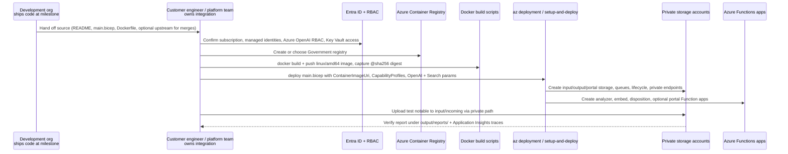

# AI Notable Analysis Pipeline — Azure End-to-End Diagrams

Pre-rendered exports of each figure (same folder):

- **PNG (open anywhere):** `END_TO_END_DIAGRAMS.fig01-full-story.png` through `END_TO_END_DIAGRAMS.fig04-deployment-sequence.png`
- **SVG (vector):** matching `.svg` files
- **Mermaid source:** matching `.mmd` files

Regenerate PNG/SVG from `azure_notable_pipeline`:

```powershell
$dir = "docs/delivery_package/end_to_end_diagrams"
foreach ($f in @("fig01-full-story","fig02-swimlane","fig03-azure-runtime","fig04-deployment-sequence")) {
  npx -y @mermaid-js/mermaid-cli -i "$dir/END_TO_END_DIAGRAMS.$f.mmd" -o "$dir/END_TO_END_DIAGRAMS.$f.png" -b white -s 2 -w 2400
  npx -y @mermaid-js/mermaid-cli -i "$dir/END_TO_END_DIAGRAMS.$f.mmd" -o "$dir/END_TO_END_DIAGRAMS.$f.svg" -b white
}
```

Optional 16:9 slide crops for fig01: `node ../s3_notable_pipeline/scripts/tools/export_svg_to_ppt_pngs.mjs docs/delivery_package/end_to_end_diagrams/END_TO_END_DIAGRAMS.fig01-full-story.mmd` (requires `npm install` in `s3_notable_pipeline`).

These Mermaid diagrams summarize how work flows from **how customers build and fire notables** through **customer-side deployment** to **analyst-ready reports** on **Azure US Government**.

**Assumptions (planning, not a guarantee):**

- **Volume:** **~250 alerts per day** handed to analysis **as one notable object each** (typical SOAR/upload pattern). That scale assumes **well-tuned detections**, not an unbounded noisy firehose.
- **Illustrative Azure-only run cost** (order of magnitude; excludes labor, SIEM/SOAR, and other tools; varies with model choice, prompt size, tokens per notable, retries, and regional pricing): **Azure OpenAI inference is usually the dominant line item** at this volume; private storage and Functions consumption are comparatively small.

---

## 1. Full story: from detections to the report

Customers typically **alert on thresholds per user or host**; when a threshold trips, an **alert fires**, **correlation searches** pull the surrounding context, and the SIEM (for example **Splunk**) ends up with **one consolidated evidence object per notable**. This pipeline **does not replace** that stack; it **takes that one object at a time** (often via SOAR) and drops it into private Blob Storage for analysis.



**Prompting and hallucination resistance (Azure path):** The model only sees **what is in the notable** plus explicit instructions to separate **evidence from inference**, use **unknown** when facts are missing, and pass an **evidence-gate** before labeling a TTP. **`analyze_notable` tool / JSON schema** tightens the answer shape. Optional Azure AI Search and query-grounding snippets are advisory context, not observed case facts. After Azure OpenAI returns, **deterministic code** validates, **repairs once** on failure, **allowlists** technique IDs, validates generated SPL or Elastic queries before execution, applies **content policies**, and if structure still fails, **surfaces raw output for review** instead of pretending the run was clean.

**Contract reminders:**

- One upload under `input/incoming/` triggers one strict v1 queue job and one analyzer run, producing one report set under `reports/` (markdown + JSON, plus HTML when `html_reports` is enabled), unless the object is skipped as empty, folder marker, or placeholder filename.
- With `analyst_portal`, the analyzer also archives a bounded case envelope to output storage and upserts CaseIndex metadata in Cosmos DB for the read-only portal API; portal chat Q&A uses Azure OpenAI over retrieved case evidence only.
- For **Splunk `notable_rest` writeback**, `finding_id` comes from the **filename stem**: e.g. `input/incoming/abc-123.json` implies `finding_id=abc-123`.
- Optional `spl_readonly` and `elastic_readonly` profiles are mutually exclusive; one read-only investigation backend is active per deployment.

**Out of scope today (non-goals):** The pipeline **does not** drive **remediation, suppression, or case closure**. ServiceNow support is limited to incident drafting and approval-gated creation; it does not make autonomous ticketing decisions.

**RAG (advisory context):** Retrieval over **customer SOPs**, **Splunk-facing knowledge packs**, and **Elasticsearch data dictionaries** can tighten **pivot ideas, query framing, and procedure fit**. Retrieved material stays **advisory**; **observed case facts** remain **only what is in the notable** the pipeline ingests.

**Operations note:** Blob triggers and Storage Queues can **retry**; customers should expect **at-least-once** delivery semantics and treat **blob ETag + finding identity** as the natural idempotency boundary for a single analysis run. External side effects such as Splunk writeback and ServiceNow create use Cosmos DB reservations when action-gated idempotency is enabled. Poison queues (`webjobs-blobtrigger-poison`, `notable-analysis-jobs-poison`, `case-embed-invocations-poison`) require manual reconciliation; see [`../../operations/AZURE_MONITORING_AND_RECOVERY.md`](../../operations/AZURE_MONITORING_AND_RECOVERY.md).

**Network:** Functions call **Azure OpenAI** and optional **Azure AI Search** via private endpoints and managed identity. Read-only investigation and writeback features use **HTTPS** to customer-configured Splunk, MCP, Elasticsearch, or ServiceNow endpoints from the analyzer execution environment. With `analyst_portal`, analysts reach the portal API through **Azure Front Door Premium** private origin links to the portal Function and static `$web` SPA.

---

## 2. Inputs, processing steps, and outputs (single swimlane)



---

## 3. Azure runtime architecture (what the stack provisions)

Aligned with [`../../../deploy/azure/main.bicep`](../../../deploy/azure/main.bicep): private input and output storage accounts, containerized Azure Functions (analyzer, embed, disposition, optional portal), Storage Queues (`notable-analysis-jobs`, `case-embed-invocations`), customer-owned Azure OpenAI, Cosmos DB, optional Azure AI Search, Key Vault, Application Insights, and optional Front Door portal origins when `analyst_portal` is enabled. **Pick the Azure Government region** that fits policy and model access; default qualified region is **`usgovvirginia`**.



---

## 4. Deployment handoff: delivery to customer team

The development organization **delivers the source** at an agreed milestone (for example a repository or release package). After handoff, the **customer owns and maintains** the deployment, fork, merge cadence, and production operations. There is **no separate software license fee**; cost is mainly **customer integration labor** (often **hours to a few days** for a straightforward deploy: image, parameters, storage, Azure OpenAI access). **New releases** can be **merged into the customer codebase** on the **customer's** schedule.

This is the **operational path** in the **customer's Azure Government subscription**: who builds the image, who runs deploy, and what proves it works.



**Important:** Bicep **references** a pre-published `ContainerImageUri` digest; it does not build or push the image for the customer. See [`../../operations/deployment/DEPLOYMENT_IMAGE_STEPS.md`](../../operations/deployment/DEPLOYMENT_IMAGE_STEPS.md).

**Documentation** shipped with the solution includes, among others: [`../../../README.md`](../../../README.md) (deploy, sinks, test path), [`../EXECUTIVE_WORKFLOW_READINESS.md`](../EXECUTIVE_WORKFLOW_READINESS.md) (end-to-end narrative), [`../../operations/deployment/DEPLOYMENT_IMAGE_STEPS.md`](../../operations/deployment/DEPLOYMENT_IMAGE_STEPS.md) (ACR and Function image order), [`../../operations/platform/CAPABILITY_PROFILES.md`](../../operations/platform/CAPABILITY_PROFILES.md) (feature bundles including `analyst_portal`), [`../../operations/analyst_portal/ANALYST_PORTAL_OPERATIONS.md`](../../operations/analyst_portal/ANALYST_PORTAL_OPERATIONS.md) (portal stack and day-two ops), [`../../operations/integrations/SIEM_SOAR_PRIVATE_INTAKE_OPERATIONS.md`](../../operations/integrations/SIEM_SOAR_PRIVATE_INTAKE_OPERATIONS.md) (SOAR to private Blob pattern), [`../../security/ATTACK_LLM_ANALYSIS.md`](../../security/ATTACK_LLM_ANALYSIS.md) (ATT&CK grounding and validation posture), and [`../../../deploy/azure/main.bicep`](../../../deploy/azure/main.bicep) (infrastructure contract).

---

## Related docs in this package

- [`../../../README.md`](../../../README.md) — quick deploy and sink modes
- [`../EXECUTIVE_WORKFLOW_READINESS.md`](../EXECUTIVE_WORKFLOW_READINESS.md) — narrative executive overview
- [`../../architecture/AZURE_GOVERNMENT_ARCHITECTURE.md`](../../architecture/AZURE_GOVERNMENT_ARCHITECTURE.md) — logical architecture and boundary rules
- [`../../architecture/AZURE_GOVERNMENT_END_TO_END.md`](../../architecture/AZURE_GOVERNMENT_END_TO_END.md) — intake sequence and failure/recovery path
- [`../../operations/deployment/DEPLOYMENT_IMAGE_STEPS.md`](../../operations/deployment/DEPLOYMENT_IMAGE_STEPS.md) — ACR and Function image order of operations
- [`../../operations/platform/CAPABILITY_PROFILES.md`](../../operations/platform/CAPABILITY_PROFILES.md) — supported feature bundles (`core`, `analyst_portal`, and others)
- [`../../operations/analyst_portal/ANALYST_PORTAL_OPERATIONS.md`](../../operations/analyst_portal/ANALYST_PORTAL_OPERATIONS.md) — optional portal stack, archive, and Case Q&A
- [`../../operations/integrations/SIEM_SOAR_PRIVATE_INTAKE_OPERATIONS.md`](../../operations/integrations/SIEM_SOAR_PRIVATE_INTAKE_OPERATIONS.md) — SOAR to private Blob payload pattern
- [`../../security/ATTACK_LLM_ANALYSIS.md`](../../security/ATTACK_LLM_ANALYSIS.md) — ATT&CK grounding, validation, and LLM trust boundaries
