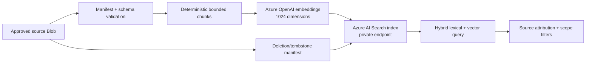

# Azure AI Search RAG and knowledge ingestion

## Corpus model

Azure AI Search is a retrieval projection, not the authoritative case store.
Use separate customer-owned indexes or filtered corpora for general SOC
knowledge, SPL guidance, Elasticsearch guidance, and case chunks. Every result
must carry corpus, source, version, tenant, and case/run scope where applicable.

| Corpus | Content | Allowed use |
| --- | --- | --- |
| SOC knowledge | Runbooks, SOPs, field dictionaries, macros | Advisory analyst context |
| SPL | Read-only query patterns and allowed fields | Query drafting and grounding |
| Elasticsearch | Read-only Query DSL patterns and field mappings | Query drafting and grounding |
| Cases | Case/report chunks with stable case/run identifiers | Authenticated case Q&A only |

## Ingestion flow

Each ingestion run has a manifest, source checksum/ETag, corpus, tenant scope,
schema version, chunk IDs, embedding model/deployment, and status. Validate
size, content type, path, metadata, and allowed fields before indexing. Publish
a new retrieval generation only after all required chunks pass validation;
never expose a partial generation as current.

## Retrieval policy

Use hybrid keyword/vector retrieval with explicit tenant/corpus filters and,
for case Q&A, case/run filters. Bound top-K, context characters, question
length, and model output tokens. Semantic rerank is opt-in and must have a
customer-approved SKU/availability check in Azure Government. If retrieval is
unavailable, follow the configured suppression behavior; do not present model
knowledge as evidence.

## Deletion and reconciliation

Source deletion produces a tombstone and removes or suppresses the matching
Search documents after the source-of-truth decision is recorded. Reconcile
manifest counts, missing chunks, stale generations, vector dimensions, and
orphaned documents. Retain audit metadata according to the customer's policy,
not indefinitely by default.

Operator provisioning, validation, and promotion gates:
[`KNOWLEDGE_BASE_OPERATIONS.md`](KNOWLEDGE_BASE_OPERATIONS.md).

## Deploy path — next

- **Path B (step 7):** return to [`KNOWLEDGE_BASE_OPERATIONS.md`](KNOWLEDGE_BASE_OPERATIONS.md) for ingest validation and promotion
- **Path C:** [`../../../README.md`](../../../README.md#path-c-custom-profiles) when vector corpora are enabled
