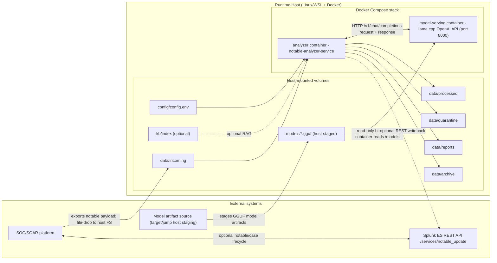

# Architecture Diagram (CPU Phi-3.5 + llama.cpp)

This diagram shows the runtime architecture for the Docker bundle in this directory.

## Notes

- GGUF model files are **not** baked into container images.
- GGUF model artifacts are staged on the host (`./models`) and mounted read-only into `model-serving`.
- SOC/SOAR drops inbound files on host filesystem `data/incoming` (then analyzer consumes them).
- Optional writeback calls Splunk ES REST API (`/services/notable_update`).
- Build hosts can build/push images without GPU; runtime hosts execute CPU inference for this stack.
