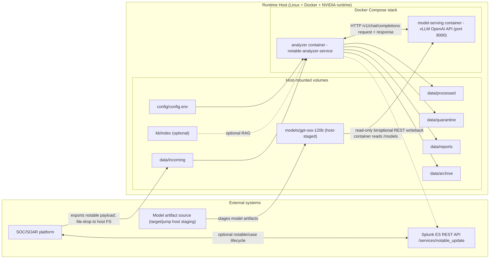

# Architecture Diagram (GPU vLLM + gpt-oss-120b)

This diagram shows the runtime architecture for the Docker bundle in this directory.

## Notes

- Model artifacts are **not** baked into container images.
- Model artifacts are staged on the host (`./models`) and mounted read-only into `model-serving`.
- SOC/SOAR drops inbound files on host filesystem `data/incoming` (then analyzer consumes them).
- Optional writeback calls Splunk ES REST API (`/services/notable_update`).
- Build hosts can produce/push images without a GPU; GPU is required on runtime hosts.
