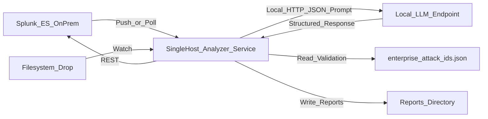

# On-Prem / Air-Gapped Deployment Guide
## Local LLM Notable Analysis Service

---

## Overview

This guide describes how to deploy the **S3 Notable Pipeline/LLM Notable Analysis Service** in an **on-premises, air-gapped environment** with no cloud services and no direct internet access.

**What stays the same:**
- Core analysis logic (normalize → LLM inference → MITRE TTP validation → markdown report generation)
- TTP validation against local MITRE ATT&CK data
- Splunk integration patterns (notable REST API)

**What changes (cloud → on-prem edge swaps):**
- **S3 input bucket** → Local ingest (Splunk push/poll or filesystem)
- **AWS Lambda** → Local service (daemon or scheduled job)
- **AWS Bedrock** → Local LLM endpoint (vLLM on localhost; OpenAI-compatible HTTP API)
- **S3 output bucket** → Local filesystem + optional Splunk writeback

---

## Architecture

### High-Level Flow



### Component Roles

| Component | Purpose | Network Requirements |
|-----------|---------|---------------------|
| **Single Host** | Runs the notable analysis service and hosts the local LLM endpoint; handles ingest, LLM orchestration, TTP validation, report generation | Internal-only access to Splunk; LLM endpoint is local to this host |
| **Splunk On-Prem** | Splunk Enterprise / Splunk ES for notable source and writeback | Standard internal Splunk deployment |
| **MITRE TTP Data** | Local JSON file with valid technique IDs | Bundled with service; updated offline |

---

## Deployment Models

### Single Host Deployment (Only Supported Deployment)
- **Use case:** Small-scale deployment, testing, or resource-constrained environments
- **Setup:** One VM/server runs both the analysis service and the local LLM stack
- **Pros:** Simple, fewer moving parts
- **Cons:** Resource contention between CPU-heavy analysis and GPU-heavy inference

---

## Hardware Sizing (Single Host)

This sizing assumes **~300 notables/day** (about **12.5/hour average**) with normal operational bursts, and that the **LLM runs on the same host** as the analysis service.

### Recommended sizing targets
- **End-to-end latency (typical):** < 60 seconds per notable
- **Burst handling:** sustain ~2–4 concurrent analyses without persistent backlog growth
- **Disk sizing:** includes OS + local LLM runtime + model weights + logs + generated markdown reports + offline installers/artifacts

### VM vs Physical Server (RHEL)
- **VM:** viable if your virtualization stack (e.g., VMware vSphere, Red Hat Virtualization, KVM) supports **GPU passthrough/vGPU**. Reserve RAM and pin vCPU where possible. Install RHEL as guest OS.
- **Physical (bare metal):** simplest for GPU deployments; best for predictable inference performance. Install RHEL directly.

### Minimum vs Recommended hardware

| Profile | CPU | RAM | Storage | GPU (for local LLM) | Network |
|---|---:|---:|---:|---|---|
| **Minimum (CPU-only / very small model)** | 8–16 vCPU | 32–64 GB | 500 GB SSD/NVMe | None (CPU inference) | 1 GbE |
| **Recommended (production, balanced)** | 16–32 vCPU | 128 GB | 1–2 TB NVMe | 1× GPU with **24–48 GB VRAM** | 1–10 GbE |
| **High headroom (larger model or faster bursts)** | 32–64 vCPU | 256 GB | 2 TB NVMe | 1× GPU with **48–80 GB VRAM** (or 2× 24–48 GB) | 10 GbE |

### Notes (what drives sizing)
- **GPU VRAM** is the primary limiter for model size/context; if the customer mandates a larger model, prioritize **more VRAM** first.
- **CPU/RAM** primarily impact concurrency, TLS overhead, Splunk REST I/O, prompt assembly, and keeping the host responsive under load.
- **Disk** should be NVMe if possible to speed model startup/reloads and reduce operational friction.

---

## Fixed Infrastructure Cost Estimates

These are **rough order-of-magnitude estimates** for a single-host deployment running **gpt-oss-20b** on **Red Hat Enterprise Linux (RHEL)**. Actual costs vary by vendor, procurement channel, and support tier.

### Hardware (One-Time Cost)

| Profile | Server + GPU | Estimated Cost (USD) |
|---------|--------------|---------------------|
| **Minimum (CPU-only, gpt-oss-20b)** | 16-core server, 64 GB RAM, 500 GB NVMe, no GPU | $5,000–$10,000 |
| **Recommended (gpt-oss-20b)** | 32-core server, 128 GB RAM, 1 TB NVMe, 1× RTX PRO 6000 (96 GB VRAM) | $18,000–$35,000 |
| **High headroom (faster inference / future upgrades)** | 64-core server, 256 GB RAM, 2 TB NVMe, 1× RTX PRO 6000 (96 GB VRAM) or H100-class | $35,000–$80,000+ |

**Recommended profile (one-time) itemized estimate:**
- **Server (CPU + RAM + motherboard + chassis + PSU)**: $6,000–$12,000
- **Storage (NVMe 1 TB + spare/OS overhead)**: $200–$600
- **GPU: RTX PRO 6000 (96 GB)**: $10,000–$20,000
- **NIC (1–10 GbE)**: $100–$800 (often integrated)
- **Rails/warranty/support uplift**: $500–$2,000
- **Total (one-time)**: $18,000–$35,000

**GPU pricing (approximate list price):**
- RTX PRO 6000 (96 GB): varies widely by channel/support tier
- NVIDIA H100 80GB PCIe: ~$25,000–$40,000

### Software (Recurring Annual Cost)

| Item | Estimated Annual Cost (USD) |
|------|----------------------------|
| **Red Hat Enterprise Linux** (Standard or Premium subscription, 1 server) | $800–$2,000/year |
| **Splunk Enterprise** (if not already licensed) | Per existing customer agreement |
| **LLM model weights** (gpt-oss-20b) | $0 (open-weights) |
| **vLLM / Ollama / TGI** | $0 (open-source) |
| **Python + dependencies** | $0 (open-source) |

### Total Cost of Ownership (Recommended Profile)

| Category | Year 1 | Year 2+ (Annual) |
|----------|--------|------------------|
| Hardware (one-time) | $18,000–$35,000 | — |
| RHEL subscription | $1,000–$2,000 | $1,000–$2,000 |
| Maintenance/support (estimate) | $1,000–$2,000 | $1,000–$2,000 |
| **Total** | **$20,000–$39,000** | **$2,000–$4,000/year** |

**Note:** This does not include Splunk licensing (assumed already in place), datacenter costs (power, cooling, rack space), or staff time for deployment/operations.

---

## End-to-End Workflow

### 1. Ingest Notable (SOAR → SFTP → Filesystem Drop)

**How it works:**
- SOAR playbook pulls notables from Splunk ES
- SOAR pushes each notable to the analyzer host via **SFTP**
- SOAR drops `*.json` (preferred) or `*.txt` files into `INCOMING_DIR`
- The service watches `INCOMING_DIR` (polling) and processes each file once, then moves it to `PROCESSED_DIR` or `QUARANTINE_DIR`

**Why this model:**
- Keeps Splunk credentials in SOAR (not the analyzer)
- Matches the cloud S3 pattern (SOAR selects notables and delivers them to the analyzer)
- Simple network posture (SOAR → analyzer SFTP; analyzer → Splunk REST optional)

**Avoid partial reads (recommended):**
- Upload to a temporary filename that does **not** match `*.json` / `*.txt` (example: `*.json.tmp`)
- Atomically rename to `*.json` after the upload completes

**Notable payload contract (JSON):**
- **Required**: `summary` (string)
- **Recommended**: `notable_id`, `event_id`, `search_name`, `risk_score`, `threat_category`, `alert_time`, plus relevant top-level fields (user, host, ip, process, etc.)
- **Important limitation (current behavior)**: the current prompt formatter only includes top-level primitives/lists; nested objects may not appear in the prompt.
  - **Future consideration**: once the customer’s notable schema is finalized, update the formatter and payload contract to match that schema permanently.
  - If you need the full notable today, include it as a string field (example: `raw_event`).

---

### 2. Normalize Notable

**Goal:** Convert incoming payload into internal structure:
```python
{
  "summary": "Brief description of the alert/notable",
  "risk_index": {
    "risk_score": "N/A or numeric",
    "source_product": "Splunk ES / Custom",
    "threat_category": "N/A or category"
  },
  "raw_log": {
    # Original notable fields as key-value pairs
  }
}
```

**Implementation:**
- Reuse the existing `normalize_notable()` logic from `lambda_handler.py`
- Handle both JSON and plain text inputs
- Preserve original notable ID for Splunk writeback (if applicable)

---

### 3. Analyze with Local LLM

**Workflow:**
1. The service builds `alert_text` using `format_alert_input()` (from `ttp_analyzer.py`)
2. The service sends HTTP POST to the local LLM endpoint (localhost, no TLS needed):
   ```json
   {
     "model": "gpt-oss-20b",
     "prompt": "<formatted_alert_text>",
     "max_tokens": 4096,
     "temperature": 0.0
   }
   ```
3. Local LLM returns an OpenAI-compatible response; the model output contains the structured JSON we parse
4. The service parses response into scored TTPs

**Local LLM Requirements:**
- **API contract:** vLLM OpenAI-compatible `/v1/completions`; model output contains JSON with TTP analysis
- **Auth:** Bearer token (vLLM `--api-key`), if enabled
- **Network:** Localhost-only endpoint (127.0.0.1); no outbound routes
- **Performance:** Response time < 30 seconds for typical notables
- **Compliance:** Customer-approved, U.S.-sourced software (if required by policy)

### Recommended Open-Source LLM

For this use case (security alert analysis, MITRE ATT&CK TTP identification, structured reasoning), we recommend:

| Model | Context | Notes |
|-------|------------|---------------|-------|
| **gpt-oss-20b** (recommended) | **131,072 tokens (128k)** | Open-weight model; well-suited for on-prem deployment with vLLM |

**Why gpt-oss-20b:**
- Strong reasoning for security analysis tasks
- On-prem friendly with modern serving stacks
- Large context window (**128k**) for long alerts/enrichment context

### Recommended LLM Serving Stack

| Stack | Use Case | Notes |
|-------|----------|-------|
| **vLLM** (recommended) | Production | High throughput, OpenAI-compatible API, continuous batching, GPU optimized |
| Ollama | Development/testing | Simple setup, easy model management, good for local dev |
| Text Generation Inference (TGI) | Production alternative | HuggingFace-backed, production-ready, good documentation |
| llama.cpp | CPU-only deployments | Lower resource requirements, slower inference |

**Recommended stack:** **vLLM** with **gpt-oss-20b**

**vLLM exposes an OpenAI-compatible API**, so your service calls:
```bash
POST http://localhost:8000/v1/completions
# or
POST http://localhost:8000/v1/chat/completions
```

This simplifies integration and allows swapping models without code changes.

---

### 4. Validate and Filter TTPs

**Process:**
1. `TTPValidator` loads `enterprise_attack_vXX.Y_ids.json` from disk (bundled with service)
2. For each TTP returned by LLM:
   - Check if TTP ID exists in the local MITRE data
   - Keep valid TTPs, log and discard invalid ones
3. Return filtered list of valid TTPs with scores and explanations

**Why this matters:**
- LLMs occasionally hallucinate invalid technique IDs
- Validation ensures all reported TTPs are real MITRE ATT&CK techniques
- Maintains data quality for downstream SIEM correlation

---

### 5. Generate Markdown Report

**Process:**
- Call `generate_markdown_report()` (from `markdown_generator.py`)
- Inputs: `alert_text`, `llm_response`, `scored_ttps`
- Output: Formatted markdown with:
  - Executive summary
  - Scored TTPs with explanations
  - Containment playbook
  - Enrichment queries
  - IOC extraction

**Outputs:**
- `<notable_id>.md` (primary report)

---

### 6. Output / Writeback (Choose One or Both)

#### Filesystem Sink (Always Supported)
**How it works:**
- Write markdown report to `REPORT_DIR/<notable_id>.md`
- Implement retention policy (delete reports older than N days)

**Use case:**
- Testing and validation
- Long-term archival
- Integration with external systems

#### Splunk Notable Update (REST API)
**How it works:**
- Call Splunk ES REST API `/services/notable_update`
- Attach markdown report as a comment
- Update notable status (e.g., "In Progress")

**Use case:**
- Analyst workflow integration
- Notable enrichment in Splunk ES UI
- Automatic status tracking

**Setup:**
- Configure `SPLUNK_BASE_URL` and `SPLUNK_API_TOKEN`
- Reuse existing `write_to_splunk_rest()` logic from `lambda_handler.py`

---

## Software Prerequisites

All software must be **locally installable** and **air-gap compatible** (no runtime internet dependency).

### Core Stack
- **Operating System:** Red Hat Enterprise Linux (RHEL) 8 or 9 (recommended); Rocky Linux 8/9 as free alternative
- **Python:** Version 3.9+ (RHEL 9 ships with Python 3.9; RHEL 8 requires `python39` package)
- **Python Dependencies:**
  - `requests` (HTTP client for LLM and Splunk)
  - Standard library only (no boto3, no AWS SDKs)

### Service Management
- **systemd** service unit (standard on RHEL)

### Optional (Recommended)
- **Container Runtime:** Podman (ships with RHEL) or Docker
  - Simplifies deployment and dependency isolation
  - Not required; can run as native Python service

### Splunk On-Prem (If Integrating)
- **Splunk Enterprise** or **Splunk ES** with:
  - REST API enabled
  - API token with `notable_update` permissions

### Local LLM Runtime
- **Customer-approved LLM inference stack** that provides:
  - Localhost-only OpenAI-compatible HTTP API (vLLM)
  - Prompt → structured response capability
  - Bearer token authentication (optional)
  - No outbound network requirements

---

## Configuration

Replace AWS Lambda environment variables with a **local config file** or **environment variables**.

### Recommended Config File Format
```ini
# config.ini or .env

# === Ingest Mode ===
INGEST_MODE=file_drop  # SOAR pushes notables via SFTP to INCOMING_DIR

# === Directories (for file_drop mode) ===
INCOMING_DIR=/var/notables/incoming
REPORT_DIR=/var/notables/reports
PROCESSED_DIR=/var/notables/processed
QUARANTINE_DIR=/var/notables/quarantine

# === Local LLM ===
LLM_API_URL=http://127.0.0.1:8000/v1/completions
LLM_API_TOKEN=<secret>

# === Splunk Integration ===
SPLUNK_BASE_URL=https://splunk.internal:8089
SPLUNK_API_TOKEN=<secret>

# === MITRE ATT&CK Data ===
# Default path used by the packaged service (matches config.env.example)
MITRE_IDS_PATH=/opt/notable-analyzer/onprem_service/enterprise_attack_v17.1_ids.json

# === Output Sink ===
SPLUNK_SINK_MODE=notable_rest  # Options: filesystem, notable_rest

# === Retention (days) ===
INPUT_RETENTION_DAYS=2
REPORT_RETENTION_DAYS=7

# Archive then delete (recommended)
ARCHIVE_DIR=/var/notables/archive
ARCHIVE_RETENTION_DAYS=14
RETENTION_RUN_INTERVAL_SECONDS=86400
```

### Config Loading (Python)
```python
import os
from pathlib import Path

# Load from environment or config file
INGEST_MODE = os.getenv('INGEST_MODE', 'file_drop')
INCOMING_DIR = Path(os.getenv('INCOMING_DIR', '/var/notables/incoming'))
LLM_API_URL = os.getenv('LLM_API_URL')
SPLUNK_BASE_URL = os.getenv('SPLUNK_BASE_URL')
MITRE_IDS_PATH = Path(os.getenv('MITRE_IDS_PATH', '/opt/notable-analyzer/onprem_service/enterprise_attack_v17.1_ids.json'))
```

---

## Security Controls (Air-Gap Friendly)

### Network Isolation
- **No outbound internet routes** from the Single Host service
- **Internal-only communication:**
  - Single Host ↔ Splunk (HTTPS)
  - Single Host ↔ Local LLM (localhost HTTP)
- **Firewall rules:** Deny all outbound by default; allow only required internal destinations

### Transport Security
- **TLS for Splunk:** Use HTTPS with valid internal CA certificates
- **Certificate validation:** Enforce cert validation for Splunk (no `verify=False` in production)
  - If Splunk uses an internal CA not in the system trust store, either:
    - Install the CA into RHEL's system trust store: `sudo cp internal-ca.pem /etc/pki/ca-trust/source/anchors/ && sudo update-ca-trust`
    - Or set `SPLUNK_CA_BUNDLE=/path/to/internal-ca.pem` in config
- **Local LLM:** localhost HTTP (no TLS required)

### vLLM Model Loading Security
- **`--trust-remote-code` is DISABLED by default** in the provided systemd unit
- This flag allows vLLM to execute arbitrary Python code bundled with model artifacts during loading
- **Only enable if:**
  - The model requires custom architecture code (some models ship `modeling_*.py` files)
  - AND you have verified model artifacts via checksum from a trusted, controlled offline import process
- **To enable:** Edit `/etc/systemd/system/vllm.service` and add `--trust-remote-code` to the `ExecStart` line

### Secrets Management
- **Never commit secrets to source control**
- **Storage options:**
  - On-prem secret management system (HashiCorp Vault, CyberArk, etc.)
  - Encrypted config files with restricted file permissions (chmod 600)
  - Environment variables loaded from protected `/opt/notable-analyzer/config.env`
- **Least privilege:**
  - Splunk API tokens scoped to minimum required endpoints
  - Service account with read-only access to MITRE data
  - Write-only access to `REPORT_DIR`

### File System Permissions
- **Service account:** Run service as dedicated non-root/non-admin user
- **Directory permissions:**
  - `INCOMING_DIR`: Write-only for upstream process, read-only for service
  - `REPORT_DIR`: Write-only for service, read-only for consumers
  - `MITRE_IDS_PATH`: Read-only for all

### Audit Logging
- **Correlation IDs:** Assign unique ID to each notable analysis job
- **Structured logs:** JSON format for easy parsing and SIEM ingestion
- **Log forwarding:** Send logs to on-prem SIEM or Splunk index
- **Immutable logs:** Write-once storage or forward to append-only index
- **Log retention:** Align with organizational policy (typically 90+ days)

### Input Validation
- **Notable payload validation:** Reject malformed JSON, oversized payloads
- **LLM response validation:** Schema validation before processing
- **Path traversal protection:** Sanitize filenames when writing reports

---

## Updating MITRE ATT&CK TTP IDs (Offline Process)

The service validates TTPs against a **local JSON file** (`enterprise_attack_vXX.Y_ids.json`) that must be updated periodically.

### Update Workflow

1. **On a connected machine (outside the air-gap):**
   - Follow your organization's approved workflow for downloading external content
   - Run the `extract_ttp_ids.py` script to generate an updated JSON file:
     ```bash
     python extract_ttp_ids.py
     # Output: enterprise_attack_v17.1_ids.json (or newer version)
     ```

2. **Transfer to air-gapped environment:**
   - Use your organization's approved media transfer process (e.g., USB drive with malware scanning, secure file transfer appliance)
   - Validate file integrity (checksum, signature verification)

3. **Deploy to the Single Host:**
   - Place the new JSON file in the configured location (e.g., `/opt/notable-analyzer/data/`)
   - Update `MITRE_IDS_PATH` config if the filename changed
   - Restart the service to load the new data (or implement hot-reload if desired)

### Update Frequency
- **Recommended:** Quarterly (aligned with MITRE ATT&CK release cadence)
- **Minimum:** Annually
- **Trigger:** When new techniques are relevant to your threat landscape

---

## Deployment Steps

### 1. Prepare Single Host

#### Install Python and Dependencies (RHEL)
```bash
# RHEL 9 (Python 3.9 is default)
sudo dnf install python3 python3-pip

# RHEL 8 (install Python 3.9 explicitly)
sudo dnf install python39 python39-pip

# Create virtual environment
python3.9 -m venv /opt/notable-analyzer/venv
source /opt/notable-analyzer/venv/bin/activate
pip install requests
```

#### Deploy Application Code
```bash
# Copy files from s3_notable_pipeline/ to /opt/notable-analyzer/
# Required files:
#   - ttp_analyzer.py
#   - markdown_generator.py
#   - enterprise_attack_v17.1_ids.json
#   - onprem_main.py (new entrypoint; adapt lambda_handler.py)
#   - config.ini (or .env)
```

#### Create Directories
```bash
sudo mkdir -p /var/notables/{incoming,reports,processed,quarantine}
sudo chown notable-service:notable-service /var/notables/*
sudo chmod 750 /var/notables/*
```

### 2. Configure Service

#### Create systemd Service
```ini
# /etc/systemd/system/notable-analyzer.service
[Unit]
Description=Notable Analysis Service (On-Prem)
After=network.target

[Service]
Type=simple
User=notable-service
Group=notable-service
WorkingDirectory=/opt/notable-analyzer
Environment="PATH=/opt/notable-analyzer/venv/bin"
EnvironmentFile=/opt/notable-analyzer/config.env
ExecStart=/opt/notable-analyzer/venv/bin/python onprem_main.py
Restart=on-failure
RestartSec=10

[Install]
WantedBy=multi-user.target
```

Enable and start:
```bash
sudo systemctl daemon-reload
sudo systemctl enable notable-analyzer
sudo systemctl start notable-analyzer
sudo systemctl status notable-analyzer
```

### 3. Configure Local LLM Endpoint (vLLM + gpt-oss-20b)

**Recommended setup:** vLLM serving gpt-oss-20b on the same host.

#### Install vLLM (RHEL)
```bash
# Ensure NVIDIA drivers and CUDA are installed (customer-specific)
# Install vLLM in a separate virtual environment
python3.9 -m venv /opt/vllm/venv
source /opt/vllm/venv/bin/activate
pip install vllm
```

#### Download gpt-oss-20b model weights
**On a connected machine** (outside the air-gap):
- Download model weights from OpenAI's official distribution
- Transfer to the air-gapped host via approved media transfer process

Place model weights in `/opt/vllm/models/gpt-oss-20b/`

#### Start vLLM server
```bash
# Start vLLM with OpenAI-compatible API
source /opt/vllm/venv/bin/activate
python -m vllm.entrypoints.openai.api_server \
  --model /opt/vllm/models/gpt-oss-20b \
  --host 127.0.0.1 \
  --port 8000 \
  --api-key "<your-api-key>" \
  --tensor-parallel-size 1
```

For production, create a systemd service for vLLM (similar to the analyzer service).

#### Test connectivity
```bash
curl -X POST http://127.0.0.1:8000/v1/completions \
  -H "Authorization: Bearer <your-api-key>" \
  -H "Content-Type: application/json" \
  -d '{"model": "gpt-oss-20b", "prompt": "Test prompt", "max_tokens": 100}'
```

**Note:** vLLM exposes an **OpenAI-compatible API** at `/v1/completions` and `/v1/chat/completions`. The analyzer service should call this endpoint.

### 4. Configure Splunk Integration (Optional)

#### For Notable REST Sink
1. Create Splunk API user with `edit_notable_events` capability
2. Generate authentication token:
   ```bash
   curl -k -u admin:password https://splunk.internal:8089/services/auth/login \
     -d username=notable-api -d password=<password>
   # Copy sessionKey to SPLUNK_API_TOKEN
   ```
3. Test:
   ```bash
   curl -k https://splunk.internal:8089/services/notable_update \
     -H "Authorization: Bearer <token>" \
     -d comment="Test comment" -d status=2
   ```

### 5. Deploy MITRE ATT&CK Data

```bash
# Copy enterprise_attack_v17.1_ids.json to the Single Host
scp enterprise_attack_v17.1_ids.json notable-service@single-host:/opt/notable-analyzer/data/

# Verify file integrity
sha256sum /opt/notable-analyzer/data/enterprise_attack_v17.1_ids.json

# Set permissions
sudo chown notable-service:notable-service /opt/notable-analyzer/data/enterprise_attack_v17.1_ids.json
sudo chmod 440 /opt/notable-analyzer/data/enterprise_attack_v17.1_ids.json
```

---

## Testing and Validation

### Acceptance Checklist

- [ ] **Ingest test:** Can receive a test notable via chosen ingest mode
- [ ] **LLM connectivity:** Single Host can reach the local LLM endpoint and parse response
- [ ] **TTP validation:** Invalid TTP IDs are filtered out using local MITRE data
- [ ] **Report generation:** Markdown report renders correctly and is written to disk
- [ ] **Splunk writeback (if enabled):** notable update succeeds
- [ ] **Network isolation:** No outbound internet traffic observed during runtime
- [ ] **Error handling:** Service recovers gracefully from transient failures
- [ ] **Logging:** Structured logs are written and forwarded to SIEM
- [ ] **Performance:** Analysis completes within acceptable time (< 60 seconds per notable)

### Test Notable (JSON Example)

```json
{
  "notable_id": "test-001",
  "event_id": "12345",
  "search_name": "Brute Force Attack Detected",
  "summary": "Multiple failed login attempts from 192.168.1.100 targeting user admin",
  "risk_score": 85,
  "source_product": "Splunk ES",
  "threat_category": "Credential Access",
  "src_ip": "192.168.1.100",
  "dest_ip": "10.0.0.50",
  "user": "admin",
  "event_count": 47,
  "time_range": "2025-12-11T10:00:00Z to 2025-12-11T10:15:00Z"
}
```

Save as `test-notable.json` and:
- Copy to `INCOMING_DIR` (via SFTP drop + rename, recommended)

### Expected Output

- **Markdown report:** `REPORT_DIR/test-001.md` with:
  - Executive summary
  - Scored TTPs (e.g., T1110 - Brute Force)
  - Containment playbook
  - Enrichment queries
- **Logs:** Structured JSON logs with correlation ID `test-001`
- **Splunk writeback (if enabled):** Notable updated with analysis comment

---

## Operations and Maintenance

### Monitoring

**Key Metrics:**
- **Throughput:** Notables processed per hour
- **Latency:** Average analysis time per notable
- **Error rate:** Failed analyses / total analyses
- **LLM availability:** Uptime of local LLM endpoint
- **Disk usage:** `INCOMING_DIR`, `PROCESSED_DIR`, `QUARANTINE_DIR`, `REPORT_DIR`, and `ARCHIVE_DIR` utilization

**Alerting:**
- Service down (systemd status)
- LLM endpoint unreachable
- Disk space < 10% free
- Error rate > 5%

### Log Management

**Log Locations:**
- `/var/log/notable-analyzer/` (custom log directory)
- systemd journal: `journalctl -u notable-analyzer`

**Log Forwarding:**
- Use Splunk Universal Forwarder or syslog to send logs to on-prem SIEM
- Index as `sourcetype=notable:analyzer:logs`

### Retention and Cleanup

**Automated Cleanup (in-service, recommended):**
- Stage 1 (move to archive):
  - Move files older than `INPUT_RETENTION_DAYS` from `PROCESSED_DIR` and `QUARANTINE_DIR` into `ARCHIVE_DIR/processed` and `ARCHIVE_DIR/quarantine`
  - Move reports older than `REPORT_RETENTION_DAYS` from `REPORT_DIR` into `ARCHIVE_DIR/reports`
- Stage 2 (delete from archive):
  - Delete files from `ARCHIVE_DIR/*` after `ARCHIVE_RETENTION_DAYS` (time spent in archive)
- Housekeeping runs every `RETENTION_RUN_INTERVAL_SECONDS` (default: daily)

**Automated Cleanup (cron alternative):** If you do not want the service to manage retention, use a scheduled job to move→delete on your desired cadence.

**Manual Cleanup:**
- Review quarantined files periodically
- Archive important reports before retention expires

### Backup and Recovery

**What to back up:**
- Configuration files (`config.ini`, `.env`)
- MITRE ATT&CK data (`enterprise_attack_vXX.Y_ids.json`)
- Application code (or maintain in version control)

**What NOT to back up:**
- Incoming notables (ephemeral)
- Generated reports (unless required for compliance)

**Recovery:**
- Restore config and code to a new Single Host
- Restart service
- Verify connectivity to LLM and Splunk

### Upgrades

**Application Code:**
1. Test new version in non-production environment
2. Stop service: `sudo systemctl stop notable-analyzer`
3. Deploy new code to `/opt/notable-analyzer/`
4. Update dependencies: `pip install -r requirements.txt`
5. Start service: `sudo systemctl start notable-analyzer`
6. Monitor logs for errors

**MITRE ATT&CK Data:**
1. Follow offline update workflow (see "Updating MITRE ATT&CK TTP IDs" section)
2. No service restart required if hot-reload is implemented; otherwise restart

**Local LLM:**
1. Coordinate with LLM vendor/team
2. Test new model version for compatibility (same JSON schema)
3. Update `LLM_API_URL` if endpoint changes
4. Restart service if config changed

---

## Troubleshooting

### Service Won't Start

**Check:**
- Config file exists and is readable: `cat /opt/notable-analyzer/config.ini`
- Python dependencies installed: `pip list | grep requests`
- Directories exist and have correct permissions: `ls -la /var/notables/`
- Logs for errors: `journalctl -u notable-analyzer -n 50`

### LLM Endpoint Unreachable

**Check:**
- HTTP connectivity: `curl http://127.0.0.1:8000/health`
- Firewall rules: Ensure local port 8000 is allowed on the host

### No TTPs Returned

**Check:**
- LLM response format: Log raw LLM output and verify JSON schema
- MITRE data loaded: Check logs for "Loaded X valid TTPs"
- Prompt quality: Review `alert_text` formatting; ensure sufficient context
- LLM temperature: Set to 0.0 for deterministic output

### Splunk Writeback Fails

**Check:**
- Splunk connectivity: `curl -k https://splunk.internal:8089`
- Token validity: Test token with manual API call
- Notable ID present: Ensure original notable includes `notable_id` or `event_id`
- Permissions: Verify token has `edit_notable_events` capability

### Reports Not Generated

**Check:**
- `REPORT_DIR` writable: `touch /var/notables/reports/test.txt`
- Disk space: `df -h /var/notables`
- Markdown generation errors: Check logs for exceptions in `generate_markdown_report()`

---

## Comparison: AWS vs On-Prem

| Aspect | AWS (S3 Pipeline) | On-Prem (This Guide) |
|--------|-------------------|----------------------|
| **Trigger** | S3 ObjectCreated event | Splunk push/poll or file watch |
| **Compute** | Lambda (serverless) | Long-running service or cron job |
| **LLM** | AWS Bedrock Nova Pro | vLLM on localhost (`/v1/completions`) |
| **Input Storage** | S3 bucket | Filesystem directory |
| **Output Storage** | S3 bucket | Filesystem directory |
| **Splunk Integration** | REST API | REST API |
| **Scaling** | Automatic (Lambda concurrency) | Manual (scale up the Single Host; or add capacity per customer standard) |
| **Cost Model** | Pay-per-invocation | Fixed infrastructure cost |
| **Internet Dependency** | Yes (Bedrock API) | No (air-gapped) |
| **Deployment** | SAM/CloudFormation | systemd service (RHEL) |
| **Monitoring** | CloudWatch Logs/Metrics | On-prem SIEM + monitoring tools |

---

## Summary

This guide provides a complete blueprint for deploying the S3 Notable Pipeline in an **on-premises, air-gapped environment**. The core analysis logic remains unchanged; only the "edges" (input, LLM, output) are swapped for local equivalents.

**Key Takeaways:**
- **No cloud dependencies:** All components run inside your enclave
- **Flexible ingest:** Splunk push, Splunk poll, or filesystem drop
- **Local LLM:** vLLM on localhost (OpenAI-compatible HTTP API)
- **MITRE validation:** Local JSON file updated via offline process
- **Splunk integration:** Notable REST update integration
- **Security-first:** Network isolation, TLS to Splunk, secrets management, audit logging

**Next Steps:**
1. Provision a Single Host
2. Install and configure the service and local LLM stack
3. Deploy local LLM stack (coordinate with vendor/team)
4. Configure Splunk integration (notable REST)
5. Deploy application code and MITRE data
6. Run acceptance tests
7. Monitor and iterate

For questions or issues, refer to the original `s3_notable_pipeline/README.md` for core logic details, or consult your organization's infrastructure and security teams for deployment-specific guidance.

