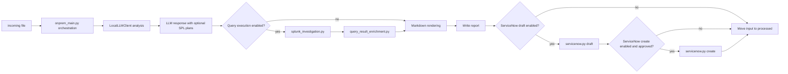
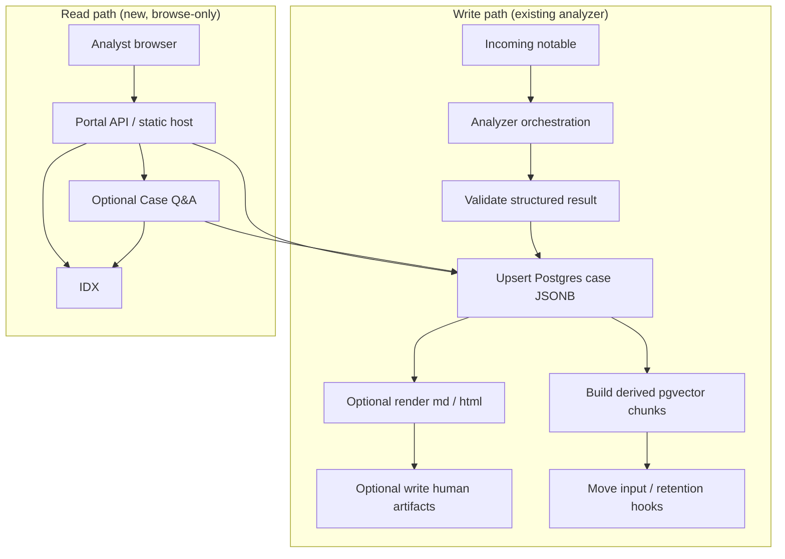

# Feature Enhancements Architecture

## Status

This document is the planning and architecture input for the next feature-enhancement block in `llm_notable_analysis_onprem_systemd`.

It is not the build-ready implementation contract. Locked implementation detail belongs in `../technical_specs/feature_enhancements_technical_spec.md`.

**Canonical roadmap:** cross-cutting enrichment, threat intel, ticketing breadth, orchestration posture, governance, observability, and AWS/on-prem **instantiation mappings** formerly scattered in repo-root `ONPREM_NOTABLE_ANALYSIS_ENHANCEMENTS.md` / `AWS_NOTABLE_ANALYSIS_ENHANCEMENTS.md` are consolidated below in **[Cross-cutting context roadmap (single source)](#cross-cutting-context-roadmap-single-source)** plus **[Deployment instantiation (On-prem vs AWS)](#deployment-instantiation-on-prem-vs-aws)**. Those markdown files intentionally defer here to avoid divergence.

## Purpose

Define the minimal on-prem architecture for adding optional read-only investigation, query-result enrichment, optional query-result interpretation, and ServiceNow ticketing support to the current `systemd` analyzer.

This architecture answers:

- what changes are allowed around the current file-drop analyzer
- which new behavior is flag-gated and off by default
- which code should stay in existing modules
- which small new modules are justified
- how to avoid copying the more abstract `updated_notable_analysis` design

## Scope

### In scope

- Splunk MCP read-only query execution
- Splunk REST read-only query execution for investigation queries
- deterministic query-result report enrichment
- optional bounded LLM interpretation of deterministic query results
- ServiceNow incident draft creation
- ServiceNow incident create with explicit approval
- light extraction of SPL generation helpers from `local_llm_client.py`
- parity updates for `onprem_main_nonsdk.py` and `local_llm_client_nonsdk.py`
- optional tool-call structured-output mode for local vLLM responses
- env flag additions in the existing config style
- deterministic unit tests with fake Splunk and ServiceNow responses

### Out of scope

- replacing the current `onprem_service` runtime shape
- adding capability profiles, customer bundles, registries, shared cores, or plugin systems
- building generic SIEM or ticketing abstractions
- changing the existing RAG implementation beyond compatibility with enriched reports
- making live Splunk or ServiceNow calls in tests
- enabling query execution or ServiceNow write by default

## Current Baseline

The current service:

- reads `.json` and `.txt` files from `INCOMING_DIR` (gzip file-drop is
  **planned** on-prem; AWS `s3_notable_pipeline` supports `.json.gz` /
  `.txt.gz` with `MAX_DECOMPRESSED_INPUT_BYTES` — see
  [`s3_notable_pipeline/docs/operations/FILE_DROP_AND_RETENTION_OPERATIONS.md`](../../../s3_notable_pipeline/docs/operations/FILE_DROP_AND_RETENTION_OPERATIONS.md))
- sends one structured prompt to the local LLM client
- optionally adds RAG/SOC context with `RAG_ENABLED`
- when `SPL_QUERY_GENERATION_ENABLED=true`, runs a second bounded LLM call for SPL query fields using the alert, the six hypotheses, optional **`SOC_OPERATIONAL_CONTEXT`**, and optional **`SPL_QUERY_GROUNDING_CONTEXT`** (`SPL_QUERY_RAG_ENABLED=true`)
- validates and normalizes the LLM response
- renders markdown to `REPORT_DIR`
- optionally writes markdown back to Splunk notable comments with `SPLUNK_SINK_ENABLED`
- moves successful files to `PROCESSED_DIR`
- moves failed files to `QUARANTINE_DIR`

When **`INVESTIGATION_QUERY_EXECUTION_ENABLED=false`** (default): the analyzer does **not** execute generated SPL against Splunk, and does **not** run deterministic query-result enrichment. When **`QUERY_RESULT_INTERPRETATION_ENABLED=false`** (default): executed query results remain deterministic-only in markdown. When **`SERVICENOW_*` drafts/create flags** are unset (default): it does **not** build incidents or POST to ServiceNow. When turned on with validated config, Splunk MCP/REST execution, deterministic `query_result` enrichment (see bounded policies above), optional bounded query-result interpretation, ServiceNow draft, and approval-gated create follow the Locked Runtime Shape.

## Locked Design Style

Keep the current direct modular style:

- use simple env flags
- keep `onprem_main.py` and `onprem_main_nonsdk.py` focused on orchestration
- add files only when the current module would become harder to read or test
- keep modules concrete to this app and these features
- prefer plain functions and dataclasses over framework-style interfaces
- do not introduce a shared core, registry, plugin system, generic adapter framework, capability profile model, or customer bundle model

Query-result enrichment does not need its own flag. If query execution is enabled and returns results, enrichment runs automatically before markdown rendering.

## Locked Runtime Shape

Default runtime shape remains:

```text
file drop -> parse input -> LLM analysis -> markdown report -> processed/quarantine
```

Enhanced runtime shape when optional flags are enabled:



## Locked Decisions

- Splunk MCP uses the smallest concrete shape: an injected object with `run_search(payload: dict) -> dict`.
- ServiceNow v1 uses the standard Incident Table API: `POST {SERVICENOW_BASE_URL}{SERVICENOW_CREATE_PATH}`.
- ServiceNow v1 uses bearer token auth from `SERVICENOW_API_TOKEN`.
- ServiceNow v1 writes standard incident fields only; the app does not create custom ServiceNow fields.
- Query execution may run one generated SPL query per hypothesis, up to 6 queries per alert.
- Query execution may run with bounded parallelism, defaulting to 3 concurrent searches.
- Query-result enrichment is part of query execution and does not get a separate flag.
- Query-result interpretation is a separate optional third LLM call controlled by `QUERY_RESULT_INTERPRETATION_ENABLED`; it never changes deterministic query facts or existing confidence scores.
- ServiceNow create approval comes from the incoming payload, not config.
- Local report metadata records ServiceNow draft/create status even when create is skipped, denied, or fails.
- Local structured-output mode is flag-gated and defaults to prompt-json.
- Tool-call mode falls back to prompt-json behavior for a request when tool-call parsing fails.

## Architecture Boundary

### `onprem_main.py` and `onprem_main_nonsdk.py` own

- current service loop wiring
- calling analysis, enrichment, rendering, sinks, and archive/quarantine steps
- reading config flags from `Config`
- choosing whether optional steps run
- preserving existing processed/quarantine behavior

### `local_llm_client.py` and `local_llm_client_nonsdk.py` own

- LLM transport call through the SDK client
- RAG provider setup and context retrieval
- prompt assembly
- repair loop
- TTP filtering
- top-level metadata annotation

### New modules own

- `spl_query_generation.py`: SPL prompt rules, SPL field validation, and SPL field normalization or suppression helpers
- `splunk_investigation.py`: read-only SPL policy checks, REST execution, MCP execution, and normalized query-result output
- `query_result_enrichment.py`: deterministic enrichment of the existing LLM response with query-result evidence
- `servicenow.py`: ServiceNow incident draft creation, create approval check, create request, and response normalization

### New modules must not own

- the service loop
- broad workflow orchestration
- generic adapter registration
- customer-specific routing systems
- future-vendor abstractions

## Light Extraction From `local_llm_client.py`

`local_llm_client.py` currently owns many jobs:

- LLM transport
- prompt assembly
- RAG setup and context retrieval
- prompt doctrine text
- SPL generation instructions
- model-output parsing
- output normalization
- schema and content validation
- SPL field validation
- repair prompting
- TTP filtering
- metadata annotation

Only the most self-contained SPL generation pieces should move first, plus the bounded second-call prompt and merge helper:

- `SPL_QUERY_GENERATION_RULES`
- SPL query field names and allowed strategies
- SPL query contract validation
- SPL field normalization or suppression helpers
- SPL-only prompt builder and deterministic merge-by-position helper

General LLM response validation can stay in `local_llm_client.py` unless a later diff makes that file harder to read.

`local_llm_client_nonsdk.py` should keep parity with this SPL split behavior:

- base analysis call remains separate from SPL-generation call
- SPL-only call uses the same bounded prompt contract and merge-by-position behavior
- base analysis continues even when SPL generation is unavailable

## SPL query generation & SPL grounding (canonical implementation plans)

This section **supersedes** the former standalone files `docs/planning/SPL_QUERY_GENERATION_IMPLEMENTATION_PLAN.md` and `docs/planning/SPL_QUERY_RAG_GROUNDING_IMPLEMENTATION_PLAN.md` (removed to avoid duplication). All SPL-query product intent—including **future AWS parity for `s3_notable_pipeline`**—should evolve here and in **`../technical_specs/feature_enhancements_technical_spec.md`**; **on‑prem filesystem paths below are illustrative host paths**, while AWS equivalents are Bedrock KB, OpenSearch, Aurora/pgvector, or a retrieval sidecar—not literal copies of `/opt/...`.

### SPL query generation (`SPL_QUERY_GENERATION_ENABLED`)

**Purpose:** Extend analyst output from competing hypotheses alone to hypotheses **plus** one **executable** primary SPL query per hypothesis (6 queries per alert), without Phantom/SOAR-specific coupling or inventing Splunk-environment tokens without explicit context.

**Approved design:**

- Exactly **six** hypotheses (3 benign, 3 adversary); exactly **one** `primary_spl_query` each when the flag is on.
- `query_strategy` is **`resolve_unknown`** or **`check_contradiction`** only (`expand_scope` is not used).
- Alert remains **format-agnostic** raw JSON/text for prompts; **no hidden normalization layer** before prompt assembly.
- **Feature flag:** `SPL_QUERY_GENERATION_ENABLED=false` default; when off—prompt omit SPL fields; normalize/strip SPL fields from responses; validators do **not** require them; markdown omits SPL subsections.

**Hypothesis-level fields when enabled:**

- `query_strategy`, `primary_spl_query`, `why_this_query`, `supports_if`, `weakens_if` (alongside existing `best_pivots`; pivots remain human direction, SPL remains executable).

**Validation / repair locked behavior:**

- If contract violation: use existing repair path; **if repair still fails**—do **not** fabricate hypotheses or queries—omit SPL rendering for that alert only; preserve rest of validated analysis.

**Anti-hallucination (prompt + validation):**

- No invented indexes, sourcetypes, CIM/datamodel names, macros; alert JSON keys are not assumed to be Splunk field names unless validated.
- Disallow placeholders (`<INDEX>`, `<SOURCETYPE>`, …) and pseudo-queries (`search …` scaffolding); prefer generic-yet-real SPL from alert-visible facts unless environment context explicitly allows otherwise.

**Environmental context (Splunk facts for SPL):**

- Indexes, sourcetypes, CIM/datamodel refs, macros, approved saved searches ground the optional **`SPL_QUERY_GROUNDING_CONTEXT`** path when `SPL_QUERY_RAG_ENABLED=true` (see **SPL RAG grounding** below). General `RAG_ENABLED` remains separate.

**Markdown:** Query block under **each hypothesis** (fenced SPL); SPL-unavailable short note after failed repair—not silent omission without explanation where helpful.

**On‑prem v1 implementation surface (historic target files):**

- `onprem_service/config.py`, `onprem_service/local_llm_client.py`, `onprem_service/local_llm_client_nonsdk.py`, `onprem_service/spl_query_generation.py`, `onprem_service/spl_query_grounding.py`, `onprem_service/markdown_generator.py`, `config.env.example`, tests mirroring **`test_spl_query_generation.py`** / **`test_markdown_generator.py`** contract coverage.

**Out of explicit v1 plan scope:**

- Playbook-only glue, SPL **execution** in Splunk (**separate bounded investigation executor** documented under Read-only Splunk investigation).

---

### SPL RAG grounding (`SPL_QUERY_RAG_ENABLED`)

**Purpose (optional shipped mode beyond stateless SPL gen):** When both `SPL_QUERY_GENERATION_ENABLED` and **`SPL_QUERY_RAG_ENABLED`** are true—retrieve from a **Splunk-focused corpus**, then pass **`SPL_QUERY_GROUNDING_CONTEXT`** into the bounded SPL-generation call. The output can include **explicit KB section references** proving environment-specific tokens.

**Effective flag matrix:**

| `SPL_QUERY_GENERATION_ENABLED` | `SPL_QUERY_RAG_ENABLED` | Behavior |
|---|---|---|
| `false` | any | SPL fields off entirely; SPL RAG meaningless |
| `true` | `false` | Stateless SPL-generation path only; generated SPL may not assume environment-specific indexes, sourcetypes, macros, or datamodels |
| `true` | `true` | Retrieve → **`SPL_QUERY_GROUNDING_CONTEXT`** → bounded grounded-SPL inference with **per-hypothesis grounding refs** when SPL KB material is used |

**Retrieval corpus (illustrative on‑prem hosting):**

- Source documents (e.g. `.docx`, `.txt`): `knowledge_base/spl_query_source_docs/` (example host root: **`/opt/llm-notable-analysis/knowledge_base/spl_query_source_docs`**).

- Runtime backend: the existing PostgreSQL FTS + pgvector retrieval machinery,
  using a separate table configured by
  **`SPL_QUERY_RAG_POSTGRES_CHUNKS_TABLE`** (default `spl_query_chunks`).
  Ingest artifacts live under **`SPL_QUERY_RAG_INDEX_DIR`**. Optional tuning
  knobs include `SPL_QUERY_RAG_MAX_SNIPPETS`,
  `SPL_QUERY_RAG_CONTEXT_BUDGET_CHARS`, and
  `SPL_QUERY_RAG_FAILURE_MODE`.

- Retrieved content spans index inventories, sourcetype catalogs, macros, saved-search exemplars, field-mapping notes—themes already listed above.

**Architectural separation from general SOC RAG:**

- Do **not** overload `SOC_OPERATIONAL_CONTEXT`; use parallel
  **`SPL_QUERY_GROUNDING_CONTEXT`** helpers/renderers backed by the SPL-focused
  Postgres table.

**Suggested extra hypothesis payload fields:**

- `primary_spl_query_grounding_refs[]` `{ "source_file", "section_path" }`.
- `primary_spl_query_grounding_summary` (future optional linkage narrative).

User-visible citations come from chunk **`source_file` + `section_path`**
metadata—**never** cite raw vector IDs as prose truth.

**Relaxed hallucination gates when grounded:**

- Splunk-environment tokens permissible **only** if present in grounding snippets **or** explicit alert facts—validator cross-checks claims vs retrieved corpus.

**Failures:** If grounding-required retrieval or validation fails, default to
**suppress grounded SPL/report subsection** posture. Operators may explicitly set
`SPL_QUERY_RAG_FAILURE_MODE=fallback_to_ungrounded` to allow alert-only SPL
generation during SPL KB outages.

**Implemented boundaries:**

- Config + dual-table Postgres plumbing.
- Prompt contract with `SPL_QUERY_GROUNDING_CONTEXT`.
- Validators enforcing token allowance against alert text plus retrieved SPL
  context.
- Deterministic `primary_spl_query_grounding_refs` for queries that use SPL KB
  material.

**Future (optional): observability without markdown bloat.** If a deployment
needs stronger **audit or SIEM correlation** for SPL grounding, a follow-on
change can add **structured log lines** (e.g., per-alert summary of grounding
availability, ref counts, or redacted `source_file` / `section_path` lists) and/or
**additional fields on the analysis `metadata` object** beside the existing
`spl_query_rag_*` flags. That path keeps **human-facing markdown** (and Splunk
comment writeback) lean: provenance stays in machine-oriented channels unless
policy explicitly requires citations in the narrative report.

**Corpus authoring guidance:** Maintain clearly headed sections (“Authentication › Failed Logons”, …) enabling meaningful provenance—not monolithic unstructured dumps.

**AWS instantiation note:** Re-host **corpus semantics** inside Bedrock Knowledge Bases, OpenSearch, etc.; enforce **same trust boundaries**, citation metadata shape, validator contracts.

---

### Future enhancements explicitly not required for initial SPL milestones

Across both halves of this roadmap:

- automatic execution/validation loops against Splunk without policy executor
- open-ended retrieval agents
- `expand_scope` / readiness ladder metadata
- raw retrieval excerpt dumps in markdown without policy

## Feature Boundaries

### Read-only Splunk investigation

Purpose:

- execute bounded read-only SPL tied to generated hypothesis query plans
- return normalized query-result evidence

Controls:

- disabled by default
- requires `INVESTIGATION_QUERY_EXECUTION_ENABLED=true`
- executor selected by `INVESTIGATION_QUERY_EXECUTOR=rest|mcp`
- runs at most `INVESTIGATION_MAX_QUERIES_PER_ALERT` generated queries per alert
- runs at most `INVESTIGATION_MAX_CONCURRENT_QUERIES` searches concurrently
- query must pass deterministic policy before execution
- query must include explicit index, time range, max rows, and timeout

RAG guidance:

- SPL generation may attach **`SOC_OPERATIONAL_CONTEXT`** when `RAG_ENABLED=true`; that block informs analyst wording but **does not by itself authorize** environment-specific SPL tokens (`index=`, sourcetypes, macros, datamodel names).
- **Grounded SPL tokens** align with deterministic validation against the alert text and **`SPL_QUERY_GROUNDING_CONTEXT`** when `SPL_QUERY_RAG_ENABLED=true`.
- Retrieval and SPL grounding text remain advisory and must not be treated as direct alert evidence.

### Query-result enrichment

Purpose:

- add query-result evidence to the existing LLM response before markdown rendering
- annotate hypotheses with support or gaps based on query result metadata

Rules:

- deterministic code only
- no LLM pass after Splunk/query execution unless `QUERY_RESULT_INTERPRETATION_ENABLED=true`
- optional interpretation ingests **only** compressed query evidence and produces a separate `query_result_interpretation` section; baseline remains code-only enrichment
- `confidence_delta` is an interpretation-only label (`increase`, `decrease`, `unchanged`, `unknown`) and never mutates `alert_reconciliation.confidence`, ATT&CK scores, query status, result counts, or hypothesis ordering
- query results remain separate from direct alert facts and RAG context
- enriched payload may include `query_result_section` for markdown rendering
- interpreted payload may include `query_result_interpretation` for markdown rendering after the deterministic `Query Results` section

### ServiceNow incident draft

Purpose:

- build a bounded ServiceNow incident payload from the validated report
- produce a draft object with no downstream side effect

Controls:

- disabled by default
- requires the `ticket_draft` or `action_gated` capability profile
- required routing fields must be configured
- summary and body size limits must be enforced

The draft should target standard ServiceNow Incident fields:

- `short_description`
- `description`
- `assignment_group`
- `category`
- `subcategory`
- `impact`
- `urgency`
- `correlation_id`
- `correlation_display`
- `work_notes`

### ServiceNow incident create

Purpose:

- create a ServiceNow incident from an approved draft

Controls:

- disabled by default
- requires the `action_gated` capability profile
- requires an incident draft
- requires explicit approval metadata
- fails closed when approval is missing

Approval comes from the incoming alert payload:

```json
{
  "servicenow_create_approval": {
    "approved": true,
    "approved_by": "analyst@example.com",
    "approval_ref": "SNOW-CHANGE-123",
    "approved_at": "2026-04-27T19:40:00Z"
  }
}
```

Local report payload may include `servicenow_section` with draft and create statuses, incident identifiers, and approval metadata when available.

## Config Contract

New flags should follow the existing `config.env.example` and `Config` style:

- `INVESTIGATION_QUERY_EXECUTION_ENABLED=false`
- `INVESTIGATION_QUERY_EXECUTOR=rest`
- `INVESTIGATION_MAX_QUERIES_PER_ALERT=6`
- `INVESTIGATION_MAX_CONCURRENT_QUERIES=6`
- `QUERY_RESULT_INTERPRETATION_ENABLED=false`
- `QUERY_RESULT_INTERPRETATION_CONTEXT_BUDGET_CHARS=4000`
- `QUERY_RESULT_INTERPRETATION_MAX_SAMPLE_ROWS=3`
- `SPLUNK_SEARCH_ENDPOINT_PATH=/services/search/jobs/oneshot`
- `SPLUNK_SEARCH_ALLOWED_INDEXES=main,notable,risk`
- `SPLUNK_SEARCH_ALLOWED_COMMANDS=search,stats,table,fields,where,head`
- `SPLUNK_SEARCH_DENIED_COMMANDS=delete,collect,outputlookup,sendemail,map,rest,script,dbxquery`
- `SPLUNK_SEARCH_MAX_TIME_RANGE=24h`
- `SPLUNK_SEARCH_MAX_ROWS=100`
- `SPLUNK_SEARCH_TIMEOUT_SECONDS=30`
- `SPLUNK_MCP_TOOL_NAME=splunk_search`
- `SPL_QUERY_GENERATION_ENABLED=false` (bounded second-call SPL field generation—see section **SPL query generation & SPL grounding (canonical implementation plans)** earlier in this document)
- `SPL_QUERY_RAG_ENABLED=false` plus `SPL_QUERY_RAG_SOURCE_DIR`, `SPL_QUERY_RAG_INDEX_DIR`, `SPL_QUERY_RAG_POSTGRES_CHUNKS_TABLE`, snippet/budget knobs, and `SPL_QUERY_RAG_FAILURE_MODE` for the optional SPL-focused KB path
- `SERVICENOW_DRAFT_ENABLED=false`
- `SERVICENOW_CREATE_ENABLED=false`
- `SERVICENOW_CREATE_REQUIRES_APPROVAL=true`
- `SERVICENOW_BASE_URL=https://your-instance.service-now.com`
- `SERVICENOW_CREATE_PATH=/api/now/table/incident`
- `SERVICENOW_API_TOKEN=`
- `SERVICENOW_ASSIGNMENT_GROUP=`
- `SERVICENOW_TIMEOUT_SECONDS=15`
- `LLM_STRUCTURED_OUTPUT_MODE=prompt_json`

Do not add `QUERY_RESULT_ENRICHMENT_ENABLED`.

## Failure Behavior

- Policy denial: skip execution, record structured denial in metadata, continue report.
- Splunk query execution failure: record query failure metadata, continue report.
- Query-result enrichment failure: quarantine only if the report would become malformed.
- Query-result interpretation failure: keep deterministic query results, record metadata reason, omit interpretation.
- ServiceNow draft failure: report still writes; metadata records draft error.
- ServiceNow create disabled or approval missing: report still writes; metadata records skipped or denied status.
- ServiceNow create failure: report still writes; metadata records create error.
- Missing credentials with enabled capability: fail closed for that optional capability.

## Security and Operations Notes

- Never execute generated SPL without deterministic validation.
- Keep query execution read-only.
- Keep time range, row count, and timeout bounded.
- Do not log Splunk or ServiceNow tokens.
- Do not store raw Splunk result rows in report metadata by default.
- Keep deterministic `Query Results` in markdown when interpretation is enabled; the LLM interpretation is additive and labeled as inference.
- Treat `confidence_delta` as prose guidance only, not a score update.
- Keep ServiceNow create behind explicit approval metadata.
- Use HTTPS for ServiceNow.
- Do not log ServiceNow bearer tokens or full auth headers.
- Keep ServiceNow output in standard Incident records, not custom tables or custom fields for v1.
- Preserve the existing default behavior when all new flags are unset.

## Known Decisions

- Query-result enrichment is part of query execution, not a separate feature flag.
- Query-result interpretation is separately flag-gated because it adds an LLM call and inference text.
- ServiceNow draft and create live in one concrete `servicenow.py` module unless that file becomes hard to read.
- Splunk REST and MCP execution live in one concrete `splunk_investigation.py` module unless that file becomes hard to read.
- SPL generation extraction is allowed because it reduces pressure on `local_llm_client.py` without changing the app shape.
- Query execution is bounded to 6 generated hypothesis queries per alert and 3 concurrent searches by default.
- ServiceNow incidents are created in the standard `incident` table and routed with `assignment_group`.
- ServiceNow create approval is payload-level approval for a specific alert, not broad config approval.

## Open Decisions Before Technical Spec Finalization

- none for the current planning block

## Cross-cutting context roadmap (single source)

This section is the **single source of truth** for backlog and adjacent capabilities that extend context around the notifier workflow. Items here may be partially implemented, flagged off, or aspirational—they are **not** all in the bounded implementation scope of **[Scope](#scope)** unless explicitly migrated into the technical spec after review.

Roadmap grouping is capability-based; **[Deployment instantiation](#deployment-instantiation-on-prem-vs-aws)** maps the same bullets to hosting patterns.

### Threat intelligence enrichment adapters

Bring normalized vendor or internal enrichment **before** (or beside) the structured LLM call, strictly separated from alert facts in prompts and payloads.

- Typical sources: VirusTotal, AbuseIPDB, GreyNoise, URLhaus, MISP, AlienVault OTX, commercial feeds, **internal TI** APIs.
- **On‑prem instantiation:** outbound HTTPS adapters on the analyzer host or a sidecar; host secrets stores for API keys; optional local cache (filesystem/redis) keyed by observable + TTL.
- **AWS instantiation:** outbound HTTPS from Lambda or VPC-attached task; Secrets Manager / SSM for secrets; DynamoDB or S3-backed TTL cache keyed by observable for quota and rerun stability.

Bounded behavior everywhere: timeouts, backoff, rate-limit handling, deterministic normalization into **`enrichment`**, structured **skipped | failed | rate_limited**, and observability correlation IDs **without logging secrets or bulk alert bodies**.

### VirusTotal adapter pattern (canonical)

Governance-first: honor org rules on third-party telemetry; ship **explicit observables** only (IPs, hashes, domains, URLs policy allows)—never arbitrary full notable blobs unless approved.

**Placement:**

- Prefer after deterministic IOC extraction from the artifact (same placement on **on‑prem systemd** analyzer and **`s3_notable_pipeline` Lambda** workflows).
- **Default-off** behind config; optional Step Functions branch on AWS when orchestration separates enrichment from the primary Bedrock call.

**Behavior:**

| Concern | On‑prem | AWS |
|---------|---------|-----|
| API key | host secret store | Secrets Manager / SSM |
| Transport | thin HTTPS client (+ optional sidecar) | HTTPS from Lambda (or VPC egress path) |
| Resilience | timeouts, backoff, bounded concurrency optional | timeouts, backoff, bounded concurrency |
| Output shape | normalized small `enrichment` object | same |
| Prompt contract | direct alert facts vs enrichment clearly separated | same |

### Investigative querying (beyond current Splunk block)

**Delivered concrete path:** bounded read-only SPL via Splunk MCP/REST (`splunk_investigation.py`), policies, deterministic row caps—see **[Read-only Splunk investigation](#read-only-splunk-investigation)** and **`query_result_enrichment.py`**.

**Roadmap / parity intent:**

- Same **deterministic summarize-then-merge** pattern for additional backends (e.g. **Elasticsearch**/Elastic SIEM equivalents) remains out of scoped modules until a deliberate design adds **another concrete adapter**, not an abstract SIEM façade.
- **AWS-native read-only querying:** bounded SQL or parameterized queries over Security Lake / Athena over curated buckets; parity with Splunk caps: scanned-byte limits, time windows, aggregates-first, deterministic merge—not raw dump into model context unless policy allows.

### Asset, identity, and ownership context

Enrich downstream reasoning with authoritative **advisory** context (never asserted as observable alert facts unless echoed from the notable).

- **On‑prem / enterprise:** CMDB, IdP/group membership, owner, workload criticality, business unit, VIP or admin tagging.
- **AWS:** AWS account Id, Organizations OU, resolver attributes (tags), environment/classification labels, workload owner/contact, assessed exposure posture where available (**Config**, **IAM Access Analyzer** signals, VPC exposure context as policy allows).

### Structured investigation planner (pattern)

Separate **planned checks** from **allowed executions**: LLM may propose next checks; deterministic policy **allowlists** which integrations, queries, and budget classes may run—aligned with SOC workflow maturity targets (bounded tools, no open-ended autonomy).

### SOC-defined SOAR playbook invocation (roadmap)

**Goal:** During bounded investigation—not only at upstream ingest—invoke **Splunk SOAR playbooks authored and maintained by the SOC**, using a curated catalog rather than ad hoc playbook names invented by the model.

**Distinct from existing patterns:**

| Pattern | Role |
|---------|------|
| Phantom ingest templates (`soar_playbook/`, `s3_notable_pipeline/scripts/soar_playbook/`) | Upstream delivery: package a notable and drop to analyzer/S3 |
| `containment_playbook` in LLM JSON | Generated analyst guidance text; no SOAR API call |
| `LLM_STRUCTURED_OUTPUT_MODE=tool_call` | Local LLM JSON shaping for analysis/SPL fields; not SOAR execution |

**Proposed surface (open to refinement):** expose registered playbooks to the investigation planner as **LLM tool/function definitions**—one tool per allowlisted playbook or a single `invoke_soar_playbook` tool with an enum of SOC-registered IDs. The model may **propose** a run with structured inputs derived from alert context; **deterministic policy** decides whether that proposal is permitted, and a **thin SOAR adapter** performs the API call.

**Preferred architecture (planner + gate + adapter, not raw tool autonomy):**

1. **SOC catalog** — versioned registry (config or small data file) of playbook id/name, risk class (`read_only` | `writeback` | `action`), required inputs schema, and optional alert-class routing hints. Only catalog entries may be invoked.
2. **Proposal** — LLM tool call, deterministic router, or analyst UI selection produces a normalized `playbook_run_request` (playbook id, container/event refs, bounded parameter map).
3. **Policy gate** — allowlists by playbook id, risk class, time window, rate budget, and tenant scope; **fail closed** on unknown playbooks or out-of-policy parameters.
4. **Approval boundary** — `writeback` and `action` playbooks require explicit approval metadata in the payload (same semantics as ServiceNow create approval) unless a narrowly scoped auto-run profile is deliberately enabled.
5. **Adapter** — thin HTTPS client to Splunk SOAR REST (run playbook / add work item / pass inputs); normalize outcomes into `enrichment` or `recommended_actions` with run id, status, and errors—never merge adapter output into direct alert facts.
6. **Observability** — log playbook id, correlation id, policy decision, approval state, and terminal status; omit secrets and bulk container bodies.

**Alternative designs worth evaluating before implementation:**

- **Approval-first:** LLM or planner only *recommends* a playbook; analyst approves in payload or UI; adapter runs after approval (simplest operational posture).
- **Deterministic routing only:** no LLM playbook selection—code maps alert class / enrichment signals to catalog entries; LLM summarizes outcomes only.
- **Async handoff:** adapter enqueues a SOAR work item and returns immediately; poll or webhook for completion (better for long-running playbooks).

**Instantiation:**

| Concern | On‑prem | AWS |
|---------|---------|-----|
| Catalog storage | host config / versioned file under operator control | SSM Parameter Store, S3 config object, or DynamoDB catalog row |
| Credentials | host secret store for SOAR API token | Secrets Manager |
| Transport | analyzer host or sidecar egress to SOAR | Lambda/Step Functions branch with VPC egress if required |
| Orchestration hook | optional post-analysis step in service loop | optional Step Functions branch after primary Bedrock pass |
| Default | **off**; no playbook runs without explicit enable + catalog + policy | same |

**Status:** roadmap only—not in the bounded **[Scope](#scope)** or locked technical spec until catalog schema, approval matrix, and adapter contract are reviewed.

### LLM observability and tracing (Langfuse-class, roadmap)

**Goal:** Give operators and engineers **visibility into multi-pass LLM work** (primary structured analysis, optional SPL generation, optional query-result interpretation, repair attempts) without turning analyst markdown or Splunk comments into trace dumps.

**Problem today:** Application logs capture high-level outcomes (timeouts, policy skips, RAG degradation) but not a **first-class trace** across passes: which model ran, latency per call, token usage, repair vs success, grounding availability, or correlation back to `finding_id` / input file stem across a single notable processing run.

**Candidate platforms (evaluate one primary path; avoid dual shipping):**

| Option | Fit | Notes |
|--------|-----|-------|
| **[Langfuse](https://langfuse.com/)** (self-hosted or cloud) | Strong default for LLM-native traces, generations, scores, prompt/version tags | OpenTelemetry export supported; fits on-prem air-gap when self-hosted |
| **OpenTelemetry → existing backend** | Org already standardizes on OTEL | Instrument LiteLLM/vLLM/Bedrock clients; export to corporate collector, Grafana Tempo, Jaeger, Datadog, etc. |
| **Helicone / Arize Phoenix** | Comparable LLM gateways or eval UI | Same architectural boundaries as Langfuse; pick based on procurement and hosting |

**Distinct from existing patterns:**

| Pattern | Role |
|---------|------|
| Structured `logging` in `onprem_service` / Lambda | Operational events, errors, policy denies—retain as source of truth for SIEM |
| `metadata` on analysis JSON | Per-alert machine fields (`spl_query_rag_*`, sink status)—not a cross-alert trace UI |
| Markdown / HTML reports | Analyst deliverable—must stay free of raw trace payloads unless policy requires citations |

**Preferred architecture (thin instrumentation, default off):**

1. **Correlation** — one trace (or root span) per notable processing attempt, keyed by `finding_id` / input stem plus a service-generated `correlation_id` already used in logs.
2. **Spans** — child spans per LLM pass: `analyze_notable`, `spl_query_generation`, `query_result_interpretation`, optional `repair`; tag `model_id`, `structured_output_mode`, pass outcome (`success` | `repair` | `timeout` | `policy_suppressed`).
3. **Redaction** — do **not** ship full prompts, API tokens, or unredacted notable bodies to the observability backend by default; use hashed or truncated previews and explicit operator opt-in for prompt capture in lab.
4. **Scores / feedback (optional)** — later tie analyst disposition or evaluation harness results to the same trace id for regression analysis.
5. **Adapter boundary** — a small `observability.py` (or OTEL wrapper) at the LLM transport edge—**not** scattered calls inside markdown or sink modules.

**Instantiation:**

| Concern | On‑prem | AWS |
|---------|---------|-----|
| Backend | self-hosted Langfuse or OTEL collector on corp network | Langfuse cloud, ADOT → X-Ray/CloudWatch, or approved SaaS |
| Credentials | host secret for Langfuse public/secret keys or OTEL headers | Secrets Manager / SSM |
| LiteLLM hook | optional Langfuse OTEL or callback on loopback proxy | same pattern on Bedrock path via SDK/OTEL |
| Default | **off** until `LLM_OBSERVABILITY_ENABLED` (or capability profile) + endpoint URL are set | same |
| Retention | operator-controlled; align with log/SIEM retention policy | account-level retention on chosen backend |

**Status:** roadmap only—not in **[Scope](#scope)** until redaction rules, hosting choice, and correlation contract are reviewed. Complements **[Observability, audit posture, degraded mode](#observability-audit-posture-degraded-mode)** (application audit fields) rather than replacing it.

### Evidence layering and structured output taxonomy (aspirational alignment)

Production analyzers currently use schemas such as `evidence_vs_inference`, competing hypotheses, and reconciliation objects. Target alignment for enrichment-heavy workflows emphasizes explicit lanes:

| Lane | Intended content |
|------|------------------|
| `direct_evidence` | verbatim or strict field-derived facts present in authoritative payload |
| `enrichment` | normalized adapter output (TI, CMDB query summary, deterministic query rollup) with source lineage |
| `inference` | model or analyst extrapolation |
| `unknowns` | explicit gaps |
| `recommended_actions` | bounded next steps |

Migrations evolve **validators and markdown** jointly; specs must not fracture without a versioning story.

### Approval-gated writeback and ticketing breadth

**In current implementation contract:** ServiceNow Incident **draft + approval-gated create** (`servicenow.py`). **Roadmap parity:** analogous patterns for **Jira**, generic **SOAR** tickets, Archer-style GRC payloads—thin adapters, deterministic drafts, mandatory approval metadata before consequential POSTs **by default**.

**AWS:** analogous **approval-gated** patterns for tagging, Security Hub suppression/finding edits, ticketing webhooks—the same approval boundary semantics; implementation lives in Lambda/Step Functions **only** behind explicit gates.

### RAG and runbooks (advisory context)

Operational SOPs, detection notes, SPL field catalogs, escalation doctrine—retrieve as **SOC advisory** text when `RAG_ENABLED`, Bedrock Knowledge Bases, or equivalent retrieval is on. Never elevate retrieved wording to factual alert assertions without matching observable fields.

### Analyst feedback loop & evaluation

Structured capture of disposition, corrections, TP/FP rationales for replay, retrieval, tuning metrics, regression evaluation—paired with deterministic batch replay (**batch harness** locally or **`s3_notable_pipeline`/Step Functions batches**).

### Deterministic preprocessing and risk cues

Prefer **severity or priority signals computed in code** (alert class, enrichment presence, anomaly scores, policy-hit counts) feeding the prompt as structured fields; LLM interprets—not invents—these aggregates.

### Detection and rule corpus context

Expose detection name/id, authored logic summary, ATT&CK links, historically known FPs/tuning narratives as advisory blocks when sources exist.

### Observability, audit posture, degraded mode

Record model id, prompt versioning, policy denies, adapter outcomes, timings, approvals—omit secrets. Explicit operational states when Bedrock/runtime, Splunk, RAG indexer, Athena, SNOW, TI, or SOAR are unavailable, capped, skipped, or policy-denied.

For **LLM-native trace visibility** (multi-pass spans, token/latency dashboards, eval linkage), see **[LLM observability and tracing (Langfuse-class, roadmap)](#llm-observability-and-tracing-langfuse-class-roadmap)**.

### Cost & quota envelopes

Envelope Bedrock token spend, Athena bytes scanned, Splunk concurrency, enrichment fan-out, Lambda duration/step retries—matching production guardrail defaults to policy.

### Quality and hallucination hygiene

Validated outputs cite only observable lanes: **direct_alert**, **adapter_enrichment**, **advisory_retrieval**, or explicit **unknown**. Third-party enrichment facts must reconcile to canonical API-derived fields.

### SPL investigation and inference call layering (baseline vs optional synthesis)

Mirrors consolidated guidance shared with **`s3_notable_pipeline`** parity narratives:

| Pass | Typical role |
|------|----------------|
| 1 | Full structured notable analysis |
| 2 | Optional SPL **field/query text** generation (when `SPL_QUERY_GENERATION_ENABLED` or parity flag) |
| Execute | Bounded read-only search; deterministic compress/enrich (**no mandatory LLM** on this rim) |
| 3 (**optional backlog**) | Additional bounded inference pass revising prose **only from compressed query evidence plus prior structured artifact** |

### Browse-only analyst portal and case archive (~30-day retention, roadmap)

**Goal:** Move from “open the latest `.html` on disk” to a **browse-only analyst portal** that lists, filters, and opens prior incidents for roughly **one month**, without turning the analyzer into an interactive app or a write path for analysts. The same 30-day archive can also support an optional **read-only Case Q&A / Notable Archive Assistant** surface that answers questions about indexed notables and points analysts back to source reports/evidence.

**Trigger:** At ~30 days and non-trivial volume, flat `REPORT_DIR` listing stops being enough. Operators need **indexed metadata**, **retention aligned to browse expectations**, and a **separate read-only web surface**—not just more HTML files.

#### Current baseline (what exists today)

| Concern | On‑prem (`llm_notable_analysis_onprem_systemd`) | AWS (`s3_notable_pipeline`) |
|---------|--------------------------------------------------|-----------------------------|
| Analyst artifact | `{finding_id}.md` and optional `{finding_id}.html` in `REPORT_DIR` | `{stem}.md` in S3 output prefix |
| Structured result persistence | **None** locally—LLM JSON exists only in memory during the run | **None** in S3 by default—markdown is the durable output |
| Browse UX | Open files from shared folder; HTML already has tabbed dashboard (`html_generator.py`) when `html_reports` profile is on | Download/list S3 objects; optional Splunk comment writeback |
| Retention | Two-stage filesystem retention: default **7 days** hot + **14 days** archive ≈ **21 days** total before delete | Operator-defined S3 lifecycle; no first-class case index |
| Index / search | Directory mtime only | S3 prefix listing only |

This is adequate for **today / this week** and small labs. It is **not** a case archive or portal product.

#### Target capability (v1 portal)

| Property | Requirement |
|----------|-------------|
| Interaction model | **Read-only interactive**—list cases, filter, open detail, and use retrieval-bound chat; **no data entry**, no re-run analysis, no SOAR/ticket actions from the UI |
| Retention target | **~30 days** (`CASE_RETENTION_DAYS=30`) as the default design point; operator-tunable |
| Detail view | Render from canonical Postgres JSONB case records; existing markdown/HTML outputs may still be generated for compatibility |
| Optional Case Q&A / Notable Archive Assistant | Read-only natural-language questions over the same 30-day Postgres case archive plus SOC/SPL/RAG context; answers must cite source cases/reports/context and may return `unknown` / no-match |
| System of record | Analyzer pipeline remains the **only writer**; portal is read-only |
| Auth | Corporate SSO or reverse-proxy auth in front of portal; fail closed |
| Default posture | **Off** until `analyst_portal` (or equivalent) capability profile + explicit config |

#### Why this crosses from “UI-only” into architecture

A three-month browse window requires changes **beyond** a nicer front end:

1. **Postgres case store** — filename and mtime are not enough for verdict filters, date ranges, stable pagination, or chatbot retrieval.
2. **Artifact contract** — persist full-fidelity alert payload plus validated analysis JSONB at write time so list views and chat do not parse markdown/HTML.
3. **Retention decoupling** — report/case retention must be **independent** of input/processed retention; default 21-day delete would undermine a 30-day portal.
4. **Separate read service** — the long-running analyzer loop should not serve HTTP to analysts; a small read-only portal process (or AWS equivalent) limits blast radius.
5. **Retrieval substrate for Case Q&A** — if enabled, Q&A needs bounded retrieval over Postgres case JSONB and derived pgvector chunks; it must not answer from model memory alone.
6. **Storage sizing & lifecycle** — ~30 days of case JSONB plus derived chunks needs documented database sizing, backup, and retention behavior.

Rough sizing at **30 days** (order of magnitude):

| Volume | Stored case data per case | Total (~30 days) |
|--------|-------------------|------------------|
| 50/day | ~100–200 KB (JSONB + metadata + retrieval chunks) | ~150 MB–300 MB |
| 200/day | same | ~600 MB–1.2 GB |
| 300/day | same | ~900 MB–1.8 GB |
| 1,000/day | same | ~3–6 GB |

These remain modest for a managed Postgres/pgvector footprint on a dedicated analyzer host; the architectural cost is **schema, migrations, backup, and retention policy**, not raw bytes.

#### Locked design principles

- **Write path unchanged in spirit:** file-drop (on‑prem) or S3 trigger (AWS) → analyze → validate → render → **append case record** → existing sinks (Splunk/SNOW) when enabled.
- **Read path isolated:** the baseline portal never calls Bedrock/vLLM, never drops files into `INCOMING_DIR`, and never triggers side effects. If Case Q&A is enabled, its only LLM use is bounded answer synthesis over retrieved archive sources.
- **Keep renderers optional:** `html_generator.py` / `markdown_generator.py` stay deterministic and may continue producing human artifacts, but the portal reads canonical Postgres JSONB rather than parsing filesystem markdown/HTML.
- **Evidence discipline:** stored JSON snapshots, if written, are the **validated structured object** already used for reports—not raw model text unless `poc_unstructured_output` fallback (then flag clearly in metadata).
- **Q&A is retrieval-bound:** a Case Q&A assistant may summarize or route the analyst to relevant reports, but every answer must be grounded in retrieved 30-day archive sources and cite the case/report evidence used.
- **No dual backlog:** one case-archive contract; on‑prem and AWS differ only in **instantiation** (see table below).

#### Proposed runtime shape



#### On‑prem instantiation (`llm_notable_analysis_onprem_systemd`)

**New / extended storage layout**

| Location | Purpose |
|----------|---------|
| Postgres `cases` table | Canonical case record: full-fidelity alert payload, validated analysis JSONB, metadata, retention fields |
| Postgres `case_chunks` table with pgvector | Derived retrieval chunks for read-only portal chat over retained cases |
| Postgres optional chat tables | Bounded chat transcript metadata and answers when chat history is explicitly enabled |
| `REPORT_DIR/` | Optional compatibility artifacts: `{finding_id}.md`, `{finding_id}.html` when current report settings enable them |

**Case archive (Postgres v1 required)**

Minimal columns (normative detail deferred to technical spec after review):

| Field | Use |
|-------|-----|
| `case_id` / `finding_id` | Primary key; matches filename stem |
| `processed_at` | Sort/filter default |
| `verdict`, `confidence` | List badges and filters |
| `search_name`, `threat_category`, `risk_score` | Optional facets from incoming JSON |
| `alert_payload_jsonb` | Full-fidelity original notable / alert payload |
| `analysis_jsonb` | Validated structured analysis output |
| `report_md_path`, `report_html_path` | Optional compatibility artifact pointers |
| `source_sections` / snippet refs | Pointers used by Case Q&A to cite case evidence |
| `correlation_id` | Join to journald traces |
| `capability_snapshot` | Which profiles were active (html, spl, snow, etc.) |

Postgres is required for the portal/archive feature. There is no SQLite/FAISS or
filesystem-backed fallback for portal storage. Existing filesystem reports can
continue as human-facing compatibility output, but the portal and chatbot read
from Postgres.

**Retention changes**

| Setting | Today (example) | Portal-enabled target |
|---------|-----------------|------------------------|
| `REPORT_RETENTION_DAYS` | 7 | Decouple from case retention; e.g. 30 hot then move |
| `ARCHIVE_RETENTION_DAYS` | 14 | Extend or replace with `CASE_RETENTION_DAYS=30` |
| `INPUT_RETENTION_DAYS` | 2 | Unchanged—inputs need not live 30 days |
| `CASE_RETENTION_DAYS` | *(new)* | 30 default when portal profile on |

Retention job must **delete Postgres case rows, derived chunks, and optional chat
references together** to avoid orphan metadata. Optional markdown/HTML artifacts
follow their existing report retention unless a later technical spec ties them
to case retention.

**New components (concrete, minimal)**

| Component | Role |
|-----------|------|
| `case_store.py` | Upsert Postgres case row after successful validation / analysis |
| `case_index.py` | Read-only Postgres queries: list, get-by-id, date range, verdict filter |
| `case_search.py` | Build/query bounded pgvector chunks for read-only Case Q&A |
| `portal_app.py` (or `deploy/systemd/notable-portal.service` + thin package) | Read-only HTTP: `GET /health`, `GET /api/cases`, `GET /api/cases/{id}`, chat endpoints |
| `html_generator.py` / `markdown_generator.py` | Unchanged optional human artifact producers; portal does not parse them |
| `retention.py` | Extended to honor `CASE_RETENTION_DAYS` and Postgres cleanup |

**Deployment**

- Separate **systemd unit** `notable-portal.service` bound to **loopback** (`127.0.0.1`) or internal VLAN; nginx/Apache with SSO terminates TLS and proxies.
- Portal requires read-only database credentials for browse/detail/chat retrieval
  plus separate limited credentials for optional bounded chat-history writes.
  It should not have filesystem write access to `INCOMING_DIR` or action secrets.
- New capability profile: **`analyst_portal`** enables the case archive,
  read-only portal, and Case Q&A. It does not imply cross-case/global retrieval
  or `html_reports`; enable those separately after policy review.

**Portal API behavior (v1)**

- Paginated case list (default sort: `processed_at` desc).
- Filters: date range, verdict, optional `search_name` prefix.
- Detail: redirect or inline-serve pre-rendered HTML; optional markdown download.
- Optional read-only Case Q&A endpoint over retrieved 30-day archive evidence; `POST` is acceptable only as a query transport for long questions and must not mutate case state.
- **No** mutating `POST`, `PUT`, `PATCH`, or `DELETE` on cases.

**Optional Tier 2+ Case Q&A / Notable Archive Assistant behavior**

- Questions are scoped to cases retained in the portal archive, default **30 days**.
- Retrieval runs before generation and returns a bounded source set, such as top N matching cases/snippets.
- The LLM answer is constrained to retrieved Postgres case metadata, canonical case JSONB, and derived case chunks.
- Retrieval may also include approved customer context, such as SOC SOPs, escalation doctrine, Splunk index/field/macro references, detection notes, and threat-hunting playbooks. These sources help interpret notables; they are advisory context, not current-alert evidence.
- Responses cite case IDs, report links/sections, and evidence snippets; weak retrieval returns `unknown` or no-match rather than a freeform guess. Prefer stable deep links to report sections such as `Evidence`, `Hypotheses`, `IOCs`, `TTPs`, query results, and SOP guidance rather than only linking to the whole report.
- Supported read-only workflows include working through one specific alert, asking threat-hunting questions across recent notables, looking for recurring patterns, and generating weekly alert summaries with links back to source cases/reports.
- The assistant cannot execute SPL, call Splunk/ServiceNow/SOAR, re-run analysis, write notes, change case state, or answer from broad model memory.

This Tier 2+ assistant is the preferred customer-facing UI direction once the
30-day case archive exists. It should cover the common analyst need to ask
"where did we see this?" or "what recent notables look related?" without
building a broad faceted archive UI first.

**Advisory customer context for the assistant**

The assistant can reuse the same grounding discipline as RAG and SPL-query
guidance elsewhere in this architecture: customer SOPs, Splunk index catalogs,
field dictionaries, macros, detection runbooks, and threat-hunting notes may
shape the answer. The assistant must keep those sources separate from direct
case evidence and should cite them as advisory guidance when they materially
influence the response.

The assistant should not introduce a separate chatbot memory store or parallel
knowledge backend. On-prem portal retrieval uses Postgres/pgvector only:
case-derived chunks live in dedicated case tables, while SOP/RAG/SPL grounding
continues to use its existing Postgres-backed corpora. The assistant adds a
read-only orchestration layer over these retrieval surfaces:

```text
question
-> case/archive retrieval from retained Postgres case JSONB and derived chunks
-> advisory retrieval from the existing customer KB / RAG / SPL-grounding store
-> bounded answer synthesis with citations
```

For example, a question such as "tell me what the last notable was about and how
should we solve it per our SOPs" should retrieve the latest retained case,
retrieve its report evidence, retrieve the relevant SOP/runbook guidance from
the customer KB, then answer with separate citations for case facts and advisory
SOP recommendations.

This can be described as a bounded read-only assistant workflow or retrieval
agent, but it is not an autonomous SOC agent. Its allowed tools are read-only:
case index lookup, report/snippet retrieval, existing KB retrieval, and cited
answer synthesis.

**Conversation/session boundaries**

- Conversation history is ephemeral by default and should not become a separate
  memory store.
- Persist transcripts only behind an explicit audit, feedback, or evaluation
  capability, with documented retention, ownership, redaction, and access rules.
- If persisted later, transcripts remain secondary artifacts; the durable source
  of truth is still the case archive, report artifacts, and customer KB.

**Tier 3 boundary**

Tier 3 is enterprise archive hardening, not simply a bigger Tier 2+ window. Move
there only when a customer needs one or more of:

- deterministic audit search or repeatable export results outside a
  conversational answer path
- large-scale retrieval where Postgres/DynamoDB metadata plus bounded snippets no
  longer gives fast, explainable Case Q&A sources
- report-body search with ranking, highlighting, broader facets, and stable
  pagination across a larger corpus
- RBAC by team, customer, source system, data sensitivity, or case type
- legal hold that overrides normal case lifecycle deletion
- evidence export bundles for legal, compliance, incident review, or a
  downstream system of record

**Phased delivery (on‑prem)**

1. **Persist metadata + extend retention to 30 days** — portal can wait; validates storage and retention jobs.
2. **Nightly static `index.html` or `cases.manifest.json`** — optional bridge using same `case_store` (still browse-only).
3. **Dedicated portal service + SSO** — full app experience.
4. **Optional Case Q&A / Notable Archive Assistant over 30-day archive** — bounded retrieval plus cited answers over retained cases; still read-only and the preferred UI direction.
5. **Enterprise archive hardening** — Tier 3; likely needs Postgres/OpenSearch plus RBAC, legal hold, export, or stronger archive governance.

#### AWS instantiation (`s3_notable_pipeline` / parity)

**New / extended storage layout**

| Location | Purpose |
|----------|---------|
| `s3://{output_bucket}/reports/{finding_id}.md` | Existing markdown artifact |
| `s3://{output_bucket}/reports/{finding_id}.html` | **New:** shared `html_generator` parity |
| `s3://{output_bucket}/cases/{yyyy}/{mm}/{dd}/{finding_id}.json` | Optional redacted analysis envelope + artifact keys |
| **DynamoDB** `CaseIndex` table | **Recommended v1 index** for list/filter at 30-day scale |
| Optional case snippet/search store | Bounded retrieval source for read-only Case Q&A; OpenSearch only when Tier 3 search is justified |

**Why DynamoDB on AWS (vs S3 listing alone)**

- S3 `ListObjectsV2` over 30 days of prefix keys does not give cheap verdict/date filters or stable pagination.
- DynamoDB item per case with GSI on `processed_at` (and optional `verdict`) matches browse UX with minimal ops.
- S3 remains blob store; Dynamo holds **metadata only** (paths, facets, sizes—not full alert bodies unless policy requires).

Example access pattern:

| Operation | Mechanism |
|-----------|-----------|
| List recent cases | Query GSI `processed_at` descending, paginated |
| Open case HTML | S3 GET via presigned URL or CloudFront OAI path |
| Ask about recent cases | Retrieve bounded metadata/snippets, then answer with source citations only |
| Expire at 30 days | Dynamo TTL on `expires_at` + S3 lifecycle rule on `reports/` and `cases/` prefixes |

**Portal on AWS (v1 options)**

| Pattern | Fit |
|---------|-----|
| **API Gateway + Lambda (read-only)** + Cognito/SSO | Smallest always-on cost; IAM denies writes |
| **Internal ALB + ECS** (compare `aws_notable_ecs_demo`—that demo is **interactive analyze**, not browse) | Heavier; use only if org standardizes on ECS for internal tools |
| **CloudFront + S3 static** for HTML + **Lambda@Edge/API** for index | Good when HTML is self-contained and index API is thin |

**Lambda writer changes (`s3_notable_pipeline`)**

After markdown write:

1. Render HTML when `HTML_REPORT_ENABLED` (parity env).
2. Put optional `cases/...json` envelope.
3. `PutItem` into DynamoDB `CaseIndex`.
4. Emit structured log with `finding_id` + correlation id (unchanged observability).

**Security (AWS)**

- Baseline portal Lambda/task role: **`s3:GetObject`** on report prefixes, **`dynamodb:Query`** on index—**no** `PutItem`, `DeleteItem`, Bedrock, or input-bucket access.
- Case Q&A, if enabled, uses a separate bounded read/synthesis role or endpoint with report/index read access and model invocation only for retrieval-grounded answer synthesis; it still has no input-bucket, writeback, ticket, SOAR, or case mutation permissions.
- Separate IAM boundary from analyzer Lambda writer role.
- Do not expose input bucket via portal.

#### Capability profile and config (both deployments)

Proposed profile **`analyst_portal`** (off by default):

| Flag / setting | On‑prem | AWS |
|----------------|---------|-----|
| `CASE_ARCHIVE_ENABLED` | true when profile on | true when profile on |
| `CASE_RETENTION_DAYS` | 30 | 30 |
| `PORTAL_ENABLED` | true when profile on | true when profile on |
| `HTML_REPORT_ENABLED` | not changed by `analyst_portal`; enable `html_reports` separately for static HTML artifacts | parity flag/profile, separate from `analyst_portal` |
| `CASE_POSTGRES_DSN` / `CASE_INDEX_TABLE` | Postgres DSN / schema | DynamoDB table name |
| `PORTAL_BIND_HOST` | `127.0.0.1` | n/a (API Gateway/ALB) |
| `PORTAL_PAGE_SIZE` | 50 | 50 |
| `CASE_QA_ENABLED` | true when profile on | true when profile on |
| `CASE_QA_GLOBAL_RETRIEVAL_ENABLED` | false by default | explicit opt-in |
| `CASE_QA_MAX_SOURCES` | bounded source count | bounded source count |

Explicit env overrides remain supported; profile only sets defaults.

#### Relationship to other roadmap items

| Related item | Relationship |
|--------------|--------------|
| **`html_reports` profile** | Optional static HTML artifact generation; add alongside `analyst_portal` only when operators want compatibility HTML files. |
| **Read-only Case Q&A / Notable Archive Assistant** | Preferred Tier 2+ portal surface over the 30-day archive; citations required and no action/write path. |
| **Splunk / ServiceNow writeback** | Long-term SoR for some customers; portal is a **local convenience window** over analyzer outputs, not a replacement for SIEM/ticket history. |
| **`aws_notable_ecs_demo`** | Reference for Bedrock **interactive** UI patterns—not the browse portal; do not conflate. |

#### Out of scope (portal v1)

- Analyst data entry, disposition capture, or feedback forms (see **[Analyst feedback loop & evaluation](#analyst-feedback-loop--evaluation)**).
- Re-run analysis or open-ended LLM chat that is not grounded in retrieved 30-day archive evidence.
- SOAR playbook triggers, Splunk query execution, or ServiceNow create from the UI.
- Enterprise archive/search hardening: deterministic audit search, large-scale full-text, multi-tenant RBAC beyond coarse SSO, legal hold, and export bundles (Tier 3 if required).

#### Open decisions before technical spec

- Finalize Postgres table shape for full-fidelity alert payloads, validated analysis JSONB, metadata columns, derived chunks, and optional chat transcripts.
- Decide whether optional markdown/HTML compatibility artifacts follow report retention or case retention.
- Decide whether case-derived chunks include full alert fields, selected fields, or redacted subsets.
- AWS portal pattern: API Gateway + Lambda vs internal ALB + ECS.
- Dynamo TTL vs nightly compaction job for index/S3 consistency on partial failures.

**Status:** roadmap only—not in bounded **[Scope](#scope)** until case schema, retention matrix, and portal IAM/systemd contracts are reviewed and split into a dedicated technical spec.

---

## Deployment instantiation (On-prem vs AWS)

Reference table for roadmap bullets above; **architecture truth** stays in prose sections—not duplicated in scattered repo-root lists.

| Cross-cutting roadmap area | Primary on‑prem pattern | Primary AWS (`s3_notable_pipeline` / Step Functions parity) pattern |
|---|---|---|
| Gzip notable intake | `*.json.gz` / `*.txt.gz` in `INCOMING_DIR`; `MAX_DECOMPRESSED_INPUT_BYTES` (planned on-prem) | `incoming/*.gz` + optional S3 `ContentEncoding: gzip`; **implemented** — [AWS file-drop ops](../../../s3_notable_pipeline/docs/operations/FILE_DROP_AND_RETENTION_OPERATIONS.md) |
| TI adapters | systemd host egress + cache dir | Lambda egress + Dynamo/S3 TTL cache |
| Bounded investigation | Splunk MCP/REST (implemented when enabled) | Security Lake / Athena + similar policy envelope when built |
| RAG/runbooks | `RAG_*` paths + embeddings | KB / OpenSearch / pgvector-backed retrieve |
| Read-only analyst portal (~90d) | Postgres JSONB case archive + pgvector chunks + read-only `notable-portal` systemd unit | DynamoDB/Aurora case index + S3/JSON artifacts + read-only API Gateway/Lambda (or internal ALB) |
| Orchestration | single service loop (+ optional playbook) | EventBridge → Lambda; optional Step Functions for fan-out retries |
| Writeback approvals | SNOW payload approvals (implemented paths) | same semantics + IAM-scoped gated AWS actions |
| SOC SOAR playbook runs | catalog + policy gate + thin SOAR adapter on analyzer host | catalog in SSM/S3/Dynamo + gated Lambda/Step Functions branch |
| LLM tracing / Langfuse-class | OTEL or Langfuse at LLM transport edge; self-hosted or corp collector | Langfuse cloud, ADOT, or approved OTEL backend |
| Replay / caching | scripted batch + disk artifacts | DynamoDB/S3 envelopes + versioning |

---

## Build-Readiness Gate

Architecture is ready to feed the technical spec when:

- all new behavior remains disabled by default
- the module plan stays concrete and minimal
- query execution and ServiceNow create have explicit validation or approval boundaries
- config values are named and scoped
- failure behavior is defined for denied, skipped, malformed, and external-error paths
- tests can be written without live Splunk, MCP, or ServiceNow systems

## One-Line Summary

Add optional read-only Splunk investigation, deterministic query-result enrichment, and ServiceNow draft/create support to the existing on-prem analyzer through simple env flags and a few concrete helper modules, without introducing a shared core, profiles, bundles, registries, or plugin-style architecture.
