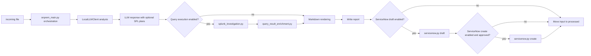

# Feature Enhancements Architecture

## Status

This document is the planning and architecture input for the next feature-enhancement block in `llm_notable_analysis_onprem_systemd`.

It is not the build-ready implementation contract. Locked implementation detail belongs in `../technical_specs/feature_enhancements_technical_spec.md`.

**Canonical roadmap:** cross-cutting enrichment, threat intel, ticketing breadth, orchestration posture, governance, observability, and AWS/on-prem **instantiation mappings** formerly scattered in repo-root `ONPREM_NOTABLE_ANALYSIS_ENHANCEMENTS.md` / `AWS_NOTABLE_ANALYSIS_ENHANCEMENTS.md` are consolidated below in **[Cross-cutting context roadmap (single source)](#cross-cutting-context-roadmap-single-source)** plus **[Deployment instantiation (On-prem vs AWS)](#deployment-instantiation-on-prem-vs-aws)**. Those markdown files intentionally defer here to avoid divergence.

## Purpose

Define the minimal on-prem architecture for adding optional read-only investigation, query-result enrichment, optional query-result interpretation, and ServiceNow ticketing support to the current `systemd` analyzer.

This architecture answers:

- what changes are allowed around the current file-drop analyzer
- which new behavior is flag-gated and off by default
- which code should stay in existing modules
- which small new modules are justified
- how to avoid copying the more abstract `updated_notable_analysis` design

## Scope

### In scope

- Splunk MCP read-only query execution
- Splunk REST read-only query execution for investigation queries
- deterministic query-result report enrichment
- optional bounded LLM interpretation of deterministic query results
- ServiceNow incident draft creation
- ServiceNow incident create with explicit approval
- light extraction of SPL generation helpers from `local_llm_client.py`
- parity updates for `onprem_main_nonsdk.py` and `local_llm_client_nonsdk.py`
- optional tool-call structured-output mode for local vLLM responses
- env flag additions in the existing config style
- deterministic unit tests with fake Splunk and ServiceNow responses

### Out of scope

- replacing the current `onprem_service` runtime shape
- adding capability profiles, customer bundles, registries, shared cores, or plugin systems
- building generic SIEM or ticketing abstractions
- changing the existing RAG implementation beyond compatibility with enriched reports
- making live Splunk or ServiceNow calls in tests
- enabling query execution or ServiceNow write by default

## Current Baseline

The current service:

- reads `.json` and `.txt` files from `INCOMING_DIR`
- sends one structured prompt to the local LLM client
- optionally adds RAG/SOC context with `RAG_ENABLED`
- when `SPL_QUERY_GENERATION_ENABLED=true`, runs a second bounded LLM call for SPL query fields using the alert, the six hypotheses, optional **`SOC_OPERATIONAL_CONTEXT`**, and optional **`SPL_QUERY_GROUNDING_CONTEXT`** (`SPL_QUERY_RAG_ENABLED=true`)
- validates and normalizes the LLM response
- renders markdown to `REPORT_DIR`
- optionally writes markdown back to Splunk notable comments with `SPLUNK_SINK_ENABLED`
- moves successful files to `PROCESSED_DIR`
- moves failed files to `QUARANTINE_DIR`

When **`INVESTIGATION_QUERY_EXECUTION_ENABLED=false`** (default): the analyzer does **not** execute generated SPL against Splunk, and does **not** run deterministic query-result enrichment. When **`QUERY_RESULT_INTERPRETATION_ENABLED=false`** (default): executed query results remain deterministic-only in markdown. When **`SERVICENOW_*` drafts/create flags** are unset (default): it does **not** build incidents or POST to ServiceNow. When turned on with validated config, Splunk MCP/REST execution, deterministic `query_result` enrichment (see bounded policies above), optional bounded query-result interpretation, ServiceNow draft, and approval-gated create follow the Locked Runtime Shape.

## Locked Design Style

Keep the current direct modular style:

- use simple env flags
- keep `onprem_main.py` and `onprem_main_nonsdk.py` focused on orchestration
- add files only when the current module would become harder to read or test
- keep modules concrete to this app and these features
- prefer plain functions and dataclasses over framework-style interfaces
- do not introduce a shared core, registry, plugin system, generic adapter framework, capability profile model, or customer bundle model

Query-result enrichment does not need its own flag. If query execution is enabled and returns results, enrichment runs automatically before markdown rendering.

## Locked Runtime Shape

Default runtime shape remains:

```text
file drop -> parse input -> LLM analysis -> markdown report -> processed/quarantine
```

Enhanced runtime shape when optional flags are enabled:



## Locked Decisions

- Splunk MCP uses the smallest concrete shape: an injected object with `run_search(payload: dict) -> dict`.
- ServiceNow v1 uses the standard Incident Table API: `POST {SERVICENOW_BASE_URL}{SERVICENOW_CREATE_PATH}`.
- ServiceNow v1 uses bearer token auth from `SERVICENOW_API_TOKEN`.
- ServiceNow v1 writes standard incident fields only; the app does not create custom ServiceNow fields.
- Query execution may run one generated SPL query per hypothesis, up to 6 queries per alert.
- Query execution may run with bounded parallelism, defaulting to 3 concurrent searches.
- Query-result enrichment is part of query execution and does not get a separate flag.
- Query-result interpretation is a separate optional third LLM call controlled by `QUERY_RESULT_INTERPRETATION_ENABLED`; it never changes deterministic query facts or existing confidence scores.
- ServiceNow create approval comes from the incoming payload, not config.
- Local report metadata records ServiceNow draft/create status even when create is skipped, denied, or fails.
- Local structured-output mode is flag-gated and defaults to prompt-json.
- Tool-call mode falls back to prompt-json behavior for a request when tool-call parsing fails.

## Architecture Boundary

### `onprem_main.py` and `onprem_main_nonsdk.py` own

- current service loop wiring
- calling analysis, enrichment, rendering, sinks, and archive/quarantine steps
- reading config flags from `Config`
- choosing whether optional steps run
- preserving existing processed/quarantine behavior

### `local_llm_client.py` and `local_llm_client_nonsdk.py` own

- LLM transport call through the SDK client
- RAG provider setup and context retrieval
- prompt assembly
- repair loop
- TTP filtering
- top-level metadata annotation

### New modules own

- `spl_query_generation.py`: SPL prompt rules, SPL field validation, and SPL field normalization or suppression helpers
- `splunk_investigation.py`: read-only SPL policy checks, REST execution, MCP execution, and normalized query-result output
- `query_result_enrichment.py`: deterministic enrichment of the existing LLM response with query-result evidence
- `servicenow.py`: ServiceNow incident draft creation, create approval check, create request, and response normalization

### New modules must not own

- the service loop
- broad workflow orchestration
- generic adapter registration
- customer-specific routing systems
- future-vendor abstractions

## Light Extraction From `local_llm_client.py`

`local_llm_client.py` currently owns many jobs:

- LLM transport
- prompt assembly
- RAG setup and context retrieval
- prompt doctrine text
- SPL generation instructions
- model-output parsing
- output normalization
- schema and content validation
- SPL field validation
- repair prompting
- TTP filtering
- metadata annotation

Only the most self-contained SPL generation pieces should move first, plus the bounded second-call prompt and merge helper:

- `SPL_QUERY_GENERATION_RULES`
- SPL query field names and allowed strategies
- SPL query contract validation
- SPL field normalization or suppression helpers
- SPL-only prompt builder and deterministic merge-by-position helper

General LLM response validation can stay in `local_llm_client.py` unless a later diff makes that file harder to read.

`local_llm_client_nonsdk.py` should keep parity with this SPL split behavior:

- base analysis call remains separate from SPL-generation call
- SPL-only call uses the same bounded prompt contract and merge-by-position behavior
- base analysis continues even when SPL generation is unavailable

## SPL query generation & SPL grounding (canonical implementation plans)

This section **supersedes** the former standalone files `docs/planning/SPL_QUERY_GENERATION_IMPLEMENTATION_PLAN.md` and `docs/planning/SPL_QUERY_RAG_GROUNDING_IMPLEMENTATION_PLAN.md` (removed to avoid duplication). All SPL-query product intent—including **future AWS parity for `s3_notable_pipeline`**—should evolve here and in **`../technical_specs/feature_enhancements_technical_spec.md`**; **on‑prem filesystem paths below are illustrative host paths**, while AWS equivalents are Bedrock KB, OpenSearch, Aurora/pgvector, or a retrieval sidecar—not literal copies of `/opt/...`.

### SPL query generation (`SPL_QUERY_GENERATION_ENABLED`)

**Purpose:** Extend analyst output from competing hypotheses alone to hypotheses **plus** one **executable** primary SPL query per hypothesis (6 queries per alert), without Phantom/SOAR-specific coupling or inventing Splunk-environment tokens without explicit context.

**Approved design:**

- Exactly **six** hypotheses (3 benign, 3 adversary); exactly **one** `primary_spl_query` each when the flag is on.
- `query_strategy` is **`resolve_unknown`** or **`check_contradiction`** only (`expand_scope` is not used).
- Alert remains **format-agnostic** raw JSON/text for prompts; **no hidden normalization layer** before prompt assembly.
- **Feature flag:** `SPL_QUERY_GENERATION_ENABLED=false` default; when off—prompt omit SPL fields; normalize/strip SPL fields from responses; validators do **not** require them; markdown omits SPL subsections.

**Hypothesis-level fields when enabled:**

- `query_strategy`, `primary_spl_query`, `why_this_query`, `supports_if`, `weakens_if` (alongside existing `best_pivots`; pivots remain human direction, SPL remains executable).

**Validation / repair locked behavior:**

- If contract violation: use existing repair path; **if repair still fails**—do **not** fabricate hypotheses or queries—omit SPL rendering for that alert only; preserve rest of validated analysis.

**Anti-hallucination (prompt + validation):**

- No invented indexes, sourcetypes, CIM/datamodel names, macros; alert JSON keys are not assumed to be Splunk field names unless validated.
- Disallow placeholders (`<INDEX>`, `<SOURCETYPE>`, …) and pseudo-queries (`search …` scaffolding); prefer generic-yet-real SPL from alert-visible facts unless environment context explicitly allows otherwise.

**Environmental context (Splunk facts for SPL):**

- Indexes, sourcetypes, CIM/datamodel refs, macros, approved saved searches ground the optional **`SPL_QUERY_GROUNDING_CONTEXT`** path when `SPL_QUERY_RAG_ENABLED=true` (see **SPL RAG grounding** below). General `RAG_ENABLED` remains separate.

**Markdown:** Query block under **each hypothesis** (fenced SPL); SPL-unavailable short note after failed repair—not silent omission without explanation where helpful.

**On‑prem v1 implementation surface (historic target files):**

- `onprem_service/config.py`, `onprem_service/local_llm_client.py`, `onprem_service/local_llm_client_nonsdk.py`, `onprem_service/spl_query_generation.py`, `onprem_service/spl_query_grounding.py`, `onprem_service/markdown_generator.py`, `config.env.example`, tests mirroring **`test_spl_query_generation.py`** / **`test_markdown_generator.py`** contract coverage.

**Out of explicit v1 plan scope:**

- `freeform_llm_client.py` paths, playbook-only glue, SPL **execution** in Splunk (**separate bounded investigation executor** documented under Read-only Splunk investigation).

---

### SPL RAG grounding (`SPL_QUERY_RAG_ENABLED`)

**Purpose (optional shipped mode beyond stateless SPL gen):** When both `SPL_QUERY_GENERATION_ENABLED` and **`SPL_QUERY_RAG_ENABLED`** are true—retrieve from a **Splunk-focused corpus**, then pass **`SPL_QUERY_GROUNDING_CONTEXT`** into the bounded SPL-generation call. The output can include **explicit KB section references** proving environment-specific tokens.

**Effective flag matrix:**

| `SPL_QUERY_GENERATION_ENABLED` | `SPL_QUERY_RAG_ENABLED` | Behavior |
|---|---|---|
| `false` | any | SPL fields off entirely; SPL RAG meaningless |
| `true` | `false` | Stateless SPL-generation path only; generated SPL may not assume environment-specific indexes, sourcetypes, macros, or datamodels |
| `true` | `true` | Retrieve → **`SPL_QUERY_GROUNDING_CONTEXT`** → bounded grounded-SPL inference with **per-hypothesis grounding refs** when SPL KB material is used |

**Retrieval corpus (illustrative on‑prem hosting):**

- Source documents (e.g. `.docx`, `.txt`): `knowledge_base/spl_query_source_docs/` (example host root: **`/opt/llm-notable-analysis/knowledge_base/spl_query_source_docs`**).

- Runtime backend: the existing PostgreSQL FTS + pgvector retrieval machinery,
  using a separate table configured by
  **`SPL_QUERY_RAG_POSTGRES_CHUNKS_TABLE`** (default `spl_query_chunks`).
  Ingest artifacts live under **`SPL_QUERY_RAG_INDEX_DIR`**. Optional tuning
  knobs include `SPL_QUERY_RAG_MAX_SNIPPETS`,
  `SPL_QUERY_RAG_CONTEXT_BUDGET_CHARS`, and
  `SPL_QUERY_RAG_FAILURE_MODE`.

- Retrieved content spans index inventories, sourcetype catalogs, macros, saved-search exemplars, field-mapping notes—themes already listed above.

**Architectural separation from general SOC RAG:**

- Do **not** overload `SOC_OPERATIONAL_CONTEXT`; use parallel
  **`SPL_QUERY_GROUNDING_CONTEXT`** helpers/renderers backed by the SPL-focused
  Postgres table.

**Suggested extra hypothesis payload fields:**

- `primary_spl_query_grounding_refs[]` `{ "source_file", "section_path" }`.
- `primary_spl_query_grounding_summary` (future optional linkage narrative).

User-visible citations come from chunk **`source_file` + `section_path`**
metadata—**never** cite raw vector IDs as prose truth.

**Relaxed hallucination gates when grounded:**

- Splunk-environment tokens permissible **only** if present in grounding snippets **or** explicit alert facts—validator cross-checks claims vs retrieved corpus.

**Failures:** If grounding-required retrieval or validation fails, default to
**suppress grounded SPL/report subsection** posture. Operators may explicitly set
`SPL_QUERY_RAG_FAILURE_MODE=fallback_to_ungrounded` to allow alert-only SPL
generation during SPL KB outages.

**Implemented boundaries:**

- Config + dual-table Postgres plumbing.
- Prompt contract with `SPL_QUERY_GROUNDING_CONTEXT`.
- Validators enforcing token allowance against alert text plus retrieved SPL
  context.
- Deterministic `primary_spl_query_grounding_refs` for queries that use SPL KB
  material.

**Future (optional): observability without markdown bloat.** If a deployment
needs stronger **audit or SIEM correlation** for SPL grounding, a follow-on
change can add **structured log lines** (e.g., per-alert summary of grounding
availability, ref counts, or redacted `source_file` / `section_path` lists) and/or
**additional fields on the analysis `metadata` object** beside the existing
`spl_query_rag_*` flags. That path keeps **human-facing markdown** (and Splunk
comment writeback) lean: provenance stays in machine-oriented channels unless
policy explicitly requires citations in the narrative report.

**Corpus authoring guidance:** Maintain clearly headed sections (“Authentication › Failed Logons”, …) enabling meaningful provenance—not monolithic unstructured dumps.

**AWS instantiation note:** Re-host **corpus semantics** inside Bedrock Knowledge Bases, OpenSearch, etc.; enforce **same trust boundaries**, citation metadata shape, validator contracts.

---

### Future enhancements explicitly not required for initial SPL milestones

Across both halves of this roadmap:

- automatic execution/validation loops against Splunk without policy executor
- open-ended retrieval agents
- `expand_scope` / readiness ladder metadata
- raw retrieval excerpt dumps in markdown without policy

## Feature Boundaries

### Read-only Splunk investigation

Purpose:

- execute bounded read-only SPL tied to generated hypothesis query plans
- return normalized query-result evidence

Controls:

- disabled by default
- requires `INVESTIGATION_QUERY_EXECUTION_ENABLED=true`
- executor selected by `INVESTIGATION_QUERY_EXECUTOR=rest|mcp`
- runs at most `INVESTIGATION_MAX_QUERIES_PER_ALERT` generated queries per alert
- runs at most `INVESTIGATION_MAX_CONCURRENT_QUERIES` searches concurrently
- query must pass deterministic policy before execution
- query must include explicit index, time range, max rows, and timeout

RAG guidance:

- SPL generation may attach **`SOC_OPERATIONAL_CONTEXT`** when `RAG_ENABLED=true`; that block informs analyst wording but **does not by itself authorize** environment-specific SPL tokens (`index=`, sourcetypes, macros, datamodel names).
- **Grounded SPL tokens** align with deterministic validation against the alert text and **`SPL_QUERY_GROUNDING_CONTEXT`** when `SPL_QUERY_RAG_ENABLED=true`.
- Retrieval and SPL grounding text remain advisory and must not be treated as direct alert evidence.

### Query-result enrichment

Purpose:

- add query-result evidence to the existing LLM response before markdown rendering
- annotate hypotheses with support or gaps based on query result metadata

Rules:

- deterministic code only
- no LLM pass after Splunk/query execution unless `QUERY_RESULT_INTERPRETATION_ENABLED=true`
- optional interpretation ingests **only** compressed query evidence and produces a separate `query_result_interpretation` section; baseline remains code-only enrichment
- `confidence_delta` is an interpretation-only label (`increase`, `decrease`, `unchanged`, `unknown`) and never mutates `alert_reconciliation.confidence`, ATT&CK scores, query status, result counts, or hypothesis ordering
- query results remain separate from direct alert facts and RAG context
- enriched payload may include `query_result_section` for markdown rendering
- interpreted payload may include `query_result_interpretation` for markdown rendering after the deterministic `Query Results` section

### ServiceNow incident draft

Purpose:

- build a bounded ServiceNow incident payload from the validated report
- produce a draft object with no downstream side effect

Controls:

- disabled by default
- requires the `ticket_draft` or `action_gated` capability profile
- required routing fields must be configured
- summary and body size limits must be enforced

The draft should target standard ServiceNow Incident fields:

- `short_description`
- `description`
- `assignment_group`
- `category`
- `subcategory`
- `impact`
- `urgency`
- `correlation_id`
- `correlation_display`
- `work_notes`

### ServiceNow incident create

Purpose:

- create a ServiceNow incident from an approved draft

Controls:

- disabled by default
- requires the `action_gated` capability profile
- requires an incident draft
- requires explicit approval metadata
- fails closed when approval is missing

Approval comes from the incoming alert payload:

```json
{
  "servicenow_create_approval": {
    "approved": true,
    "approved_by": "analyst@example.com",
    "approval_ref": "SNOW-CHANGE-123",
    "approved_at": "2026-04-27T19:40:00Z"
  }
}
```

Local report payload may include `servicenow_section` with draft and create statuses, incident identifiers, and approval metadata when available.

## Config Contract

New flags should follow the existing `config.env.example` and `Config` style:

- `INVESTIGATION_QUERY_EXECUTION_ENABLED=false`
- `INVESTIGATION_QUERY_EXECUTOR=rest`
- `INVESTIGATION_MAX_QUERIES_PER_ALERT=6`
- `INVESTIGATION_MAX_CONCURRENT_QUERIES=3`
- `QUERY_RESULT_INTERPRETATION_ENABLED=false`
- `QUERY_RESULT_INTERPRETATION_CONTEXT_BUDGET_CHARS=4000`
- `QUERY_RESULT_INTERPRETATION_MAX_SAMPLE_ROWS=3`
- `SPLUNK_SEARCH_ENDPOINT_PATH=/services/search/jobs/oneshot`
- `SPLUNK_SEARCH_ALLOWED_INDEXES=main,notable,risk`
- `SPLUNK_SEARCH_ALLOWED_COMMANDS=search,stats,table,fields,where,head`
- `SPLUNK_SEARCH_DENIED_COMMANDS=delete,collect,outputlookup,sendemail,map,rest,script,dbxquery`
- `SPLUNK_SEARCH_MAX_TIME_RANGE=24h`
- `SPLUNK_SEARCH_MAX_ROWS=100`
- `SPLUNK_SEARCH_TIMEOUT_SECONDS=20`
- `SPLUNK_MCP_TOOL_NAME=splunk_search`
- `SPL_QUERY_GENERATION_ENABLED=false` (bounded second-call SPL field generation—see section **SPL query generation & SPL grounding (canonical implementation plans)** earlier in this document)
- `SPL_QUERY_RAG_ENABLED=false` plus `SPL_QUERY_RAG_SOURCE_DIR`, `SPL_QUERY_RAG_INDEX_DIR`, `SPL_QUERY_RAG_POSTGRES_CHUNKS_TABLE`, snippet/budget knobs, and `SPL_QUERY_RAG_FAILURE_MODE` for the optional SPL-focused KB path
- `SERVICENOW_DRAFT_ENABLED=false`
- `SERVICENOW_CREATE_ENABLED=false`
- `SERVICENOW_CREATE_REQUIRES_APPROVAL=true`
- `SERVICENOW_BASE_URL=https://your-instance.service-now.com`
- `SERVICENOW_CREATE_PATH=/api/now/table/incident`
- `SERVICENOW_API_TOKEN=`
- `SERVICENOW_ASSIGNMENT_GROUP=`
- `SERVICENOW_TIMEOUT_SECONDS=15`
- `LLM_STRUCTURED_OUTPUT_MODE=prompt_json`

Do not add `QUERY_RESULT_ENRICHMENT_ENABLED`.

## Failure Behavior

- Policy denial: skip execution, record structured denial in metadata, continue report.
- Splunk query execution failure: record query failure metadata, continue report.
- Query-result enrichment failure: quarantine only if the report would become malformed.
- Query-result interpretation failure: keep deterministic query results, record metadata reason, omit interpretation.
- ServiceNow draft failure: report still writes; metadata records draft error.
- ServiceNow create disabled or approval missing: report still writes; metadata records skipped or denied status.
- ServiceNow create failure: report still writes; metadata records create error.
- Missing credentials with enabled capability: fail closed for that optional capability.

## Security and Operations Notes

- Never execute generated SPL without deterministic validation.
- Keep query execution read-only.
- Keep time range, row count, and timeout bounded.
- Do not log Splunk or ServiceNow tokens.
- Do not store raw Splunk result rows in report metadata by default.
- Keep deterministic `Query Results` in markdown when interpretation is enabled; the LLM interpretation is additive and labeled as inference.
- Treat `confidence_delta` as prose guidance only, not a score update.
- Keep ServiceNow create behind explicit approval metadata.
- Use HTTPS for ServiceNow.
- Do not log ServiceNow bearer tokens or full auth headers.
- Keep ServiceNow output in standard Incident records, not custom tables or custom fields for v1.
- Preserve the existing default behavior when all new flags are unset.

## Known Decisions

- Query-result enrichment is part of query execution, not a separate feature flag.
- Query-result interpretation is separately flag-gated because it adds an LLM call and inference text.
- ServiceNow draft and create live in one concrete `servicenow.py` module unless that file becomes hard to read.
- Splunk REST and MCP execution live in one concrete `splunk_investigation.py` module unless that file becomes hard to read.
- SPL generation extraction is allowed because it reduces pressure on `local_llm_client.py` without changing the app shape.
- Query execution is bounded to 6 generated hypothesis queries per alert and 3 concurrent searches by default.
- ServiceNow incidents are created in the standard `incident` table and routed with `assignment_group`.
- ServiceNow create approval is payload-level approval for a specific alert, not broad config approval.

## Open Decisions Before Technical Spec Finalization

- none for the current planning block

## Cross-cutting context roadmap (single source)

This section is the **single source of truth** for backlog and adjacent capabilities that extend context around the notifier workflow. Items here may be partially implemented, flagged off, or aspirational—they are **not** all in the bounded implementation scope of **[Scope](#scope)** unless explicitly migrated into the technical spec after review.

Roadmap grouping is capability-based; **[Deployment instantiation](#deployment-instantiation-on-prem-vs-aws)** maps the same bullets to hosting patterns.

### Threat intelligence enrichment adapters

Bring normalized vendor or internal enrichment **before** (or beside) the structured LLM call, strictly separated from alert facts in prompts and payloads.

- Typical sources: VirusTotal, AbuseIPDB, GreyNoise, URLhaus, MISP, AlienVault OTX, commercial feeds, **internal TI** APIs.
- **On‑prem instantiation:** outbound HTTPS adapters on the analyzer host or a sidecar; host secrets stores for API keys; optional local cache (filesystem/redis) keyed by observable + TTL.
- **AWS instantiation:** outbound HTTPS from Lambda or VPC-attached task; Secrets Manager / SSM for secrets; DynamoDB or S3-backed TTL cache keyed by observable for quota and rerun stability.

Bounded behavior everywhere: timeouts, backoff, rate-limit handling, deterministic normalization into **`enrichment`**, structured **skipped | failed | rate_limited**, and observability correlation IDs **without logging secrets or bulk alert bodies**.

### VirusTotal adapter pattern (canonical)

Governance-first: honor org rules on third-party telemetry; ship **explicit observables** only (IPs, hashes, domains, URLs policy allows)—never arbitrary full notable blobs unless approved.

**Placement:**

- Prefer after deterministic IOC extraction from the artifact (same placement on **on‑prem systemd** analyzer and **`s3_notable_pipeline` Lambda** workflows).
- **Default-off** behind config; optional Step Functions branch on AWS when orchestration separates enrichment from the primary Bedrock call.

**Behavior:**

| Concern | On‑prem | AWS |
|---------|---------|-----|
| API key | host secret store | Secrets Manager / SSM |
| Transport | thin HTTPS client (+ optional sidecar) | HTTPS from Lambda (or VPC egress path) |
| Resilience | timeouts, backoff, bounded concurrency optional | timeouts, backoff, bounded concurrency |
| Output shape | normalized small `enrichment` object | same |
| Prompt contract | direct alert facts vs enrichment clearly separated | same |

### Investigative querying (beyond current Splunk block)

**Delivered concrete path:** bounded read-only SPL via Splunk MCP/REST (`splunk_investigation.py`), policies, deterministic row caps—see **[Read-only Splunk investigation](#read-only-splunk-investigation)** and **`query_result_enrichment.py`**.

**Roadmap / parity intent:**

- Same **deterministic summarize-then-merge** pattern for additional backends (e.g. **Elasticsearch**/Elastic SIEM equivalents) remains out of scoped modules until a deliberate design adds **another concrete adapter**, not an abstract SIEM façade.
- **AWS-native read-only querying:** bounded SQL or parameterized queries over Security Lake / Athena over curated buckets; parity with Splunk caps: scanned-byte limits, time windows, aggregates-first, deterministic merge—not raw dump into model context unless policy allows.

### Asset, identity, and ownership context

Enrich downstream reasoning with authoritative **advisory** context (never asserted as observable alert facts unless echoed from the notable).

- **On‑prem / enterprise:** CMDB, IdP/group membership, owner, workload criticality, business unit, VIP or admin tagging.
- **AWS:** AWS account Id, Organizations OU, resolver attributes (tags), environment/classification labels, workload owner/contact, assessed exposure posture where available (**Config**, **IAM Access Analyzer** signals, VPC exposure context as policy allows).

### Case history retrieval

Retrieve **prior** similar notables, analyst disposition, tuning notes, and remediation outcomes as advisory retrieval—bounded count, TTL, ownership checks. Optional durable store differs by deployment (**on‑prem** DB/files vs **Dynamo/S3** summaries on AWS).

### Structured investigation planner (pattern)

Separate **planned checks** from **allowed executions**: LLM may propose next checks; deterministic policy **allowlists** which integrations, queries, and budget classes may run—aligned with SOC workflow maturity targets (bounded tools, no open-ended autonomy).

### SOC-defined SOAR playbook invocation (roadmap)

**Goal:** During bounded investigation—not only at upstream ingest—invoke **Splunk SOAR playbooks authored and maintained by the SOC**, using a curated catalog rather than ad hoc playbook names invented by the model.

**Distinct from existing patterns:**

| Pattern | Role |
|---------|------|
| Phantom ingest templates (`soar_playbook/`, `s3_notable_pipeline/scripts/soar_playbook/`) | Upstream delivery: package a notable and drop to analyzer/S3 |
| `containment_playbook` in LLM JSON | Generated analyst guidance text; no SOAR API call |
| `LLM_STRUCTURED_OUTPUT_MODE=tool_call` | Local LLM JSON shaping for analysis/SPL fields; not SOAR execution |

**Proposed surface (open to refinement):** expose registered playbooks to the investigation planner as **LLM tool/function definitions**—one tool per allowlisted playbook or a single `invoke_soar_playbook` tool with an enum of SOC-registered IDs. The model may **propose** a run with structured inputs derived from alert context; **deterministic policy** decides whether that proposal is permitted, and a **thin SOAR adapter** performs the API call.

**Preferred architecture (planner + gate + adapter, not raw tool autonomy):**

1. **SOC catalog** — versioned registry (config or small data file) of playbook id/name, risk class (`read_only` | `writeback` | `action`), required inputs schema, and optional alert-class routing hints. Only catalog entries may be invoked.
2. **Proposal** — LLM tool call, deterministic router, or analyst UI selection produces a normalized `playbook_run_request` (playbook id, container/event refs, bounded parameter map).
3. **Policy gate** — allowlists by playbook id, risk class, time window, rate budget, and tenant scope; **fail closed** on unknown playbooks or out-of-policy parameters.
4. **Approval boundary** — `writeback` and `action` playbooks require explicit approval metadata in the payload (same semantics as ServiceNow create approval) unless a narrowly scoped auto-run profile is deliberately enabled.
5. **Adapter** — thin HTTPS client to Splunk SOAR REST (run playbook / add work item / pass inputs); normalize outcomes into `enrichment` or `recommended_actions` with run id, status, and errors—never merge adapter output into direct alert facts.
6. **Observability** — log playbook id, correlation id, policy decision, approval state, and terminal status; omit secrets and bulk container bodies.

**Alternative designs worth evaluating before implementation:**

- **Approval-first:** LLM or planner only *recommends* a playbook; analyst approves in payload or UI; adapter runs after approval (simplest operational posture).
- **Deterministic routing only:** no LLM playbook selection—code maps alert class / enrichment signals to catalog entries; LLM summarizes outcomes only.
- **Async handoff:** adapter enqueues a SOAR work item and returns immediately; poll or webhook for completion (better for long-running playbooks).

**Instantiation:**

| Concern | On‑prem | AWS |
|---------|---------|-----|
| Catalog storage | host config / versioned file under operator control | SSM Parameter Store, S3 config object, or DynamoDB catalog row |
| Credentials | host secret store for SOAR API token | Secrets Manager |
| Transport | analyzer host or sidecar egress to SOAR | Lambda/Step Functions branch with VPC egress if required |
| Orchestration hook | optional post-analysis step in service loop | optional Step Functions branch after primary Bedrock pass |
| Default | **off**; no playbook runs without explicit enable + catalog + policy | same |

**Status:** roadmap only—not in the bounded **[Scope](#scope)** or locked technical spec until catalog schema, approval matrix, and adapter contract are reviewed.

### Evidence layering and structured output taxonomy (aspirational alignment)

Production analyzers currently use schemas such as `evidence_vs_inference`, competing hypotheses, and reconciliation objects. Target alignment for enrichment-heavy workflows emphasizes explicit lanes:

| Lane | Intended content |
|------|------------------|
| `direct_evidence` | verbatim or strict field-derived facts present in authoritative payload |
| `enrichment` | normalized adapter output (TI, CMDB query summary, deterministic query rollup) with source lineage |
| `inference` | model or analyst extrapolation |
| `unknowns` | explicit gaps |
| `recommended_actions` | bounded next steps |

Migrations evolve **validators and markdown** jointly; specs must not fracture without a versioning story.

### Approval-gated writeback and ticketing breadth

**In current implementation contract:** ServiceNow Incident **draft + approval-gated create** (`servicenow.py`). **Roadmap parity:** analogous patterns for **Jira**, generic **SOAR** tickets, Archer-style GRC payloads—thin adapters, deterministic drafts, mandatory approval metadata before consequential POSTs **by default**.

**AWS:** analogous **approval-gated** patterns for tagging, Security Hub suppression/finding edits, ticketing webhooks—the same approval boundary semantics; implementation lives in Lambda/Step Functions **only** behind explicit gates.

### RAG and runbooks (advisory context)

Operational SOPs, detection notes, SPL field catalogs, escalation doctrine—retrieve as **SOC advisory** text when `RAG_ENABLED`, Bedrock Knowledge Bases, or equivalent retrieval is on. Never elevate retrieved wording to factual alert assertions without matching observable fields.

### Analyst feedback loop & evaluation

Structured capture of disposition, corrections, TP/FP rationales for replay, retrieval, tuning metrics, regression evaluation—paired with deterministic batch replay (**batch harness** locally or **`s3_notable_pipeline`/Step Functions batches**).

### Deterministic preprocessing and risk cues

Prefer **severity or priority signals computed in code** (alert class, enrichment presence, anomaly scores, policy-hit counts) feeding the prompt as structured fields; LLM interprets—not invents—these aggregates.

### Detection and rule corpus context

Expose detection name/id, authored logic summary, ATT&CK links, historically known FPs/tuning narratives as advisory blocks when sources exist.

### Observability, audit posture, degraded mode

Record model id, prompt versioning, policy denies, adapter outcomes, timings, approvals—omit secrets. Explicit operational states when Bedrock/runtime, Splunk, RAG indexer, Athena, SNOW, TI, or SOAR are unavailable, capped, skipped, or policy-denied.

### Cost & quota envelopes

Envelope Bedrock token spend, Athena bytes scanned, Splunk concurrency, enrichment fan-out, Lambda duration/step retries—matching production guardrail defaults to policy.

### Quality and hallucination hygiene

Validated outputs cite only observable lanes: **direct_alert**, **adapter_enrichment**, **advisory_retrieval**, or explicit **unknown**. Third-party enrichment facts must reconcile to canonical API-derived fields.

### SPL investigation and inference call layering (baseline vs optional synthesis)

Mirrors consolidated guidance shared with **`s3_notable_pipeline`** parity narratives:

| Pass | Typical role |
|------|----------------|
| 1 | Full structured notable analysis |
| 2 | Optional SPL **field/query text** generation (when `SPL_QUERY_GENERATION_ENABLED` or parity flag) |
| Execute | Bounded read-only search; deterministic compress/enrich (**no mandatory LLM** on this rim) |
| 3 (**optional backlog**) | Additional bounded inference pass revising prose **only from compressed query evidence plus prior structured artifact** |

---

## Deployment instantiation (On-prem vs AWS)

Reference table for roadmap bullets above; **architecture truth** stays in prose sections—not duplicated in scattered repo-root lists.

| Cross-cutting roadmap area | Primary on‑prem pattern | Primary AWS (`s3_notable_pipeline` / Step Functions parity) pattern |
|---|---|---|
| TI adapters | systemd host egress + cache dir | Lambda egress + Dynamo/S3 TTL cache |
| Bounded investigation | Splunk MCP/REST (implemented when enabled) | Security Lake / Athena + similar policy envelope when built |
| RAG/runbooks | `RAG_*` paths + embeddings | KB / OpenSearch / pgvector-backed retrieve |
| Case history | local store / corp DB abstraction | DynamoDB / Aurora / curated S3 |
| Orchestration | single service loop (+ optional playbook) | EventBridge → Lambda; optional Step Functions for fan-out retries |
| Writeback approvals | SNOW payload approvals (implemented paths) | same semantics + IAM-scoped gated AWS actions |
| SOC SOAR playbook runs | catalog + policy gate + thin SOAR adapter on analyzer host | catalog in SSM/S3/Dynamo + gated Lambda/Step Functions branch |
| Replay / caching | scripted batch + disk artifacts | DynamoDB/S3 envelopes + versioning |

---

## Build-Readiness Gate

Architecture is ready to feed the technical spec when:

- all new behavior remains disabled by default
- the module plan stays concrete and minimal
- query execution and ServiceNow create have explicit validation or approval boundaries
- config values are named and scoped
- failure behavior is defined for denied, skipped, malformed, and external-error paths
- tests can be written without live Splunk, MCP, or ServiceNow systems

## One-Line Summary

Add optional read-only Splunk investigation, deterministic query-result enrichment, and ServiceNow draft/create support to the existing on-prem analyzer through simple env flags and a few concrete helper modules, without introducing a shared core, profiles, bundles, registries, or plugin-style architecture.
