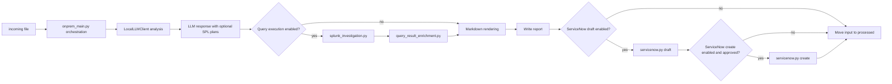

# Feature Enhancements Architecture

## Status

This document is the planning and architecture input for the next feature-enhancement block in `llm_notable_analysis_onprem_systemd`.

It is not the build-ready implementation contract. Locked implementation detail belongs in `../technical_specs/feature_enhancements_technical_spec.md`.

## Purpose

Define the minimal on-prem architecture for adding optional read-only investigation, query-result enrichment, and ServiceNow ticketing support to the current `systemd` analyzer.

This architecture answers:

- what changes are allowed around the current file-drop analyzer
- which new behavior is flag-gated and off by default
- which code should stay in existing modules
- which small new modules are justified
- how to avoid copying the more abstract `updated_notable_analysis` design

## Scope

### In scope

- Splunk MCP read-only query execution
- Splunk REST read-only query execution for investigation queries
- deterministic query-result report enrichment
- ServiceNow incident draft creation
- ServiceNow incident create with explicit approval
- light extraction of SPL generation helpers from `local_llm_client.py`
- parity updates for `onprem_main_nonsdk.py` and `local_llm_client_nonsdk.py`
- env flag additions in the existing config style
- deterministic unit tests with fake Splunk and ServiceNow responses

### Out of scope

- replacing the current `onprem_service` runtime shape
- adding capability profiles, customer bundles, registries, shared cores, or plugin systems
- building generic SIEM or ticketing abstractions
- changing the existing RAG implementation beyond compatibility with enriched reports
- making live Splunk or ServiceNow calls in tests
- enabling query execution or ServiceNow write by default

## Current Baseline

The current service:

- reads `.json` and `.txt` files from `INCOMING_DIR`
- sends one structured prompt to the local LLM client
- optionally adds RAG/SOC context with `RAG_ENABLED`
- when `SPL_QUERY_GENERATION_ENABLED=true`, runs a second bounded LLM call for SPL query fields using the alert, the six hypotheses, and SOC/RAG context
- validates and normalizes the LLM response
- renders markdown to `REPORT_DIR`
- optionally writes markdown back to Splunk notable comments with `SPLUNK_SINK_ENABLED`
- moves successful files to `PROCESSED_DIR`
- moves failed files to `QUARANTINE_DIR`

The current service does not execute generated SPL, enrich reports with query results, create ServiceNow drafts, or create ServiceNow incidents.

## Locked Design Style

Keep the current direct modular style:

- use simple env flags
- keep `onprem_main.py` and `onprem_main_nonsdk.py` focused on orchestration
- add files only when the current module would become harder to read or test
- keep modules concrete to this app and these features
- prefer plain functions and dataclasses over framework-style interfaces
- do not introduce a shared core, registry, plugin system, generic adapter framework, capability profile model, or customer bundle model

Query-result enrichment does not need its own flag. If query execution is enabled and returns results, enrichment runs automatically before markdown rendering.

## Locked Runtime Shape

Default runtime shape remains:

```text
file drop -> parse input -> LLM analysis -> markdown report -> processed/quarantine
```

Enhanced runtime shape when optional flags are enabled:



## Locked Decisions

- Splunk MCP uses the smallest concrete shape: an injected object with `run_search(payload: dict) -> dict`.
- ServiceNow v1 uses the standard Incident Table API: `POST {SERVICENOW_BASE_URL}{SERVICENOW_CREATE_PATH}`.
- ServiceNow v1 uses bearer token auth from `SERVICENOW_API_TOKEN`.
- ServiceNow v1 writes standard incident fields only; the app does not create custom ServiceNow fields.
- Query execution may run one generated SPL query per hypothesis, up to 6 queries per alert.
- Query execution may run with bounded parallelism, defaulting to 3 concurrent searches.
- Query-result enrichment is part of query execution and does not get a separate flag.
- ServiceNow create approval comes from the incoming payload, not config.
- Local report metadata records ServiceNow draft/create status even when create is skipped, denied, or fails.

## Architecture Boundary

### `onprem_main.py` and `onprem_main_nonsdk.py` own

- current service loop wiring
- calling analysis, enrichment, rendering, sinks, and archive/quarantine steps
- reading config flags from `Config`
- choosing whether optional steps run
- preserving existing processed/quarantine behavior

### `local_llm_client.py` and `local_llm_client_nonsdk.py` own

- LLM transport call through the SDK client
- RAG provider setup and context retrieval
- prompt assembly
- repair loop
- TTP filtering
- top-level metadata annotation

### New modules own

- `spl_query_generation.py`: SPL prompt rules, SPL field validation, and SPL field normalization or suppression helpers
- `splunk_investigation.py`: read-only SPL policy checks, REST execution, MCP execution, and normalized query-result output
- `query_result_enrichment.py`: deterministic enrichment of the existing LLM response with query-result evidence
- `servicenow.py`: ServiceNow incident draft creation, create approval check, create request, and response normalization

### New modules must not own

- the service loop
- broad workflow orchestration
- generic adapter registration
- customer-specific routing systems
- future-vendor abstractions

## Light Extraction From `local_llm_client.py`

`local_llm_client.py` currently owns many jobs:

- LLM transport
- prompt assembly
- RAG setup and context retrieval
- prompt doctrine text
- SPL generation instructions
- model-output parsing
- output normalization
- schema and content validation
- SPL field validation
- repair prompting
- TTP filtering
- metadata annotation

Only the most self-contained SPL generation pieces should move first, plus the bounded second-call prompt and merge helper:

- `SPL_QUERY_GENERATION_RULES`
- SPL query field names and allowed strategies
- SPL query contract validation
- SPL field normalization or suppression helpers
- SPL-only prompt builder and deterministic merge-by-position helper

General LLM response validation can stay in `local_llm_client.py` unless a later diff makes that file harder to read.

`local_llm_client_nonsdk.py` should keep parity with this SPL split behavior:

- base analysis call remains separate from SPL-generation call
- SPL-only call uses the same bounded prompt contract and merge-by-position behavior
- base analysis continues even when SPL generation is unavailable

## Feature Boundaries

### Read-only Splunk investigation

Purpose:

- execute bounded read-only SPL tied to generated hypothesis query plans
- return normalized query-result evidence

Controls:

- disabled by default
- requires `INVESTIGATION_QUERY_EXECUTION_ENABLED=true`
- executor selected by `INVESTIGATION_QUERY_EXECUTOR=rest|mcp`
- runs at most `INVESTIGATION_MAX_QUERIES_PER_ALERT` generated queries per alert
- runs at most `INVESTIGATION_MAX_CONCURRENT_QUERIES` searches concurrently
- query must pass deterministic policy before execution
- query must include explicit index, time range, max rows, and timeout

RAG guidance:

- when `RAG_ENABLED=true`, query generation should use retrieved data dictionary context where available
- generated SPL may use RAG-grounded index names, sourcetypes, fields, macros, and query examples
- RAG context remains advisory and must not be treated as direct alert evidence

### Query-result enrichment

Purpose:

- add query-result evidence to the existing LLM response before markdown rendering
- annotate hypotheses with support or gaps based on query result metadata

Rules:

- deterministic code only
- no second LLM call for the first implementation
- query results remain separate from direct alert facts and RAG context
- enriched payload may include `query_result_section` for markdown rendering

### ServiceNow incident draft

Purpose:

- build a bounded ServiceNow incident payload from the validated report
- produce a draft object with no downstream side effect

Controls:

- disabled by default
- requires `SERVICENOW_DRAFT_ENABLED=true`
- required routing fields must be configured
- summary and body size limits must be enforced

The draft should target standard ServiceNow Incident fields:

- `short_description`
- `description`
- `assignment_group`
- `category`
- `subcategory`
- `impact`
- `urgency`
- `correlation_id`
- `correlation_display`
- `work_notes`

### ServiceNow incident create

Purpose:

- create a ServiceNow incident from an approved draft

Controls:

- disabled by default
- requires `SERVICENOW_CREATE_ENABLED=true`
- requires an incident draft
- requires explicit approval metadata
- fails closed when approval is missing

Approval comes from the incoming alert payload:

```json
{
  "servicenow_create_approval": {
    "approved": true,
    "approved_by": "analyst@example.com",
    "approval_ref": "SNOW-CHANGE-123",
    "approved_at": "2026-04-27T19:40:00Z"
  }
}
```

Local report payload may include `servicenow_section` with draft and create statuses, incident identifiers, and approval metadata when available.

## Config Contract

New flags should follow the existing `config.env.example` and `Config` style:

- `INVESTIGATION_QUERY_EXECUTION_ENABLED=false`
- `INVESTIGATION_QUERY_EXECUTOR=rest`
- `INVESTIGATION_MAX_QUERIES_PER_ALERT=6`
- `INVESTIGATION_MAX_CONCURRENT_QUERIES=3`
- `SPLUNK_SEARCH_ENDPOINT_PATH=/services/search/jobs/oneshot`
- `SPLUNK_SEARCH_ALLOWED_INDEXES=main,notable,risk`
- `SPLUNK_SEARCH_ALLOWED_COMMANDS=search,stats,table,fields,where,head`
- `SPLUNK_SEARCH_DENIED_COMMANDS=delete,collect,outputlookup,sendemail,map,rest,script,dbxquery`
- `SPLUNK_SEARCH_MAX_TIME_RANGE=24h`
- `SPLUNK_SEARCH_MAX_ROWS=100`
- `SPLUNK_SEARCH_TIMEOUT_SECONDS=20`
- `SPLUNK_MCP_TOOL_NAME=splunk_search`
- `SERVICENOW_DRAFT_ENABLED=false`
- `SERVICENOW_CREATE_ENABLED=false`
- `SERVICENOW_CREATE_REQUIRES_APPROVAL=true`
- `SERVICENOW_BASE_URL=https://your-instance.service-now.com`
- `SERVICENOW_CREATE_PATH=/api/now/table/incident`
- `SERVICENOW_API_TOKEN=`
- `SERVICENOW_ASSIGNMENT_GROUP=`
- `SERVICENOW_TIMEOUT_SECONDS=15`

Do not add `QUERY_RESULT_ENRICHMENT_ENABLED`.

## Failure Behavior

- Policy denial: skip execution, record structured denial in metadata, continue report.
- Splunk query execution failure: record query failure metadata, continue report.
- Query-result enrichment failure: quarantine only if the report would become malformed.
- ServiceNow draft failure: report still writes; metadata records draft error.
- ServiceNow create disabled or approval missing: report still writes; metadata records skipped or denied status.
- ServiceNow create failure: report still writes; metadata records create error.
- Missing credentials with enabled capability: fail closed for that optional capability.

## Security and Operations Notes

- Never execute generated SPL without deterministic validation.
- Keep query execution read-only.
- Keep time range, row count, and timeout bounded.
- Do not log Splunk or ServiceNow tokens.
- Do not store raw Splunk result rows in report metadata by default.
- Keep ServiceNow create behind explicit approval metadata.
- Use HTTPS for ServiceNow.
- Do not log ServiceNow bearer tokens or full auth headers.
- Keep ServiceNow output in standard Incident records, not custom tables or custom fields for v1.
- Preserve the existing default behavior when all new flags are unset.

## Known Decisions

- Query-result enrichment is part of query execution, not a separate feature flag.
- ServiceNow draft and create live in one concrete `servicenow.py` module unless that file becomes hard to read.
- Splunk REST and MCP execution live in one concrete `splunk_investigation.py` module unless that file becomes hard to read.
- SPL generation extraction is allowed because it reduces pressure on `local_llm_client.py` without changing the app shape.
- Query execution is bounded to 6 generated hypothesis queries per alert and 3 concurrent searches by default.
- ServiceNow incidents are created in the standard `incident` table and routed with `assignment_group`.
- ServiceNow create approval is payload-level approval for a specific alert, not broad config approval.

## Open Decisions Before Technical Spec Finalization

- none for the current planning block

## Build-Readiness Gate

Architecture is ready to feed the technical spec when:

- all new behavior remains disabled by default
- the module plan stays concrete and minimal
- query execution and ServiceNow create have explicit validation or approval boundaries
- config values are named and scoped
- failure behavior is defined for denied, skipped, malformed, and external-error paths
- tests can be written without live Splunk, MCP, or ServiceNow systems

## One-Line Summary

Add optional read-only Splunk investigation, deterministic query-result enrichment, and ServiceNow draft/create support to the existing on-prem analyzer through simple env flags and a few concrete helper modules, without introducing a shared core, profiles, bundles, registries, or plugin-style architecture.
