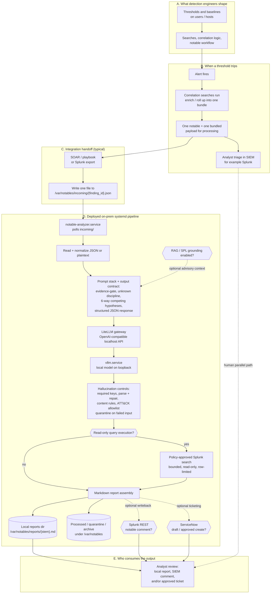

# On-Prem AI Notable Analysis Pipeline - End-to-End Diagrams

Pre-rendered exports of the on-prem full-story figure are in this folder:

- `END_TO_END_DIAGRAMS.fig01-full-story.svg`
- `END_TO_END_DIAGRAMS.fig01-full-story.png`
- `END_TO_END_DIAGRAMS.fig01-full-story.ppt-full.png`
- `END_TO_END_DIAGRAMS.fig01-full-story.ppt-slide01-upstream.png`
- `END_TO_END_DIAGRAMS.fig01-full-story.ppt-slide02-onprem-pipeline.png`
- `END_TO_END_DIAGRAMS.fig01-full-story.ppt-slide03-outputs-review.png`
- `ONPREM_LLM_SERVING_ARCHITECTURE.svg`
- `ONPREM_LLM_SERVING_ARCHITECTURE.png`

The Mermaid source used to render the exports is `END_TO_END_DIAGRAMS.fig01-full-story.mmd`.
The one-slide LLM-serving architecture source is `ONPREM_LLM_SERVING_ARCHITECTURE.mmd`.

These diagrams summarize how work flows from customer detection engineering through the single-host on-prem `systemd` deployment to analyst-ready reports.

**Assumptions (planning, not a guarantee):**

- **Volume:** about **300 notables per day** handed to analysis as one notable object each, matching the on-prem sizing guide. That scale assumes tuned detections, not an unbounded alert firehose.
- **Deployment shape:** a single RHEL-oriented host runs `notable-analyzer.service`, `litellm.service`, and `vllm.service`; the LLM endpoint binds to loopback by default.
- **Evidence discipline:** RAG, SPL query grounding, and query-result interpretation are advisory or bounded enrichment paths. Observed case facts remain limited to the ingested notable and policy-approved query results.

---

## 1. Full story: from detections to the report

Customers typically alert on thresholds per user or host. When a threshold trips, correlation searches gather nearby context and Splunk ES or a SOAR playbook produces one bundled notable payload. The on-prem pipeline does not replace that stack; it processes one dropped file at a time and writes a local report, with optional Splunk writeback and optional ServiceNow ticketing when the relevant flags and approvals are enabled.

**Prompting and hallucination resistance (on-prem path):** The model only sees the dropped notable plus bounded advisory context when enabled. The analyzer separates evidence from inference, uses `unknown` when facts are missing, validates required fields, repairs once where supported, filters ATT&CK technique IDs through a local allowlist, and quarantines failed inputs instead of silently discarding them.

**Contract reminders:**

- One file in `/var/notables/incoming` maps to one analysis attempt and one report, unless the input is malformed or quarantined.
- The filename stem is the natural finding identifier for local reports and optional Splunk notable writeback.
- Optional Splunk query execution is read-only, policy-approved, time-bounded, row-bounded, and disabled by default.
- Optional ServiceNow create is approval-gated; draft/create status is recorded in report metadata when enabled.

**Out of scope for this figure:** Open-ended remediation, case closure, suppression, and autonomous response actions. The default product shape remains analyst triage support with explicit gates around consequential writeback or ticket creation.
