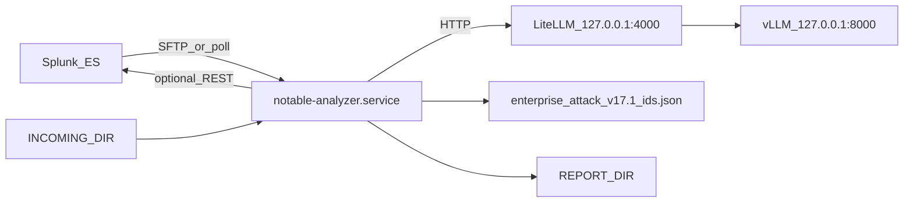

# Air-Gapped and On-Prem Deployment

Deploy `llm_notable_analysis_onprem_systemd` without cloud services: no Bedrock,
no S3 triggers, no runtime internet on the analyzer host.

| Start here | Doc |
| --- | --- |
| Connected-host install | [`INSTALL.md`](INSTALL.md) |
| Artifact staging before transfer | [`OFFLINE_PRESTAGE_GUIDE.md`](OFFLINE_PRESTAGE_GUIDE.md) |
| End-to-end product behavior | [`../../delivery_package/EXECUTIVE_ONPREM_WORKFLOW.md`](../../delivery_package/EXECUTIVE_ONPREM_WORKFLOW.md) |

## AWS to on-prem mapping

| AWS (`s3_notable_pipeline`) | On-prem (`llm_notable_analysis_onprem_systemd`) |
| --- | --- |
| S3 `incoming/` object | SFTP or filesystem drop into `INCOMING_DIR` |
| Lambda handler | `systemd`: `notable-analyzer.service` |
| Bedrock | vLLM on loopback, fronted by LiteLLM on `127.0.0.1:4000` |
| S3 `reports/` output | `REPORT_DIR` (+ optional Splunk notable comment writeback) |
| Optional profiles | `CAPABILITY_PROFILES` in `/etc/notable-analyzer/config.env` |

Core analysis is unchanged: normalize notable, structured LLM analysis, local
MITRE ATT&CK ID validation, markdown/JSON report generation, optional gated
integrations.

## Runtime shape (single host)

Only supported deployment: one host runs vLLM, LiteLLM, and the analyzer.



Packaged units:

- [`notable-analyzer.service`](../../../deploy/systemd/notable-analyzer.service)
- [`litellm.service`](../../../deploy/systemd/litellm.service)
- [`vllm.service`](../../../deploy/systemd/vllm.service)

Analyzer entrypoint (must match installer and systemd):

```bash
/opt/notable-analyzer/venv/bin/python -m llm_notable_analysis_onprem_systemd.onprem_service.onprem_main
```

Service dependencies:

- `notable-analyzer.service`: `After=network.target litellm.service`, `Requires=litellm.service`
- `litellm.service`: `After=network.target vllm.service`, `Wants=vllm.service` (not hard-required; remote backends are supported via `/etc/litellm/config.yaml`)

Start order on first boot: `vllm` -> `litellm` -> `notable-analyzer`.

Default example model: **`gemma-4-31B-it`** via LiteLLM. Do not use retired
example model names in runbooks.

## Hardware and tuning

Target: about **300 notables/day** on one GPU host with typical latency under
**60 seconds** per notable when the serving stack is healthy.

| Profile | CPU | RAM | Storage | GPU |
| --- | --- | --- | --- | --- |
| Lab / CPU-only | 8-16 vCPU | 32-64 GB | 500 GB NVMe | None (not production default) |
| Production starting point | 16-32 vCPU | 128 GB | 1-2 TB NVMe | 1x GPU with 24 GB+ VRAM |
| Higher headroom | 32-64 vCPU | 256 GB | 2 TB NVMe | 48-80 GB VRAM class |

Use host-specific starting values in
[`deployment_profiles/README.md`](deployment_profiles/README.md) before raising
`MAX_WORKERS` or vLLM concurrency.

Rough one-time hardware for a **gemma-4-31B-it** single-GPU RHEL host is often
**USD 18k-35k** (server + RTX PRO 6000-class GPU), plus **USD 1k-2k/year** RHEL
support. Splunk licensing and datacenter costs are separate.

## Ingest contract (file drop)

Supported ingest: **`INGEST_MODE=file_drop`** only.

- SOAR or an operator delivers `*.json` (preferred) or `*.txt` into
  `INCOMING_DIR` (commonly `/var/notables/incoming`, symlinked to the SFTP
  chroot at `/var/sftp/soar/incoming`).
- Upload to a temp name, then rename to `*.json` when complete to avoid partial
  reads.
- Required JSON field: `summary`. Recommended: `notable_id`, `search_name`,
  `risk_score`, `threat_category`, and top-level primitive fields the analyzer
  can render. Nested objects may not appear in the prompt unless flattened.

See [`../platform/FILE_DROP_AND_RETENTION_OPERATIONS.md`](../platform/FILE_DROP_AND_RETENTION_OPERATIONS.md)
for paths, retention, and concurrency.

## Configuration

Copy [`config.env.example`](../../../config.env.example) to
`/etc/notable-analyzer/config.env` (mode `600`). The installer creates this
file from the template on first install when it does not already exist.

LiteLLM routing: installer copies
[`deploy/litellm/config.yaml.example`](../../../deploy/litellm/config.yaml.example)
to `/etc/litellm/config.yaml` (mode `600`).

Minimum air-gap baseline:

```ini
CAPABILITY_PROFILES=core
INGEST_MODE=file_drop
INCOMING_DIR=/var/notables/incoming
PROCESSED_DIR=/var/notables/processed
QUARANTINE_DIR=/var/notables/quarantine
REPORT_DIR=/var/notables/reports
LLM_API_URL=http://127.0.0.1:4000/v1/chat/completions
LLM_MODEL_NAME=gemma-4-31B-it
MITRE_IDS_PATH=/opt/notable-analyzer/src/llm_notable_analysis_onprem_systemd/onprem_service/enterprise_attack_v17.1_ids.json
```

Enable optional capabilities one profile at a time after validation (`rag`,
`spl_readonly`, `html_reports`, `ticket_draft`, `action_gated`, `analyst_portal`).
See [`../platform/CAPABILITY_PROFILES.md`](../platform/CAPABILITY_PROFILES.md).

Portal config (when enabled) uses separate
`/etc/notable-analyzer/portal.env` from
[`config.portal.env.example`](../../../config.portal.env.example). The installer
writes `portal.env` on first install even when the portal profile is disabled.

## Security (air-gap essentials)

- No outbound internet from the analyzer host at runtime.
- Keep LiteLLM and vLLM on loopback; Splunk and optional integrations on internal
  HTTPS with validated TLS.
- Store secrets in `/etc/notable-analyzer/config.env` and `portal.env` with
  restrictive permissions; never commit tokens.
- Dedicated service users (`notable-analyzer`, `litellm`, `vllm`, `soar-uploader`
  for SFTP) are created by `scripts/install.sh`.
- Do not enable `MODEL_DOWNLOAD=true` on air-gapped hosts; stage weights offline.

Full posture: [`../../security/SECURITY_POSTURE.md`](../../security/SECURITY_POSTURE.md)
and [`../security/SECURITY_OPERATIONS.md`](../security/SECURITY_OPERATIONS.md).

## Offline bring-up (recommended path)

1. **Stage artifacts** on a connected machine per
   [`OFFLINE_PRESTAGE_GUIDE.md`](OFFLINE_PRESTAGE_GUIDE.md):
   - `llm_notable_analysis_onprem_systemd/` plus sibling bundles
     `onprem_rag_notable_analysis/` and `onprem-llm-sdk/`
   - Python wheelhouse, model weights at `/opt/models/gemma-4-31B-it`, optional
     KB/RAG bundles and RPMs for Python 3.12 / CUDA / PostgreSQL
2. **Transfer** via approved media/process; verify checksums or manifests.
3. **Install** on the target host from the wheelhouse (do not rely on
   `MODEL_DOWNLOAD` or pip index access):
   ```bash
   cd /path/to/llm_notable_analysis_onprem_systemd
   sudo INSTALL_PYTHON=false \
        PIP_NO_INDEX=1 \
        PIP_FIND_LINKS=/mnt/media/wheelhouse \
        VLLM_PIP_SPEC="/mnt/media/wheelhouse/vllm-0.21.0-*.whl" \
        MODEL_DOWNLOAD=false \
        bash scripts/install.sh
   ```
   - Set `INSTALL_PYTHON=false` when Python 3.12 OS packages are pre-staged.
   - Pin interpreters when required:
     `ANALYZER_PYTHON_BIN=python3.12 VLLM_PYTHON_BIN=python3.12`
   - Use `VLLM_SKIP_INSTALL=true` only when vLLM is pre-installed into
     `/opt/vllm/venv` (or update `vllm.service` to match your path).
   - Use `AUTO_START_SERVICES=false` to finish `config.env` review before the
     installer attempts service start and smoke checks.
4. **Configure** `/etc/notable-analyzer/config.env` and optional `portal.env`.
5. **Start stack** (if not auto-started):
   ```bash
   sudo systemctl enable --now vllm
   sudo systemctl enable --now litellm
   sudo systemctl enable --now notable-analyzer
   ```
6. **Smoke test**:
   ```bash
   sudo bash scripts/smoke_service_chain.sh --config-env /etc/notable-analyzer/config.env
   ```

Do not hand-copy partial systemd units when the packaged installer already
installs them under `/etc/systemd/system/`.

## MITRE ATT&CK data refresh

Bundled file: `enterprise_attack_v17.1_ids.json` (package default via
`MITRE_IDS_PATH`). Refresh offline through your approved ATT&CK export process;
see [`../platform/MITRE_TTP_OPERATIONS.md`](../platform/MITRE_TTP_OPERATIONS.md).

## Validation

Automated tests (run on a connected dev machine or CI from monorepo root):

```bash
PYTHONPATH=llm_notable_analysis_onprem_systemd/src \
  python -m unittest discover -s llm_notable_analysis_onprem_systemd/tests -p "test*.py" -v
```

Air-gap acceptance checklist:

- [ ] Test notable ingests from `INCOMING_DIR` and lands in `PROCESSED_DIR` or `QUARANTINE_DIR`
- [ ] vLLM health on `127.0.0.1:8000`; LiteLLM responds on `127.0.0.1:4000`; analyzer completes one end-to-end run
- [ ] Invalid ATT&CK IDs are filtered; report written under `REPORT_DIR`
- [ ] Splunk writeback works when `action_gated` / writeback profile is enabled
- [ ] No runtime egress to the public internet observed (per local monitoring policy)
- [ ] Logs are forwarded or collected per local policy

Example test drop:

```bash
echo '{"notable_id":"airgap-test","summary":"Test alert","ip_address":"203.0.113.45","user":"admin"}' \
  | sudo tee /var/notables/incoming/airgap-test.json
ls -la /var/notables/reports/
```

## AWS vs on-prem summary

| Topic | AWS | On-prem |
| --- | --- | --- |
| Trigger | S3 event | Directory poll |
| LLM | Bedrock | vLLM + LiteLLM |
| Secrets | Secrets Manager / env | `/etc/notable-analyzer/config.env` |
| Case archive / portal | DynamoDB + S3 + Lambda | Postgres + systemd portal |
| Internet at runtime | Customer-controlled egress | None in true air-gap |

Parity status:
[`s3_notable_pipeline/docs/technical_specs/AWS_ONPREM_PARITY_TECHNICAL_SPEC.md`](../../../../s3_notable_pipeline/docs/technical_specs/AWS_ONPREM_PARITY_TECHNICAL_SPEC.md).

## Related docs

| Topic | Doc |
| --- | --- |
| Install and post-install smoke | [`INSTALL.md`](INSTALL.md) |
| Offline artifact list | [`OFFLINE_PRESTAGE_GUIDE.md`](OFFLINE_PRESTAGE_GUIDE.md) |
| GPU/concurrency tuning | [`deployment_profiles/README.md`](deployment_profiles/README.md) |
| LLM serving ops | [`../llm/LLM_INFERENCE_OPERATIONS.md`](../llm/LLM_INFERENCE_OPERATIONS.md) |
| Recovery | [`../platform/RECOVERY_BEHAVIOR_AND_RESPONSIBILITIES.md`](../platform/RECOVERY_BEHAVIOR_AND_RESPONSIBILITIES.md) |
| Tests | [`../../testing/TESTING.md`](../../testing/TESTING.md) |

## Next

- Path B step 3: [`INSTALL.md`](INSTALL.md) — offline install commands
- Path B step 4: [`CUSTOMER_DEFAULT_DEPLOYMENT.md`](CUSTOMER_DEFAULT_DEPLOYMENT.md) — customer-default bundle
- Validation terminus: [`../../testing/TESTING.md`](../../testing/TESTING.md)
- Path order: root [`README.md`](../../../README.md#2-deploy--pick-one-path) section 2
