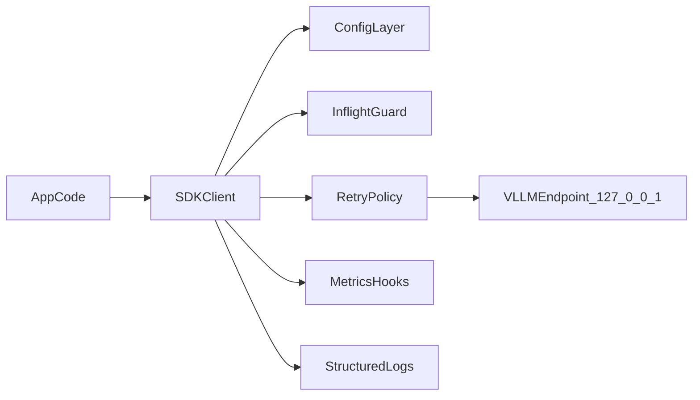

# Architecture

`onprem-llm-sdk` standardizes how local applications consume a same-host vLLM endpoint.

## Design goals

- Keep all consumers on the same contract for retries, timeouts, and errors.
- Prevent per-app overload using process-local inflight limits.
- Keep observability consistent even across unrelated projects.
- Support deterministic offline installation in air-gapped environments.

## Request flow

## Key components

- `config.py` loads and validates environment-driven runtime settings.
- `client.py` handles request construction, retry logic, and error mapping.
- `contracts.py` enforces response shape extraction from OpenAI-compatible payloads.
- `metrics.py` exposes hooks for application-level metrics sinks.
- `logging.py` emits structured JSON logs with correlation IDs.

## Config precedence

1. SDK defaults in code.
2. Environment variables loaded by `SDKConfig.from_env()`.
3. Explicit method-call overrides (e.g., `max_tokens` per request).

This allows global policy defaults while preserving safe per-call flexibility.

