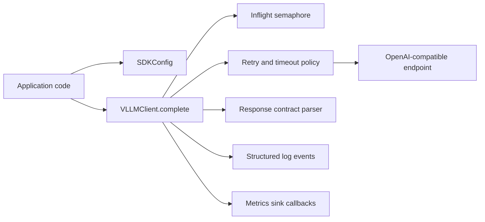

# Architecture

`onprem-llm-sdk` is a shared client layer for local OpenAI-compatible chat-completions
endpoints (default: `http://127.0.0.1:8000/v1/chat/completions`).

## Scope

### What this SDK is

- A reusable Python package used by multiple projects.
- A runtime policy layer for retries, timeout budgets, and in-flight limits.
- A contract layer that normalizes response text extraction and exception types.
- A packaging target for deterministic, offline install workflows.

### What this SDK is not

- Not a model server installer or lifecycle manager.
- Not an async or streaming SDK.
- Not a domain workflow framework (for example, SOC/TTP business logic).

## Design goals

- Keep callers on one transport/exception contract.
- Prevent per-process overload with bounded in-flight requests.
- Keep logs and metrics callback behavior consistent across consumers.
- Keep installs reproducible in air-gapped environments.

## Runtime request flow

## Component responsibilities

- `config.py`
  - environment parsing and validation (`SDKConfig.from_env`)
- `client.py`
  - request construction, retries/backoff, timeout handling, status-to-error mapping
- `contracts.py`
  - payload helpers, response parsing, `Retry-After` parsing, `CompletionResult`
- `errors.py`
  - stable exception hierarchy for consumers
- `logging.py`
  - structured JSON event emission
- `metrics.py`
  - metrics callback protocol and reference sinks

## Configuration precedence

1. SDK defaults
2. environment values
3. explicit config overrides (`from_env(overrides=...)`)
4. method-call overrides on `VLLMClient.complete(...)`

For public behavior details and constraints, see `docs/API_REFERENCE.md`.

