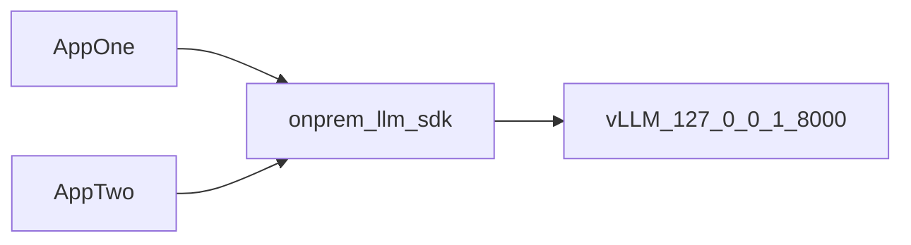

# High-Level Overview

`onprem-llm-sdk` is a shared transport/runtime client for local OpenAI-compatible vLLM endpoints.

## What this SDK is

- A reusable Python package for consistent endpoint calls across projects.
- A runtime policy layer for retries, timeouts, and per-process inflight limits.
- An offline-installable package with air-gapped bundle scripts.

## What this SDK is not

- Not a vLLM server installer.
- Not a model management tool.
- Not a domain-analysis framework (for example, TTP logic, markdown rendering, Splunk workflows).

## Typical architecture

## Runtime responsibilities

- Build request payloads for completion APIs.
- Inject correlation ID and app identity headers.
- Enforce retries and timeout budgets.
- Emit structured event logs and metrics sink callbacks.
- Normalize response text extraction (`choices[0].text` or `choices[0].message.content`).

## Packaging responsibilities

- Build deterministic wheel bundles for offline transfer.
- Verify bundle integrity with checksums before install.
- Install with `pip --no-index --find-links ...` in air-gapped hosts.

