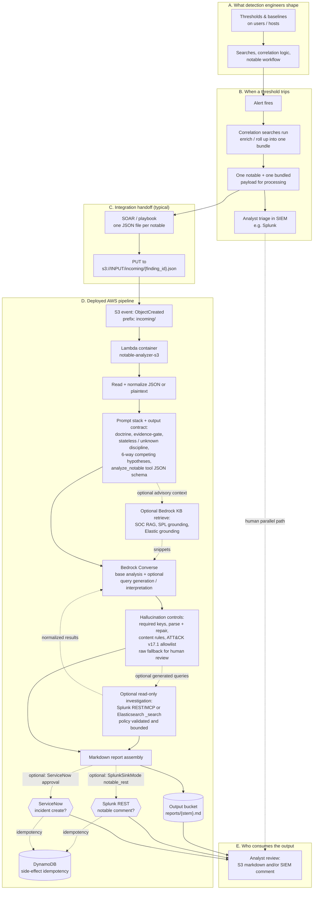
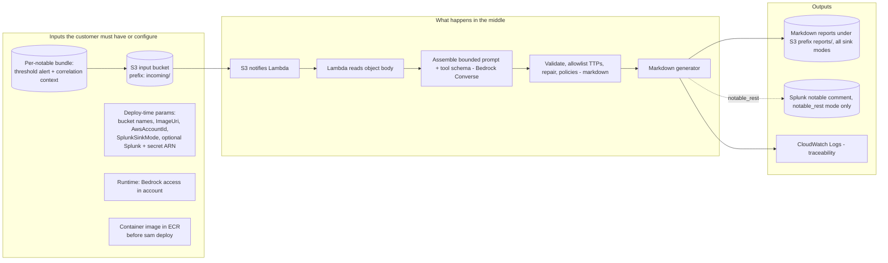
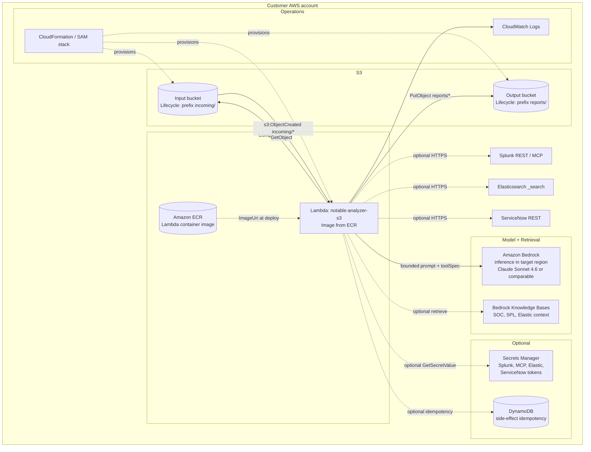
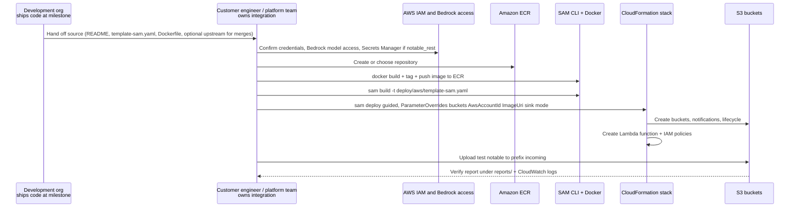

# AI Notable Analysis Pipeline — End-to-End Diagrams

Pre-rendered SVG exports of each figure (same folder): `END_TO_END_DIAGRAMS.fig01-full-story.svg` through `END_TO_END_DIAGRAMS.fig04-deployment-sequence.svg`.

**PowerPoint PNGs (fig01):** Source `END_TO_END_DIAGRAMS.fig01-full-story.mmd`. Exports: `END_TO_END_DIAGRAMS.fig01-full-story.ppt-slide01-upstream.png` (A-C), `END_TO_END_DIAGRAMS.fig01-full-story.ppt-slide02-aws-pipeline.png` (D-E), and optional `END_TO_END_DIAGRAMS.fig01-full-story.ppt-full.png`. The upstream slide is also split into 16:9 slide crops: `END_TO_END_DIAGRAMS.fig01-full-story.ppt-slide01-upstream-part01-authoring-live.png`, `END_TO_END_DIAGRAMS.fig01-full-story.ppt-slide01-upstream-part02-live-handoff.png`, and `END_TO_END_DIAGRAMS.fig01-full-story.ppt-slide01-upstream-part03-handoff-pipeline-entry.png`. Regenerate the base exports from `s3_notable_pipeline`: `npm install`, `pip install pillow`, then `node scripts/tools/export_svg_to_ppt_pngs.mjs docs/delivery_package/end_to_end_diagrams/END_TO_END_DIAGRAMS.fig01-full-story.mmd` (uses `mmdc`/Chromium so labels render; do not rasterize the SVG with resvg alone).

These Mermaid diagrams summarize how work flows from **how customers build and fire notables** through **customer-side deployment** to **analyst-ready reports**.

**Assumptions (planning, not a guarantee):**

- **Volume:** **~250 alerts per day** handed to analysis **as one notable object each** (typical SOAR/upload pattern). That scale assumes **well-tuned detections**, not an unbounded noisy firehose.
- **Illustrative AWS-only run cost** (order of magnitude; excludes labor, SIEM/SOAR, and other tools; varies with model choice, prompt size, tokens per notable, retries, and regional pricing): **Bedrock inference is usually the dominant line item** at this volume; S3 and Lambda are comparatively small. About **US$1k/year** all-in on AWS with **Nova Pro**–class Bedrock usage, and about **US$4.5k–5.5k/year** with **Claude Sonnet 4.6**–class usage (analyzer default), as modeled for this pipeline shape.

---

## 1. Full story: from detections to the report

Customers typically **alert on thresholds per user or host**; when a threshold trips, an **alert fires**, **correlation searches** pull the surrounding context, and the SIEM (for example **Splunk**) ends up with **one consolidated evidence object per notable**. This pipeline **does not replace** that stack; it **takes that one object at a time** (often via SOAR) and drops it into S3 for analysis.

**Prompting & hallucination resistance (AWS path):** The model only sees **what is in the notable** plus explicit instructions to separate **evidence from inference**, use **unknown** when facts are missing, and pass an **evidence-gate** before labeling a TTP. **`analyze_notable` tool / JSON schema** tightens the answer shape. Optional RAG and query-grounding snippets are advisory context, not observed case facts. After Bedrock returns, **deterministic code** validates, **repairs once** on failure, **allowlists** technique IDs, validates generated SPL or Elastic queries before execution, applies **content policies**, and if structure still fails, **surfaces raw output for review** instead of pretending the run was clean.

**Contract reminders:**

- One upload under `incoming/` ⇒ one Lambda run ⇒ one report (unless the object is skipped as empty, folder marker, or placeholder filename).
- For **Splunk `notable_rest` writeback**, `finding_id` comes from the **filename stem**: e.g. `incoming/abc-123.json` ⇒ `finding_id=abc-123`.
- Optional `spl_readonly` and `elastic_readonly` profiles are mutually exclusive; one read-only investigation backend is active per deployment.

**Out of scope today (non-goals):** The pipeline **does not** drive **remediation, suppression, or case closure**. ServiceNow support is limited to incident drafting and approval-gated creation; it does not make autonomous ticketing decisions.

**RAG (advisory context):** Retrieval over **customer SOPs**, **Splunk-facing knowledge packs**, and **Elasticsearch data dictionaries** can tighten **pivot ideas, query framing, and procedure fit**. Retrieved material stays **advisory**; **observed case facts** remain **only what is in the notable** the pipeline ingests.

**Operations note:** S3 event notifications can **retry** Lambda; customers should expect **at-least-once** delivery semantics and treat **object key** as the natural idempotency boundary for a single analysis run. External side effects such as Splunk writeback and ServiceNow create use DynamoDB reservations when action-gated idempotency is enabled.

**Network:** Lambda calls **Bedrock** and optional **Bedrock Knowledge Bases** via AWS service APIs. Read-only investigation and writeback features use **HTTPS** to customer-configured Splunk, MCP, Elasticsearch, or ServiceNow endpoints from the function execution environment.

---

## 2. Inputs, processing steps, and outputs (single swimlane)

---

## 3. AWS runtime architecture (what the stack provisions)

Aligned with `../../../deploy/aws/template-sam.yaml`: two buckets, image-based Lambda, `incoming/` notifications, IAM for S3/Bedrock/logs, optional Secrets Manager. **Pick the AWS region** that fits policy and Bedrock access; if you change it, keep **Bedrock inference ARNs, IAM, and ECR** in `../../../deploy/aws/template-sam.yaml` **in that region** (`../../operations/DEPLOYMENT_IMAGE_STEPS.md`).

---

## 4. Deployment handoff: delivery → customer team

The development organization **delivers the source** at an agreed milestone (for example a repository or release package). After handoff, the **customer owns and maintains** the deployment, fork, merge cadence, and production operations. There is **no separate software license fee**; cost is mainly **customer integration labor** (often **hours to a few days** for a straightforward deploy: image, parameters, buckets, Bedrock access). **New releases** can be **merged into the customer codebase** on the **customer's** schedule. The development organization remains **available for support** when the customer needs it (for example integration questions or upgrade guidance).

This is the **operational path** in the **customer's AWS account**: who builds the image, who runs deploy, and what proves it works.

**Important:** The SAM template **references** a pre-published `ImageUri`; it does not build or push the image for the customer. See `../../operations/DEPLOYMENT_IMAGE_STEPS.md`.

**Documentation** shipped with the solution includes, among others: **`../../../README.md`** (deploy, sinks, test path), **`../EXECUTIVE_AWS_WORKFLOW.md`** (end-to-end narrative), **`../../operations/DEPLOYMENT_IMAGE_STEPS.md`** (ECR and Lambda image order), **`../../integrations/SOAR_PLAYBOOK_PHANTOM.md`** (SOAR → S3 pattern), **`../../security/ATTACK_LLM_ANALYSIS.md`** (ATT&CK grounding and validation posture), and **`../../../deploy/aws/template-sam.yaml`** (infrastructure contract).

---

## Related docs in this package

- `../../../README.md` — quick deploy and sink modes
- `../EXECUTIVE_AWS_WORKFLOW.md` — narrative executive overview
- `../../operations/DEPLOYMENT_IMAGE_STEPS.md` — ECR and Lambda image order of operations
- `../../integrations/SOAR_PLAYBOOK_PHANTOM.md` — SOAR → S3 payload pattern
- `../../security/ATTACK_LLM_ANALYSIS.md` — ATT&CK grounding, validation, and LLM trust boundaries
