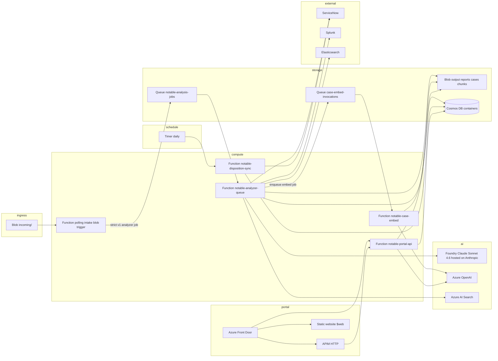

# Azure / AWS Parity Implementation Plan

## Status

**Planning only.** No Azure deployment assets or runtime code exist in this repository yet.

This document is the normative implementation contract for building an Azure deployment that preserves the shipped AWS stack's product behavior while using Azure services natively. An implementing agent must treat the AWS runtime, tests, schemas, prompts, policies, and operator-visible behavior as the behavioral source of truth. Reuse proven cloud-neutral code, but do not preserve AWS SDK syntax, AWS event envelopes, AWS response shapes, AWS resource names, or AWS infrastructure parameters inside the Azure implementation except for exact field names already locked by a durable stored or public API contract.

## Normative references

| Reference | Path |
| --- | --- |
| AWS SAM template (primary IaC baseline) | [`deploy/aws/template-sam.yaml`](../../deploy/aws/template-sam.yaml) |
| AWS CloudFormation zip template (secondary) | [`deploy/aws/template-cfn.yaml`](../../deploy/aws/template-cfn.yaml) |
| Runtime env contract | [`config.env.example`](../../config.env.example) |
| AWS/on-prem behavioral parity spec | [`../technical_specs/AWS_ONPREM_PARITY_TECHNICAL_SPEC.md`](../technical_specs/AWS_ONPREM_PARITY_TECHNICAL_SPEC.md) |
| Portal OpenAPI contract | [`../contracts/portal.openapi.json`](../contracts/portal.openapi.json) |
| AWS deploy runbook | [`../operations/deployment/DEPLOYMENT_IMAGE_STEPS.md`](../operations/deployment/DEPLOYMENT_IMAGE_STEPS.md) |
| Analyst portal operations | [`../operations/analyst_portal/ANALYST_PORTAL_OPERATIONS.md`](../operations/analyst_portal/ANALYST_PORTAL_OPERATIONS.md) |

Current Azure platform constraints must be revalidated against these official references when implementation begins:

| Constraint | Official reference |
| --- | --- |
| Azure Functions HTTP response ceiling | [Azure Functions HTTP trigger](https://learn.microsoft.com/en-us/azure/azure-functions/functions-bindings-http-webhook-trigger) |
| Identity-based Functions host storage | [Guidance for developing Azure Functions](https://learn.microsoft.com/en-us/azure/azure-functions/functions-reference) |
| Front Door private static website origin | [Connect Front Door to a storage static website with Private Link](https://learn.microsoft.com/en-us/azure/frontdoor/how-to-enable-private-link-storage-static-website) |
| Front Door origin response timeout | [Troubleshoot Azure Front Door](https://learn.microsoft.com/en-us/azure/frontdoor/troubleshoot-issues) |
| Keyless Azure OpenAI client | [Use keyless connections with Azure OpenAI](https://learn.microsoft.com/en-us/azure/developer/ai/keyless-connections) |
| Azure OpenAI tools and embedding dimensions | [Azure OpenAI REST API reference](https://learn.microsoft.com/en-us/azure/foundry/openai/reference) |
| Claude Sonnet 4.6 Messages API and Entra authentication | [Deploy and use Claude models in Microsoft Foundry](https://learn.microsoft.com/en-us/azure/foundry/foundry-models/how-to/use-foundry-models-claude) |
| Cosmos DB strong consistency | [Azure Cosmos DB consistency levels](https://learn.microsoft.com/en-us/azure/cosmos-db/consistency-levels) |

## Goal

Deliver an Azure-hosted instance of the notable analysis pipeline with **behavioral parity** to the AWS stack:

```text
Blob incoming object -> Function -> LLM analysis -> Blob report output -> optional Splunk writeback
```

Optional capability profiles (`core`, `html_reports`, `rag`, `spl_readonly`, `elastic_readonly`, `ticket_draft`, `action_gated`, `analyst_portal`) must behave the same as on AWS per [`AWS_ONPREM_PARITY_TECHNICAL_SPEC.md`](../technical_specs/AWS_ONPREM_PARITY_TECHNICAL_SPEC.md).

## Non-goals

- Do not refactor AWS code in place; Azure is a sibling package.
- Do not rewrite proven cloud-neutral business logic merely to make the Azure tree look different.
- Do not move orchestration to Durable Functions, Step Functions, or Kubernetes unless a pure Azure limitation blocks the AWS shape and the exception is documented here.
- Do not add Postgres/OpenSearch for case archive on Azure (AWS v1 uses Blob + NoSQL table store only).
- Do not change portal OpenAPI response shapes, capability profile semantics, or deterministic policy logic.
- Do not implement Azure until this plan is approved; this file is the build contract.

---

## Behavior-first reuse and Azure-native boundaries (mandatory)

The commercial AWS codebase in this project is the behavioral baseline. Reuse its cloud-neutral business logic, prompts, schemas, validators, policy checks, fixtures, and golden evaluations. Cloud integration code must use Azure-native SDKs and native Azure request/response models; source-code similarity is not a parity requirement.

### Default workflow for every file

1. Classify the file as cloud-neutral business logic, a cloud integration boundary, or mixed.
2. Copy cloud-neutral files and change only package imports or genuinely Azure-specific configuration.
3. For mixed files, retain the business rules and replace the cloud-facing portion with calls to application-oriented Azure boundaries.
4. For cloud integration files, implement the simplest native Azure design even when the file name, function signatures, exception handling, or control flow must differ from AWS.
5. Run portable behavior/contract tests plus Azure-native boundary tests before moving on.

Do not create a compatibility object merely so an unchanged AWS call site can continue to send or receive an AWS SDK shape.

### Repo and file structure parity

`azure_notable_pipeline/` should retain the same high-level package, test, data, frontend, docs, and deployment boundaries, but cloud-specific modules may be renamed, added, or omitted:

| AWS path | Azure path | Action |
| --- | --- | --- |
| `src/s3_notable_pipeline/<cloud-neutral module>.py` | `src/azure_notable_pipeline/<module>.py` | Copy and preserve behavior |
| AWS cloud integration modules | Azure-native modules listed below | Reuse domain logic only; do not preserve AWS transports or SDK shapes |
| Portable `tests/test_<module>.py` | `tests/test_<module>.py` | Reuse fixtures and contract assertions; update package imports |
| AWS SDK/handler tests | Azure-native boundary/trigger tests | Rewrite around native Azure APIs and events |
| `tests/golden_eval_rubric.py` | `tests/golden_eval_rubric.py` | Copy verbatim |
| `tests/fixtures/**` | `tests/fixtures/**` | Copy verbatim |
| `data/golden_eval/**` | `data/golden_eval/**` | Copy verbatim |
| `frontend/analyst-portal/**` | `frontend/analyst-portal/**` | Copy first; change only the Azure chat timeout constant from 270s to 220s |
| `docs/contracts/portal.openapi.json` | `docs/contracts/portal.openapi.json` | Copy verbatim |
| `deploy/servicenow/**` | `deploy/servicenow/**` | Copy verbatim |
| `config.env.example` | `config.env.example` | Preserve cloud-neutral settings; replace AWS settings with Azure-native settings |
| `requirements.txt` | `requirements.txt` | Reuse application dependencies; replace AWS SDK dependencies with required Azure SDK dependencies |
| `deploy/aws/template-sam.yaml` | `deploy/azure/main.bicep` (+ modules) | Capability/resource mapping with Azure-native composition; not structural or line-by-line parity |
| `scripts/setup-and-deploy.*` | `scripts/setup-and-deploy.*` | Preserve operator workflow and validations; implement commands, parameters, identity, and readiness checks natively for Bicep/ACR/Functions |

**Rule:** If an AWS file is fully cloud-neutral, retain it at the same relative path unless a documented package-level reason prevents that. This rule does not apply to AWS SDK factories, AWS handlers, AWS-branded retrieval modules, or AWS deployment code.

### Azure client and persistence boundaries

Implement `azure_clients.py` only as a centralized factory for Azure platform SDK clients, including the Anthropic SDK's Azure AI Foundry client. Application code must either call those native clients at a narrow boundary or use the application-oriented boundaries listed below. No production object may expose boto3, Lambda, Bedrock, DynamoDB, S3, or Secrets Manager method names or request/response shapes.

```text
blob_service_client()
secret_client()
anthropic_foundry_client()
azure_openai_client()
azure_search_client(index_name)
cosmos_client()
queue_client(queue_name)
```

Use small application-oriented boundaries where they keep business logic testable: `blob_store.py`, `secret_provider.py`, `queue_publisher.py`, `azure_anthropic_gateway.py`, `azure_openai_gateway.py`, `azure_search_retrieval.py`, and `cosmos_store.py`. These boundaries expose product operations such as `read_blob`, `write_blob`, `enqueue_analyzer_job`, `enqueue_case_embed`, `analyze_notable`, `embed_texts`, `retrieve_grounding`, and `create_chat_completion`; they must not reproduce an AWS client API.

**Goal:** Preserve shared business behavior, validation/policy decisions, durable data meaning, and external API/output contracts. Azure-internal interfaces are allowed and expected to differ from AWS.

#### Durable schema exception

Preserve existing case envelope, report, case-index, and portal API field names exactly, including `source_key`, `input_bucket`, `input_key`, `case_envelope_key`, `report_markdown_key`, `report_json_key`, `report_html_key`, and `splunk_sink_mode`. In Azure, every `*_key` value is a Blob name, `input_bucket` contains the logical input container name (`input`), and `splunk_sink_mode` contains `blob`. These legacy names are schema compatibility fields only; they do not justify S3-style function parameters or SDK objects.

Do not preserve internal-only AWS names such as `s3_result`, `write_to_s3_sink`, `extract_finding_id_from_s3_key`, `case_envelope_bucket` in the embed job, or any `*_client` argument whose type is an AWS client. Use truthful internal names such as `blob_result`, `write_to_blob_sink`, `extract_finding_id_from_blob_name`, `container_name`, `blob_name`, and application-boundary objects.

The polling Blob-trigger wrapper authors the analyzer queue message. Its strict v1 schema is:

```json
{
  "schema_version": 1,
  "container_name": "input",
  "blob_name": "incoming/<finding_id>.json.gz",
  "etag": "<blob-etag>",
  "size_bytes": 1234,
  "last_modified": "2026-07-10T12:34:56Z"
}
```

These six keys are required and are the only accepted keys. `schema_version` must equal integer `1`; `container_name`, `blob_name`, `etag`, and `last_modified` must be non-empty strings; `size_bytes` must be a non-negative integer; and `last_modified` must be an RFC 3339 UTC timestamp. The queue wrapper rejects unknown versions, missing fields, extra fields, booleans used as integers, and invalid values before constructing the internal `BlobCreatedInput`. Duplicate delivery is expected; `etag` participates in the stable intake identity, while the existing case/report and side-effect idempotency rules remain authoritative.

The versioned Storage Queue embed-job schema is:

```json
{
  "schema_version": 1,
  "case_envelope_container": "output",
  "case_envelope_blob_name": "cases/YYYY/MM/DD/<case_id>.json"
}
```

All three fields are required; unknown schema versions or extra fields are rejected and dead-lettered by the queue-trigger path. Duplicate delivery is expected and must remain idempotent through the existing case/chunk replacement and Cosmos status-update behavior.

### File classification

#### Tier A — Reuse cloud-neutral files

No logic changes. Same file structure, same function names, same control flow.

- `markdown_generator.py`, `html_generator.py`
- `spl_query_generation.py`, `splunk_investigation.py`
- `elastic_query_generation.py`, `elasticsearch_investigation.py`
- `query_result_enrichment.py`, `query_result_interpretation.py`
- `servicenow.py`
- `portal_jwt.py`, `portal_api_models.py`, `verdicts.py`, `case_archive_notices.py`, `chat_context_usage.py`
- `portal_chat_kb_query.py`
- `__init__.py`
- All portable behavior/contract `tests/test_*.py` except cloud-client, cloud-handler, deployment-template, and persistence implementation tests
- All `data/golden_eval/**`, `tests/fixtures/**`
- All `frontend/analyst-portal/**` except `frontend/analyst-portal/src/api/client.ts`
- `docs/contracts/portal.openapi.json`

#### Tier B — Reuse business behavior; replace cloud access natively

These modules retain their public product behavior and deterministic logic, but their cloud-facing code may be rewritten to call the application-oriented Azure boundaries:

- `runtime_security.py` uses `secret_provider.py` and native Key Vault semantics.
- `spl_query_grounding.py`, `elasticsearch_query_grounding.py`, and `portal_chat_kb.py` use `azure_search_retrieval.py` and stable internal retrieval objects.
- `case_chunk_retrieval.py` uses native Azure OpenAI embeddings through `azure_openai_gateway.py`.
- `portal_chat.py` uses native Azure OpenAI chat-completion/tool-call responses through `azure_openai_gateway.py`.
- `config.py` preserves capability validation and cloud-neutral defaults, removes AWS-only settings, and defines Azure-native settings. It does not retain AWS variable names as aliases.

#### Tier C — Azure-native handlers and persistence

Use the AWS file as the behavioral reference, not as an SDK/interface template:

| AWS source | Azure implementation | Required parity and native change |
| --- | --- | --- |
| `aws_clients.py` | Omit; replace with `azure_clients.py` | Construct only native Azure SDK clients. No AWS factory name or method surface carries over. |
| `lambda_handler.py` | `blob_handler.py` plus a cloud-neutral orchestration function if needed | The polling Blob-trigger wrapper publishes the strict v1 analyzer job; the analyzer queue wrapper validates it and constructs a native internal intake object. Preserve pipeline ordering and side effects; never construct an S3 event. |
| `embed_handler.py` | `embed_handler.py` | Consume a native Azure Storage Queue message, validate the internal embed-job schema, and invoke the existing embedding workflow. |
| `disposition_sync_handler.py` | `disposition_sync_handler.py` | Use a native timer trigger and Azure dependencies while preserving synchronization policy. |
| `portal_handler.py` | `portal_handler.py` | Route native Azure `HttpRequest` values and return native `HttpResponse` values while preserving the published OpenAPI contract; never construct an API Gateway event. |
| `ttp_analyzer.py` | `ttp_analyzer.py` | Preserve prompts, structured output schema, ATT&CK validation, repair-once behavior, limits, and deterministic policy. Rewrite model calls, response parsing, exceptions, and retries for the Anthropic-hosted Messages API accessed through Azure AI Foundry. |
| `bedrock_kb_retrieval.py` | `azure_search_retrieval.py` | Replace the AWS-branded module. Map native Azure AI Search results directly to stable internal retrieval objects; never produce a Bedrock `retrieve` response. |
| `case_chat.py` | `case_chat.py` | Preserve chat behavior and contracts; use the native Azure OpenAI gateway. |
| `frontend/analyst-portal/src/api/client.ts` | `frontend/analyst-portal/src/api/client.ts` | Copy first; set `CHAT_TIMEOUT_MS=220_000` as the only Azure-specific frontend delta |
| `idempotency.py` | `idempotency.py` | Preserve lock semantics and public functions; replace DynamoDB calls with application-oriented `cosmos_store` operations |
| `case_index.py` | `case_index.py` | Preserve portal response contract and ordering; implement native Cosmos point reads and bounded keyset queries |
| `case_archive.py` | `case_archive.py` | Preserve archive schema/orchestration; write case-index state through native Cosmos persistence operations |
| `case_chat_history.py` | `case_chat_history.py` | Preserve ownership, retention, limits, and public functions; use native Cosmos session/message operations |
| `servicenow_disposition_sync.py` | `servicenow_disposition_sync.py` | Preserve synchronization policy and row semantics; use native Cosmos disposition/sync-state operations |
| `case_embed.py` | `case_embed.py` | Preserve embedding/chunking behavior; use native Azure OpenAI embedding and Cosmos persistence operations. |

#### Tier D — New Azure-only files (do not duplicate logic from Tier A–C)

These files are written once and contain narrow platform or application boundaries. They must not absorb policy, workflow ordering, or output-shaping rules that belong in the reused domain modules:

- `analyzer_job.py` — strict six-key v1 analyzer queue schema, serialization, and validation
- `azure_clients.py` — centralized constructors for Azure platform SDK clients, including `AnthropicFoundry`
- `blob_store.py` — application-oriented Blob read/write/list/delete operations using native Blob SDK types
- `secret_provider.py` — native Key Vault secret lookup and application-config decoding
- `queue_publisher.py` — native Storage Queue publication of the strict versioned analyzer and embed-job messages
- `azure_anthropic_gateway.py` — native Anthropic Messages API analysis operations through Azure AI Foundry
- `azure_openai_gateway.py` — native Azure OpenAI portal-chat and embedding operations
- `azure_search_retrieval.py` — native Azure AI Search query and stable internal result mapping
- `cosmos_store.py` — required Azure-native persistence boundary with application-oriented operations; no `dynamodb_client()`, DynamoDB expression parser, boto3 attribute-value encoding, GSI-name emulation, or boto3 error/response emulation

These are testability and separation-of-concerns boundaries, not portability adapters. None may expose `Bucket`/`Key`, `StreamingBody`, `converse`, `invoke_model`, `retrieve`, `FunctionName`, `InvocationType`, `SecretString`, DynamoDB expressions, or other AWS-specific contracts.

### What is forbidden

- Rewriting `portal_handler.py` route table or response builders from scratch
- Reimplementing `servicenow_disposition_sync.py` sync algorithm instead of copying it
- Changing config validation or capability profile semantics while replacing AWS-only variables
- Consolidating modules or renaming public functions "for clarity"
- Writing new tests that change business behavior or external contracts merely because Cosmos uses a different SDK
- Discarding portable AWS business-behavior tests instead of reusing their fixtures and assertions where the public contract is unchanged
- Creating an AWS-shaped compatibility client, event envelope, exception, or response object in production Azure code
- Retaining an AWS-branded variable or module name only to reduce source diffs

### Diff discipline

When reviewing an Azure PR or agent output:

- Tier A files should show only package-name, documented configuration, or necessary platform-neutral fixes.
- Tier B and Tier C review is behavior-based: prompts, validation, policy, side-effect ordering, durable data meaning, and public contracts must be traceable to the AWS baseline and covered by tests.
- Large cloud-facing diffs are expected when Azure's native API differs. Reviewers must reject AWS emulation, not penalize native code for lacking line-level similarity.
- Unrelated business-logic rewrites still require a documented reason and separate review.

### Sync policy (post v1)

After Azure v1 ships, apply shared behavioral fixes to both deployments and reuse identical cloud-neutral code where practical. Cloud integration fixes remain platform-specific; do not force one cloud's SDK model into the other to keep files identical.

## Locked deployment target (v1)

| Decision | Value | Rationale |
| --- | --- | --- |
| Cloud | **Azure Commercial** | Mirror AWS commercial default; Gov parity is a separate customer decision |
| Primary region | **`eastus`** (default) | Bicep `Location` parameter; operator-overridable at deploy time and must match the qualified Foundry Claude and Azure OpenAI deployment regions |
| IaC | **Bicep** (with generated ARM if required by customer) | Closest maintainable equivalent to SAM/CloudFormation |
| Package layout | Independent **`azure_notable_pipeline/`** project | Keeps Azure deployment ownership separate from this commercial AWS product |
| Python runtime | **3.12** | Match AWS Lambda base |
| Container registry | **Azure Container Registry (ACR)** | Mirror ECR one-image / multi-entrypoint pattern |

If the customer requires **Azure Government**, use Azure Gov regions and Azure Gov endpoints for OpenAI/AI Search/Key Vault. All examples below use commercial resource names; swap to Gov equivalents without changing application logic.

---

## Historical Azure comparison baseline

> Planning-only record: CloudFront and Lambda Function URL mappings below
> describe an earlier proposed edge design for the independent Azure product.
> They are not current commercial AWS product decisions. The commercial AWS v1
> baseline is regional API Gateway for all portal routes, a private SPA bucket
> read through the portal Lambda, and a 29-second synchronous chat boundary.
> Any future Azure implementation must reconcile this section with that current
> contract before work begins.

### Compute (4 functions, 1 container image)

| AWS Lambda | Default name | Handler / command | Trigger | Timeout (default) |
| --- | --- | --- | --- | --- |
| `NotableAnalyzerFunction` | `notable-analyzer-s3` | `s3_notable_pipeline.lambda_handler.handler` | S3 `ObjectCreated:*` on `incoming/` | 360s |
| `CaseEmbedFunction` | `notable-case-embed` | `s3_notable_pipeline.embed_handler.handler` | Async invoke from analyzer | 900s |
| `DispositionSyncFunction` | `notable-disposition-sync` | `s3_notable_pipeline.disposition_sync_handler.handler` | EventBridge `rate(1 day)` | 900s |
| `PortalApiFunction` | `notable-portal-api` | `s3_notable_pipeline.portal_handler.handler` | API Gateway HTTP + Function URL | 300s |

Image recipe baseline: [`deploy/docker/Dockerfile`](../../deploy/docker/Dockerfile).

### Storage

| AWS resource | Name pattern | Purpose |
| --- | --- | --- |
| `InputBucket` | param `InputBucketName` | Notable intake; event on `incoming/*`; lifecycle `InputRetentionDays` (default 2) |
| `OutputBucket` | param `OutputBucketName` | `reports/`, optional `cases/`, `case_chunks/` |
| `PortalUiBucket` | param `PortalUiBucketName` | Static React SPA (conditional) |

### NoSQL tables (DynamoDB on AWS)

| Table | Key schema | GSIs | TTL attribute |
| --- | --- | --- | --- |
| `SideEffectIdempotencyTable` | PK `id` | none | `expires_at` |
| `CaseIndexTable` | PK `case_id` | `ProcessedAtIndex`, `CorrelationIdIndex` | `expires_at_epoch` |
| `DispositionTable` | PK `snow_sys_id` | `CorrelationIdIndex`, `CaseIdIndex` | `expires_at_epoch` |
| `DispositionSyncStateTable` | PK `job_name` | none | none |
| `ChatSessionsTable` | PK `session_id` | `UserUpdatedIndex` | `expires_at_epoch` |
| `ChatMessagesTable` | PK `session_id`, SK `created_at_message_id` | none | `expires_at_epoch` |

Billing: on-demand (PAY_PER_REQUEST) on AWS.

### Portal edge routing (CloudFront)

When `PortalUiBucketName` is set with `CaseIndexTableName`:

| Path pattern | Origin | Notes |
| --- | --- | --- |
| Default (`/*`) | S3 UI bucket | SPA; 403/404 -> `/index.html` |
| `/api/chat` | Lambda Function URL | Long chat; bypasses API Gateway 30s limit |
| `/api/*` | API Gateway HTTP API | JWT or IAM auth on `$default` route |
| `/health`, `/ready` | API Gateway HTTP API | Authenticated |

Azure outputs preserve the operator-visible information but use truthful Azure names:

| AWS output | Azure Bicep output |
| --- | --- |
| `PortalApiUrl` | `PortalApiUrl` |
| `PortalChatFunctionUrl` | `PortalChatUrl` |
| `PortalBrowserApiBaseUrl` | `PortalBrowserApiBaseUrl` |
| `PortalUiDistributionDomainName` | `PortalFrontDoorHostName` |
| `PortalUiBucketName` | `PortalUiStorageAccountName` |

### External integrations (unchanged across clouds)

Outbound HTTPS only: Splunk REST/MCP, Elasticsearch, ServiceNow Table API. Same validation rules (`validate_https_url`, private IP block unless `ALLOW_PRIVATE_OUTBOUND_ENDPOINTS=true`).

### Secrets (customer-provided, not created by stack)

AWS uses Secrets Manager ARNs passed as template parameters. Azure uses Key Vault secret **names** with Managed Identity access. Do not pass raw secret values in parameters or app settings.

---

## Authoritative itemized swap-out matrix

This table is the implementation source of truth for AWS-to-Azure substitutions. If a later section conflicts with this matrix, this matrix wins and the later section must be corrected before implementation.

### Account, deployment, and packaging

| AWS item | Azure item | Implementation decision |
| --- | --- | --- |
| AWS account | Azure subscription + resource group | Bicep deploys one resource group per environment. |
| AWS region | Azure region | Bicep parameter `Location` defaults to `eastus`; the Foundry Claude deployment, Azure OpenAI, Functions, Storage, Cosmos, Search, Key Vault, and Front Door origins use the same region unless a documented Azure limitation prevents it. Deployment scripts may source this from the operator environment. |
| SAM / CloudFormation stack | Bicep deployment | `deploy/azure/main.bicep` is the root. Modules mirror SAM resources by area. |
| ECR repository + `ImageUri` | ACR repository + `ContainerImageUri` | Build one image. Bicep deploys the same image digest to all Function Apps. |
| Lambda Python 3.12 base image | Azure Functions Python 3.12 custom container base | Reuse dependency/build stages where valid, but implement the runtime stage and host layout for Azure Functions. Do not constrain the Azure Dockerfile to a base-image-only diff. |
| SAM `ImageConfig.Command` handler override | Azure Functions host wrappers + disabled-function app settings | Image contains all thin Azure trigger wrappers. Each Function App disables wrappers it does not own with `AzureWebJobs.<FunctionName>.Disabled=true`. Do not use separate images. |
| Lambda environment variables | Function App application settings | Preserve cloud-neutral business/capability names. Replace AWS service settings with the Azure-native names defined in this plan; do not provide AWS-name aliases. |
| CloudFormation parameters | Bicep parameters | Preserve parameters whose business semantics apply across clouds, rename service/runtime parameters for Azure, and omit AWS-only parameters. The parameter disposition table below is authoritative. |

### Compute and triggers

| AWS item | Azure item | Implementation decision |
| --- | --- | --- |
| `NotableAnalyzerFunction` Lambda | `notable-analyzer-queue` Function App | Premium plan custom container. Only the polling intake Blob trigger and analyzer queue wrapper are enabled. Timeout = `AnalyzerTimeoutSeconds`. |
| S3 `ObjectCreated:*` on `incoming/` | Polling Azure Functions Blob trigger plus Storage Queue | The identity-based `InputStorage` Blob trigger watches `input/incoming/{name}` through the private Blob endpoint. Application code reads native Blob properties, authors the strict v1 analyzer job, and publishes it to `notable-analysis-jobs` in the output account. The analyzer queue wrapper validates that job and constructs an internal `BlobCreatedInput`; neither wrapper creates an S3 event. No push-subscription intake resource exists in v1. |
| `CaseEmbedFunction` Lambda | `notable-case-embed` Function App | Premium plan custom container. Queue-trigger wrapper enabled. Timeout = 900s. |
| Lambda async invoke to embed | Azure Storage Queue message | `queue_publisher.enqueue_case_embed()` serializes a versioned internal embed-job message to `case-embed-invocations`. The queue wrapper validates that schema and passes the normalized job to the embedding workflow; it never accepts or emits a Lambda invocation shape. |
| `DispositionSyncFunction` Lambda | `notable-disposition-sync` Function App | Timer-trigger wrapper enabled. Timeout = 900s. |
| EventBridge `rate(1 day)` | Azure Functions timer trigger | Schedule `0 0 0 * * *` UTC (daily). |
| `PortalApiFunction` Lambda | `notable-portal-api` Function App | HTTP wrappers enabled for portal routes. Azure effective timeout is 225s, below the platform's approximately 230s HTTP ceiling. |
| Lambda Function URL for chat | Direct private HTTP route on portal Function App through Front Door | `/api/chat` bypasses APIM and validates JWT in application code, preserving the security behavior without reproducing a Lambda/API Gateway request. The portal Function App origin is not publicly reachable; Front Door reaches it through private origin connectivity. Front Door origin timeout is 240s; Function timeout is 225s; browser timeout is 220s. |
| Lambda reserved concurrency | Analyzer queue-trigger scale limit | Analyzer `functionAppScaleLimit=5` by default. Excess analyzer work remains in `notable-analysis-jobs`; Blob-trigger retry is used only when the intake wrapper cannot publish a valid analyzer job. Portal chat still enforces `PORTAL_CHAT_MAX_CONCURRENCY` in code. |
| Lambda ephemeral storage | Azure Functions temp storage | No configurable 1:1 setting. Code must not depend on more than 512 MB temp space in v1. If larger temp space becomes required, stop and document a platform exception. |

### Object storage

| AWS item | Azure item | Implementation decision |
| --- | --- | --- |
| `InputBucket` | Blob container `input` | Same logical bucket boundary. Prefix `incoming/` unchanged. |
| `OutputBucket` | Blob container `output` | Prefixes `reports/`, `cases/`, and `case_chunks/` unchanged. |
| `PortalUiBucket` | Storage static website `$web` container (dedicated storage account) | SPA files copied byte-for-byte from AWS frontend build output. Static website enabled; public network access disabled; Front Door Premium Private Link is the only browser entry point. |
| S3 object key | Blob name | Keep exact key strings and prefixes. |
| S3 `get_object` / `put_object` / `delete_object` / `list_objects_v2` | Native Blob SDK through `blob_store.py` | Data-facing modules call `read_blob`, `write_blob`, `delete_blob(s)`, and bounded `list_blobs` operations using container names, blob names, bytes/text, and native continuation internally. Do not expose `Bucket`, `Key`, `Body`/`StreamingBody`, `Contents`, or `NextContinuationToken`. |
| S3 lifecycle rules | Storage lifecycle management policy | Match `InputRetentionDays`, `OutputRetentionDays`, and `CaseRetentionDays`. |
| S3 SSE-S3 AES256 | Azure Storage encryption with Microsoft-managed keys | No code change. |
| S3 public access block | Storage `publicNetworkAccess=Disabled` + Private Link | Locked decision: no storage data-plane endpoint is reachable over the public internet. Function Apps and upload clients use private endpoints and private DNS. |

### NoSQL state

| AWS item | Azure item | Implementation decision |
| --- | --- | --- |
| DynamoDB service | Cosmos DB for NoSQL, serverless default | Serverless best matches DynamoDB on-demand. Autoscale is a documented operator override only. |
| `SideEffectIdempotencyTable` | Cosmos container `notable-side-effect-idempotency` | Partition key `/id`; preserve `id` and `expires_at`; add Cosmos `ttl` only for physical expiry. |
| `CaseIndexTable` | Cosmos container named from `CaseIndexContainerName` | Partition key `/case_id`, physical `id=case_id`; preserve case business fields but do not retain DynamoDB-only synthetic index attributes unless an external contract consumes them. |
| `CaseIndexTable.ProcessedAtIndex` | Native Cosmos keyset query + composite index over `processed_at`, `case_id` | Preserve newest-first listing behavior and cursor contract, not the AWS GSI name or key encoding. |
| `CaseIndexTable.CorrelationIdIndex` | Native bounded Cosmos query + composite index over `correlation_id`, `processed_at`, `case_id` | Preserve correlation lookup behavior; cross-partition execution is allowed and monitored in v1. |
| `DispositionTable` | Cosmos container `${stack}-servicenow-dispositions` | Partition key `/snow_sys_id`, physical `id=snow_sys_id`; use native queries for correlation/status access patterns. |
| `DispositionSyncStateTable` | Cosmos container `${stack}-disposition-sync-state` | Partition key `/job_name`. |
| `ChatSessionsTable` | Cosmos container `${stack}-chat-sessions` | Partition key `/user_id`, physical `id=session_id`; list sessions natively by user and `updated_at`. |
| `ChatMessagesTable` | Cosmos container `${stack}-chat-messages` | Partition key `/session_id`, physical `id=message_id`; order natively by `created_at` and `message_id`. |
| DynamoDB conditional operations | Native Cosmos create/patch/delete with ETags and 409/412 handling | Convert Cosmos conflicts into application results such as `acquired=false` or `ownership_changed`; do not synthesize boto3 exceptions. |
| DynamoDB TTL | Cosmos item TTL calculated from retained business expiry fields | Preserve `expires_at` / `expires_at_epoch` where used by business logic and set `ttl=max(1, expiry_epoch-now_epoch)` on each write. |
| DynamoDB client | Native `cosmos_store.py` persistence operations | Data-facing modules call explicit application operations; no DynamoDB compatibility client exists in Azure. |

### LLM, embeddings, RAG, and rerank

| AWS item | Azure item | Implementation decision |
| --- | --- | --- |
| Bedrock Runtime client | Anthropic SDK `AnthropicFoundry` client through `azure_anthropic_gateway.py` | Analyzer calls the Anthropic-hosted Messages API through Azure AI Foundry with Microsoft Entra authentication. Portal chat and embeddings remain behind the separate Azure OpenAI gateway. Do not expose `.converse()`, Bedrock content blocks, or Bedrock usage/exception shapes. |
| Bedrock Converse `toolConfig` | Anthropic Messages API `tools` / `tool_choice` | Preserve the `analyze_notable` tool schema, forced structured-output behavior, and validation/repair policy. Parse native Anthropic tool-use content blocks at the gateway boundary. |
| Bedrock model inference profile ARN | Azure AI Foundry Claude deployment name | Bicep parameter `AzureAiFoundryAnalysisDeployment`; app setting `AZURE_AI_FOUNDRY_ANALYSIS_DEPLOYMENT`; no `BEDROCK_MODEL_ID` alias. |
| Claude Sonnet 4.6 | Customer Azure AI Foundry Claude deployment | Default deployment name `claude-sonnet-4-6`; do not silently substitute if unavailable. |
| Bedrock `InvokeModel` for Titan embeddings | Native Azure OpenAI embeddings API | `azure_openai_gateway.embed_texts()` calls the native embeddings API and returns vectors as the stable internal value; no Titan request or response is constructed. |
| `amazon.titan-embed-text-v2:0` | `text-embedding-3-large` deployment | Request `dimensions=1024`; keep `CASE_QA_VECTOR_DIMENSIONS=1024`. |
| Bedrock Agent Runtime KB client | Native Azure AI Search client through `azure_search_retrieval.py` | Queries return stable internal `RetrievalResult` values directly. Do not retain `.retrieve()` or construct Bedrock retrieval payloads. |
| `RAG_BEDROCK_KB_ID` | `RAG_AZURE_SEARCH_INDEX` | Bicep parameter `RagAzureSearchIndex`; value is the Azure AI Search index name. |
| `SPL_QUERY_RAG_BEDROCK_KB_ID` | `SPL_QUERY_AZURE_SEARCH_INDEX` | Bicep parameter `SplQueryAzureSearchIndex`. |
| `ELASTICSEARCH_GROUNDING_BEDROCK_KB_ID` | `ELASTICSEARCH_GROUNDING_AZURE_SEARCH_INDEX` | Bicep parameter `ElasticsearchGroundingAzureSearchIndex`. |
| Bedrock rerank | Azure AI Search semantic ranker | Use semantic ranker only when `RAG_RERANK_ENABLED=true`; if SKU unavailable, log skipped and keep default off. |

### API, portal, and edge

| AWS item | Azure item | Implementation decision |
| --- | --- | --- |
| API Gateway HTTP API | API Management Standard v2 | Required for `/api/*`, `/health`, and `/ready` when portal is enabled. Standard v2 is the locked v1 production tier because it supports private endpoints behind Front Door Premium; do not use Consumption. |
| API Gateway JWT authorizer | APIM `validate-jwt` policy | Use `PortalJwtIssuer` and `PortalJwtAudience`. |
| API Gateway `$default` route | APIM wildcard route to portal Function App | Preserve route behavior from copied `portal_handler.py`. APIM and the portal Function App are private origins behind Front Door. |
| API Gateway `/health`, `/ready` authenticated | APIM authenticated routes | Require the configured portal authentication mode; do not expose readiness endpoints anonymously. |
| CloudFront distribution | Azure Front Door Premium | Use Premium so Private Link to origins is available. |
| CloudFront `/api/chat` behavior | Front Door route `/api/chat` to private portal Function App origin | Route priority before `/api/*`; caching disabled; synchronous timeout chain is browser 220s, Function 225s, Front Door 240s. |
| CloudFront `/api/*` behavior | Front Door route `/api/*` to private APIM origin | Caching disabled. |
| CloudFront default S3 behavior | Front Door default route to `$web` static website origin | SPA fallback to `index.html`. |
| CloudFront OAC private S3 origin | Front Door Premium Private Link to the `$web` static website origin | Azure has no SigV4 OAC equivalent. Locked decision: enable the static website, disable public network access on the portal-UI storage account, and reach it only through Front Door Premium Private Link. If the customer SKU cannot support Private Link, stop and escalate; do not expose the static website publicly. |
| CloudFront cache policies | Front Door route cache settings | API routes no-cache; static assets cache enabled; SPA fallback no-cache or short TTL. |

### Secrets, identity, and observability

| AWS item | Azure item | Implementation decision |
| --- | --- | --- |
| Secrets Manager | Key Vault | Do not create secret values in Bicep. Grant read access only to identities that need them. |
| `*_SECRET_ARN` env vars | `*_SECRET_NAME` plus `KEY_VAULT_URI` | `secret_provider.py` calls the native Key Vault `SecretClient`. Preserve the application meaning/JSON fields of each secret, but do not construct `SecretString` responses or retain ARN terminology. |
| IAM role per Lambda | User-assigned Managed Identity per Function App | Separate identity per analyzer, embed, disposition sync, and portal app. |
| IAM inline policies | Azure RBAC role assignments | Scope at container, Cosmos container, Key Vault, OpenAI, and Search index where possible. |
| CloudWatch Logs | Application Insights + Log Analytics | Function Apps send logs and traces to a shared workspace. |
| CloudWatch metrics | Azure Monitor metrics | Use native Function, Storage, Cosmos, OpenAI, and Front Door metrics. |

### External integrations

| AWS item | Azure item | Implementation decision |
| --- | --- | --- |
| Splunk REST/MCP outbound HTTPS | Same external Splunk endpoints | No product behavior change; reused domain logic keeps URL validation and policy guards. |
| Elasticsearch outbound HTTPS | Same external Elasticsearch endpoint | No code behavior change. |
| ServiceNow Table API | Same external ServiceNow endpoint | No code behavior change. |
| `ALLOW_PRIVATE_OUTBOUND_ENDPOINTS` | Same env var | Same validation behavior. Network egress controls are an Azure infrastructure add-on, not a code change. |

---

## Platform differences that prevent pure 1:1

Each item lists the AWS behavior, the Azure limitation, and the **locked decision** for v1.

### 1. Native Cosmos persistence

**AWS:** Native DynamoDB with GSIs, conditional `PutItem`, TTL, and boto3 SDK throughout (`case_index.py`, `idempotency.py`, `case_chat_history.py`, `servicenow_disposition_sync.py`).

**Azure:** No managed DynamoDB-compatible service. Table Storage lacks GSIs. Cosmos DB Table API does not replicate DynamoDB GSIs.

**Decision:** Use **Azure Cosmos DB for NoSQL serverless** by default and implement Azure persistence natively. Do not build a DynamoDB compatibility adapter, parse DynamoDB expressions, preserve GSI implementation names, encode values as boto3 `{"S": ...}` / `{"N": ...}` maps, or return boto3 response/error shapes.

`azure_clients.cosmos_client()` centralizes native SDK construction, identity, endpoint, retry, and timeout configuration. Required `cosmos_store.py` functions are application-oriented and grouped by capability:

- Idempotency: acquire, inspect, release, and complete a side-effect lock using conditional create and ETags.
- Case index: create a case if absent, fetch by case ID, update retrieval status, list newest-first with bounded keyset pagination, and find bounded cases by correlation ID.
- Disposition sync: get/upsert disposition state, query bounded correlation/status candidates, and get/upsert synchronization checkpoints.
- Chat history: create/get/list/update/delete sessions by authenticated user, append/list/delete messages by session, enforce ownership and retention, and count/prune messages.

The store accepts and returns ordinary typed Python records or plain dictionaries with application values. It never accepts `TableName`, `IndexName`, `KeyConditionExpression`, `ExpressionAttributeValues`, `ExclusiveStartKey`, or other DynamoDB transport concepts.

Use one Cosmos database with one container per application aggregate listed in the substitution matrix. Configure account consistency as **Strong** for the single-region v1 account so point reads preserve the correctness assumptions behind AWS `ConsistentRead=True`. If a future multi-region design cannot use Strong consistency, that is a documented behavior change requiring explicit approval.

Use natural physical IDs: idempotency `id`; case `case_id`; disposition `snow_sys_id`; sync checkpoint `job_name`; chat session `session_id`; chat message `message_id`. Physical `id` is an Azure storage detail and is omitted from application responses unless it is already the business identifier.

Portal pagination remains a stable application keyset cursor based on `processed_at` plus `case_id`; do not expose Cosmos continuation tokens in the public API. Cross-partition case/correlation/disposition queries are permitted in v1 because the workload is bounded, but every query must set an explicit maximum result count, use a matching index, log Cosmos request charge and latency, and never implement an unbounded generic scan.

Internal Cosmos documents may differ from DynamoDB rows when fields exist only to support DynamoDB GSIs or attribute encoding. External API responses, case envelopes, report schemas, ownership rules, retention behavior, idempotency outcomes, and disposition/chat business behavior remain parity contracts.

**Acceptance:** Shared behavior tests remain the source for business expectations, but Azure tests call the native store contract. Cosmos emulator/integration tests cover partition keys, strong point reads, ETag conflicts, duplicate create, TTL calculation, bounded ordering, keyset pagination, cross-partition queries, ownership isolation, message pruning, and request-charge logging. No test asserts boto3 request or response syntax in the Azure package.

### 2. Bedrock Converse + forced tool call

**AWS:** `bedrock-runtime` `converse()` with `toolConfig` forcing `analyze_notable` tool; repair pass on malformed output (`ttp_analyzer.py`).

**Azure:** Claude Sonnet 4.6 deployments in Azure AI Foundry use Anthropic's Messages API, not Azure OpenAI chat completions. The Anthropic Messages API supports `tools` / `tool_choice` and returns Anthropic content blocks.

**Decision:** Retain the analyzer's prompts, `analyze_notable` schema, ATT&CK validation, repair-once policy, temperature, token bounds, and output/error contract. Rewrite its model boundary to call `azure_anthropic_gateway.analyze_notable()` using `anthropic.AnthropicFoundry.messages.create()` with native Anthropic `tools` / `tool_choice`, parse native tool-use content blocks, and handle native Anthropic timeout, rate-limit, authentication, content-filter/refusal, and service errors. Do not keep `_parse_bedrock_response`, `.converse()`, `.invoke_model()`, Bedrock content blocks, or boto3 exceptions merely for source parity.

- `AZURE_AI_FOUNDRY_ANTHROPIC_BASE_URL` identifies the Foundry account's Anthropic base URL, for example `https://<resource-name>.services.ai.azure.com/anthropic`. Validate that its path ends at `/anthropic`; reject a full `/v1/messages` target because the SDK appends that operation path.
- `AZURE_AI_FOUNDRY_RESOURCE_ID` is the full resource ID used to scope the analyzer identity's role assignment and deployment validation.
- `AZURE_AI_FOUNDRY_ANALYSIS_DEPLOYMENT` identifies the analyzer deployment and replaces `BEDROCK_MODEL_ID` without an alias. Default it to the customer's Claude Sonnet 4.6 deployment name `claude-sonnet-4-6` so operators can change qualified Claude deployments later through configuration, not code.
- `azure_clients.anthropic_foundry_client()` uses `AnthropicFoundry` with an Entra bearer-token provider scoped to `https://ai.azure.com/.default` and the Function App's user-assigned managed identity. Bicep sets `AZURE_CLIENT_ID` to that app identity's client ID. Never configure a Foundry or Anthropic API key in app settings or Key Vault.
- `AZURE_OPENAI_ENDPOINT` and `AZURE_OPENAI_API_VERSION=2024-10-21` configure the separate Azure OpenAI gateway used for embeddings and portal chat with Microsoft Entra authentication; do not use an API-key fallback in v1 of this product.
- `AZURE_OPENAI_PORTAL_CHAT_DEPLOYMENT` identifies the portal-chat deployment and is required when the analyst portal is enabled. It never falls back to the Claude analysis deployment because the services use different client and response contracts.
- `portal_chat.py` calls a native chat operation in `azure_openai_gateway.py` and preserves its public response, grounding, authorization, limits, and concurrency behavior.

`azure_clients.azure_openai_client()` uses `AzureOpenAI` with an Entra bearer-token provider created from the Function App's user-assigned managed identity. Never configure an Azure OpenAI API key in app settings or Key Vault.

**Model mapping (default):**

| AWS | Azure AI Foundry deployment (customer must create) |
| --- | --- |
| Claude Sonnet 4.6 inference profile | Customer-created Claude Sonnet 4.6 deployment, default config value **`claude-sonnet-4-6`** |

**Customer approval boundary:** Claude Sonnet 4.6 is a preview model hosted on Anthropic infrastructure and made available through Microsoft Foundry; it is not Azure-hosted inference. Before enabling it, record explicit customer approval of the preview status, hosting/data-processing boundary, region availability, content-filter behavior, and applicable terms. Stop deployment when that approval is absent.

Do not silently substitute models. The app reads the deployment name from `AZURE_AI_FOUNDRY_ANALYSIS_DEPLOYMENT`, and operators may change that setting to another customer-approved Claude deployment after qualification. Document the configured deployment in the operator runbook.

### 3. Titan embeddings (1024 dimensions)

**AWS:** `amazon.titan-embed-text-v2:0`, 1024 dims, `normalize=true` (`case_embed.py`, `case_chunk_retrieval.py`).

**Azure:** OpenAI embeddings differ by model and dimensions.

**Decision:** Deploy **`text-embedding-3-large`** and request **`dimensions=1024`** via the native Azure OpenAI embeddings API. Set `AZURE_OPENAI_EMBEDDINGS_DEPLOYMENT` to the customer deployment name and keep `CASE_QA_VECTOR_DIMENSIONS=1024`. Re-embed all chunks at deploy cutover; do not mix AWS and Azure vectors in one index.

If the customer's Azure OpenAI SKU cannot set 1024 dimensions, **stop and escalate**; do not change RRF/BM25 behavior to compensate without customer sign-off.

### 4. Bedrock Knowledge Base Retrieve

**AWS:** `bedrock-agent-runtime` `retrieve()` against customer-managed KB IDs (`bedrock_kb_retrieval.py`, SPL/Elastic grounding modules).

**Azure:** Azure AI Search indexes with vector + semantic search.

**Decision:** Implement `azure_search_retrieval.py` against the native Azure AI Search SDK. Preserve the stable internal `RetrievalResult`, rendered SOC context, source labels/attribution, result limits, and fail-soft/`fail_closed` behavior. Map native Search documents, scores, semantic reranker scores, and metadata directly to internal results; do not retain the AWS-branded filename, `.retrieve()` signature, or a Bedrock-shaped intermediate payload.

Use `AZURE_SEARCH_ENDPOINT`, `RAG_AZURE_SEARCH_INDEX`, `SPL_QUERY_AZURE_SEARCH_INDEX`, and `ELASTICSEARCH_GROUNDING_AZURE_SEARCH_INDEX`. Bicep parameters `RagAzureSearchIndex`, `SplQueryAzureSearchIndex`, and `ElasticsearchGroundingAzureSearchIndex` populate those settings. Customer provisions indexes outside this stack, matching the existing customer-managed knowledge-source operating model.

### 5. Bedrock rerank

**AWS:** `cohere.rerank-v3-5:0` with fallback `amazon.rerank-v1:0`.

**Azure:** No Bedrock rerank API.

**Decision:** When `RAG_RERANK_ENABLED=true`, use **Azure AI Search semantic ranker** (`@search.rerankScore`) in query requests. If semantic ranker unavailable in customer SKU, disable rerank by default and log `rerank_status=skipped`. Do not call external Cohere API unless customer explicitly configures it (out of v1 scope).

### 6. Lambda Function URL vs API Gateway 30s limit

**AWS:** CloudFront routes `/api/chat` to Function URL; other `/api/*` to API Gateway (30s integration limit).

**Azure:** APIM has a short backend timeout, Azure Front Door allows an origin response timeout up to 240 seconds, and Azure Functions HTTP responses have an approximately 230-second platform ceiling.

**Decision:** Replicate the **two-origin pattern** with an Azure-safe synchronous timeout chain:

- **Origin A:** APIM route for `/api/*` (except chat), `/health`, and `/ready` with 30s backend timeout; all routes require the configured portal authentication mode.
- **Origin B:** Separate Functions HTTP route for `/api/chat` (anonymous trigger plus JWT validation in application code, preserving the AWS security behavior).
- Set Front Door `originResponseTimeoutSeconds=240`.
- Set the portal Function App effective `functionTimeout=00:03:45` (225 seconds).
- Set Azure frontend `CHAT_TIMEOUT_MS=220_000` so the browser fails cleanly before the Function/platform limit.
- Azure Bicep retains the cloud-neutral `PortalChatTimeoutSec` business setting, validates a range of 30-225, and defaults it to 225. Values above 225 are rejected at deployment because they cannot produce a valid synchronous Azure HTTP response.

Front Door route order must match AWS CloudFront cache behavior order: `/api/chat` before `/api/*`.

### 7. Single ECR image, four handlers

**AWS:** One `ImageUri`; SAM `ImageConfig.Command` overrides per function.

**Azure:** Azure Functions custom containers run the Functions host; per-function handler commands are not the same as Lambda `ImageConfig.Command`.

**Decision:** Build **one ACR image** tagged per release. The image contains thin Azure Functions wrappers in `function_app.py` plus shared application modules. Deploy **four Function Apps** on Premium plan, all referencing the same image digest. Each app enables only its owned wrapper and disables the others with app settings:

| Function App | Enabled wrapper | Disabled wrappers |
| --- | --- | --- |
| `notable-analyzer-queue` | `intake_blob` and `analyzer_queue` | embed queue, disposition timer, portal HTTP |
| `notable-case-embed` | `case_embed_queue` | intake Blob trigger, analyzer queue, disposition timer, portal HTTP |
| `notable-disposition-sync` | `disposition_sync_timer` | intake Blob trigger, analyzer queue, embed queue, portal HTTP |
| `notable-portal-api` | portal HTTP wrappers | intake Blob trigger, analyzer queue, embed queue, disposition timer |

Wrappers are platform glue only. They parse and validate native Azure trigger inputs, normalize them into stable internal request/job objects, and call application workflows. They must never construct S3, Lambda, EventBridge, or API Gateway envelopes.

### 8. Reserved concurrency

**AWS:** `LambdaReservedConcurrentExecutions=5` on analyzer (default). Current AWS direct S3-to-Lambda delivery should be upgraded separately to use an explicit SQS backlog; track that work in [`TODOS.md`](TODOS.md).

**Azure:** A polling Blob-trigger wrapper in the analyzer Function App observes completed blobs under `input/incoming/`, authors a strict v1 job, and publishes it to Azure Storage Queue `notable-analysis-jobs`; the analyzer queue wrapper consumes that queue with `functionAppScaleLimit` / `maximumInstanceCount` on Premium.

**Decision:** Put Storage Queue `notable-analysis-jobs` in front of the analyzer. The output account owns both `notable-analysis-jobs` and `case-embed-invocations`. Set analyzer Function App `functionAppScaleLimit=5` by default (parameter `AnalyzerMaxInstanceCount`) and tune it per deployment using expected burst volume, the Foundry Claude deployment quota, and cost targets. Configure the queue extension in `host.json` with `batchSize=1` and `newBatchThreshold=0`, so each analyzer instance processes at most one queue job at a time; the five-instance scale limit therefore means at most five simultaneous analyses. Apply the same one-message-per-instance setting to the embed queue and set its separate `EmbedMaxInstanceCount` deployment parameter (default 5) from the qualified Azure OpenAI embeddings quota. Jobs beyond the concurrency cap remain queued; retries and poison handling apply to processing failures rather than normal backlog. Set `maxDequeueCount=5`: after five failed attempts, Functions moves analyzer and embed jobs to `notable-analysis-jobs-poison` and `case-embed-invocations-poison` respectively.

The polling Blob trigger has a separate failure domain. If native Blob-trigger processing fails before the analyzer job is durably published, Functions retries the Blob-trigger invocation and ultimately writes its trigger receipt to `webjobs-blobtrigger-poison` on the identity-based input storage connection. That queue is not an analyzer dead-letter queue. Once `enqueue_analyzer_job` succeeds, analyzer failures are retried from `notable-analysis-jobs` and ultimately poison to `notable-analysis-jobs-poison`; embed failures independently poison to `case-embed-invocations-poison`. None of the three poison queues is automatically replayed. Operators correct the cause, verify whether a durable analyzer job already exists, and perform an explicit idempotent replay through the matching runbook. Portal chat uses in-handler semaphore (`PORTAL_CHAT_MAX_CONCURRENCY=18`) unchanged.

### 9. Hardcoded Bedrock region in SAM

**AWS:** Template hardcodes inference profile ARN to `us-east-1` regardless of stack region.

**Azure:** No equivalent cross-region inference profile ARN.

**Decision:** Deploy the qualified Foundry Claude deployment and Azure OpenAI in the **same region** as Functions and Storage. Bicep parameter `Location` defaults to `eastus`, and the Foundry deployment plus `AzureOpenAiResourceRegion` must equal `Location` in v1. Deployment scripts may read the location from an operator environment variable and pass it to Bicep. Do not implement cross-region model calls.

### 10. Commercial AWS partition ARNs

**AWS:** This product's production target is commercial AWS (`aws` partition) in `us-east-1`.

**Azure:** Azure Government is a separate cloud with distinct endpoints.

**Decision:** Document Azure Gov as operator variant only. v1 implementation targets Azure Commercial; Bicep parameters accept `cloudEnvironment=AzureCloud|AzureUSGovernment` for endpoint suffixes.

---

## Repository structure to create

```text
azure_notable_pipeline/
  config.env.example                 # Cloud-neutral settings + Azure-native service settings
  deploy/
    azure/
      main.bicep                     # Root Azure deployment and capability/resource mapping
      modules/
        network.bicep                # VNet integration, private-endpoint subnets, and private DNS
        storage.bicep                # Input, output, and portal-UI storage accounts (UI uses $web static website)
        identities.bicep             # One user-assigned runtime identity per Function App
        container-registry-access.bicep # AcrPull assignments for all Function App identities
        cosmos.bicep                 # All NoSQL containers
        functions-analyzer.bicep
        functions-embed.bicep
        functions-disposition.bicep
        functions-portal.bicep
        apim-portal.bicep            # Required for portal /api/*, /health, /ready
        frontdoor-portal.bicep       # UI + API routing
        keyvault-access.bicep        # MI grants (secrets not created)
    docker/
      Dockerfile                     # Azure Functions Python 3.12 custom container base
    servicenow/                      # Copy disposition maps from AWS package
  docs/
    operations/deployment/DEPLOYMENT_IMAGE_STEPS.md
    operations/...                   # Azure variants of AWS ops guides touched by deploy
    planning/
      AZURE_IMPLEMENTATION_TRACKER.md
    technical_specs/
      AZURE_AWS_PARITY_TECHNICAL_SPEC.md   # Shipped contract after implementation
  frontend/analyst-portal/           # Copy from AWS; Azure chat timeout constant delta only
  scripts/
    setup-and-deploy.ps1             # Native Azure deploy flow preserving operator safeguards
    setup-and-deploy.sh
    test-pipeline.ps1
  src/azure_notable_pipeline/
    # Phase 0: copy cloud-neutral modules; use AWS cloud modules only as behavioral references
    azure_clients.py                 # NEW: centralized native Azure SDK client constructors
    analyzer_job.py                  # NEW: strict v1 Blob-intake analyzer queue contract
    blob_store.py                    # NEW: native application-oriented Blob operations
    secret_provider.py               # NEW: native Key Vault secret access
    queue_publisher.py               # NEW: native Storage Queue job publication
    azure_anthropic_gateway.py       # NEW: Anthropic-hosted Messages analysis through Foundry
    azure_openai_gateway.py          # NEW: native Azure OpenAI portal-chat/embedding operations
    azure_search_retrieval.py        # NEW: native Azure AI Search retrieval
    cosmos_store.py                  # NEW: required native, application-oriented Cosmos persistence
    blob_handler.py                  # Azure-native intake handler preserving pipeline behavior
    function_app.py                  # NEW: thin Azure Functions trigger wrappers only
    # Cloud-neutral/domain modules retain AWS filenames where useful; AWS-branded cloud modules do not
  tests/                             # Portable AWS behavior tests copied; Azure persistence/client/IaC tests are native
  data/golden_eval/                  # Full copy from AWS
  events/                            # Native Azure trigger samples plus cloud-neutral notable payload fixtures
```

See **Behavior-first reuse and Azure-native boundaries** above for Tier A/B/C classification. Every AWS product capability must have an Azure implementation, but AWS-only factories, handlers, branded modules, and transport helpers do not require same-named counterparts.

---

## Bicep parameter disposition

Do not map SAM parameters one-for-one. Apply this deterministic rule:

1. Parameters in the replacement table below use the Azure name and semantics shown.
2. Parameters in the omission table do not exist in Bicep or Azure runtime config.
3. Every SAM parameter not present in either table is a cloud-neutral capability/business parameter and retains its PascalCase name, default, validation, and semantics.
4. A future AWS parameter is not automatically copied to Bicep; classify it under these rules first.

### Azure-native replacements

| AWS SAM parameter | Azure Bicep parameter | Azure runtime setting / decision |
| --- | --- | --- |
| `SplunkSinkMode` | `ReportSinkMode` | `REPORT_SINK_MODE`, allowed values `blob` and `notable_rest`; default `blob`. Preserve the stored `splunk_sink_mode` field for schema compatibility, but write the truthful Azure value `blob`. |
| `InputBucketName` | `StorageAccountNameInput` | `INPUT_STORAGE_ACCOUNT_URL` plus fixed `INPUT_CONTAINER_NAME=input` |
| `OutputBucketName` | `StorageAccountNameOutput` | `OUTPUT_STORAGE_ACCOUNT_URL` plus fixed `OUTPUT_CONTAINER_NAME=output` |
| `PortalUiBucketName` | `StorageAccountNamePortalUi` | Infrastructure only; the SPA uses the Front Door hostname, not a bucket/container setting. |
| `RagBedrockKbId` | `RagAzureSearchIndex` | `RAG_AZURE_SEARCH_INDEX` |
| `SplQueryRagBedrockKbId` | `SplQueryAzureSearchIndex` | `SPL_QUERY_AZURE_SEARCH_INDEX` |
| `ElasticsearchGroundingBedrockKbId` | `ElasticsearchGroundingAzureSearchIndex` | `ELASTICSEARCH_GROUNDING_AZURE_SEARCH_INDEX` |
| `SplunkMcpAuthSecretArn` | `SplunkMcpAuthSecretName` | `SPLUNK_MCP_AUTH_SECRET_NAME` |
| `ServiceNowApiTokenSecretArn` | `ServiceNowApiTokenSecretName` | `SERVICENOW_API_TOKEN_SECRET_NAME` |
| `ServiceNowApprovalHmacSecretArn` | `ServiceNowApprovalHmacSecretName` | `SERVICENOW_APPROVAL_HMAC_SECRET_NAME` |
| `ServiceNowDispositionSyncTokenSecretArn` | `ServiceNowDispositionSyncTokenSecretName` | `SERVICENOW_DISPOSITION_SYNC_TOKEN_SECRET_NAME` |
| `ElasticsearchApiKeySecretArn` | `ElasticsearchApiKeySecretName` | `ELASTICSEARCH_API_KEY_SECRET_NAME` |
| `SplunkApiTokenSecretArn` | `SplunkApiTokenSecretName` | `SPLUNK_API_TOKEN_SECRET_NAME` |
| `SideEffectIdempotencyTableName` | `SideEffectIdempotencyContainerName` | `SIDE_EFFECT_IDEMPOTENCY_CONTAINER` |
| `CaseEmbedLambdaName` | `CaseEmbedQueueName` | `CASE_EMBED_QUEUE_NAME`; default `case-embed-invocations` |
| `CaseIndexTableName` | `CaseIndexContainerName` | `CASE_INDEX_CONTAINER` |
| `ChatSessionsTableName` | `ChatSessionsContainerName` | `CHAT_SESSIONS_CONTAINER` |
| `ChatMessagesTableName` | `ChatMessagesContainerName` | `CHAT_MESSAGES_CONTAINER` |
| `PortalChatBedrockModelId` | `AzureOpenAiPortalChatDeployment` | `AZURE_OPENAI_PORTAL_CHAT_DEPLOYMENT`; required when the analyst portal is enabled and never aliases the Claude analysis deployment |
| `CaseQaEmbeddingModel` | `AzureOpenAiEmbeddingsDeployment` | `AZURE_OPENAI_EMBEDDINGS_DEPLOYMENT`; this is an Azure deployment name, not a model ID |
| `LambdaTimeoutSeconds` | `AnalyzerTimeoutSeconds` | Analyzer `functionTimeout`; default remains 360 seconds |
| `LambdaReservedConcurrentExecutions` | `AnalyzerMaxInstanceCount` | Analyzer Function App scale limit; default 5 |
| `ImageUri` | `ContainerImageUri` | Full ACR image URI pinned to an immutable digest in production |

`Location` defaults to `eastus` and is the single deployment-region input for Azure resources. `AzureAiFoundryAnalysisDeployment` defaults to `claude-sonnet-4-6` and writes `AZURE_AI_FOUNDRY_ANALYSIS_DEPLOYMENT`; `AzureAiFoundryAnthropicBaseUrl` writes `AZURE_AI_FOUNDRY_ANTHROPIC_BASE_URL`; and `AzureAiFoundryResourceId` writes `AZURE_AI_FOUNDRY_RESOURCE_ID`. Together they replace the SAM template's hardcoded Bedrock inference-profile ARN. `AzureOpenAiApiVersion` defaults to `2024-10-21` and writes `AZURE_OPENAI_API_VERSION`. `AzureOpenAiEndpoint`, `AzureOpenAiResourceRegion`, `AzureOpenAiPortalChatDeployment`, `AzureSearchEndpoint`, `KeyVaultName`, `CosmosAccountName`, `CosmosDatabaseName`, `FunctionPlanSkuName` (default `EP1`), `ApiManagementSkuName` (fixed to `StandardV2` in v1), `AnalyzerMaxInstanceCount` (default 5), `EmbedMaxInstanceCount` (default 5), `PortalEntraRequiredAppRole` (required only when `PortalAuthMode=iam`), `AlertActionGroupResourceId` (required for production), `ContainerRegistryResourceId`, and `FunctionsHostStorageAccountName` are Azure-only infrastructure parameters.

Use managed identity for Azure AI Foundry, Azure OpenAI, AI Search, Key Vault, Cosmos, Storage, and ACR. There is no Foundry, Anthropic, Azure OpenAI, or Azure Search API-key parameter or API-key fallback in v1.

### Omitted AWS-only parameters

| SAM parameter | Reason it is omitted in Azure |
| --- | --- |
| `CaseArchiveBucketName` | Case archives use the locked output storage account and `output` container. |
| `DispositionSyncLambdaName` | Function App resource name is generated from the Azure deployment prefix. |
| `PortalApiLambdaName` | Function App resource name is generated from the Azure deployment prefix. |
| `PortalChatFunctionUrlEnabled` | The direct Front Door `/api/chat` route is part of the enabled portal architecture, not a Lambda URL toggle. |
| `PortalUiPriceClass` | Front Door Premium is locked because private origin connectivity is required. |
| `RagRerankModel` | Azure AI Search semantic ranker does not accept a Bedrock/Cohere model ID. |
| `RagRerankModelFallback` | There is no model fallback; unavailable semantic ranker produces the documented skipped behavior. |
| `LambdaMemorySize` | Premium Function compute is selected by Azure plan SKU/capacity, not Lambda memory units. |
| `LambdaEphemeralStorageMb` | Azure has no equivalent setting; the v1 temporary-storage limit is an application constraint. |
| `AwsAccountId` | Azure AI Foundry and Azure OpenAI use endpoint/deployment names and managed identity, not an ARN. |

### Azure runtime settings

`config.env.example` for Azure must use the following cloud-service settings. These replace, rather than alias, their AWS counterparts:

```text
REPORT_SINK_MODE=blob
INPUT_STORAGE_ACCOUNT_URL=
INPUT_CONTAINER_NAME=input
OUTPUT_STORAGE_ACCOUNT_URL=
OUTPUT_CONTAINER_NAME=output
CASE_ARCHIVE_CONTAINER=output
ANALYZER_QUEUE_NAME=notable-analysis-jobs
CASE_EMBED_QUEUE_NAME=case-embed-invocations
COSMOS_ENDPOINT=
COSMOS_DATABASE_NAME=
SIDE_EFFECT_IDEMPOTENCY_CONTAINER=
CASE_INDEX_CONTAINER=
DISPOSITION_CONTAINER=
DISPOSITION_SYNC_STATE_CONTAINER=
CHAT_SESSIONS_CONTAINER=
CHAT_MESSAGES_CONTAINER=
AZURE_AI_FOUNDRY_ANTHROPIC_BASE_URL=
AZURE_AI_FOUNDRY_RESOURCE_ID=
AZURE_AI_FOUNDRY_ANALYSIS_DEPLOYMENT=claude-sonnet-4-6
AZURE_OPENAI_ENDPOINT=
AZURE_OPENAI_API_VERSION=2024-10-21
AZURE_OPENAI_PORTAL_CHAT_DEPLOYMENT=
AZURE_OPENAI_EMBEDDINGS_DEPLOYMENT=
AZURE_SEARCH_ENDPOINT=
RAG_AZURE_SEARCH_INDEX=
SPL_QUERY_AZURE_SEARCH_INDEX=
ELASTICSEARCH_GROUNDING_AZURE_SEARCH_INDEX=
KEY_VAULT_URI=
```

Bicep also writes identity-based Azure Functions binding settings. These are infrastructure settings rather than application aliases: `InputStorage__blobServiceUri`, `InputStorage__queueServiceUri`, `InputStorage__credential=managedidentity`, and `InputStorage__clientId` for the polling Blob trigger and its receipt/poison queue; and `OutputStorage__queueServiceUri`, `OutputStorage__credential=managedidentity`, and `OutputStorage__clientId` for analyzer/embed queue publication and triggers. No storage connection string or account key is permitted.

Remove `SPLUNK_SINK_MODE`, `INPUT_BUCKET_NAME`, `OUTPUT_BUCKET_NAME`, `CASE_ARCHIVE_BUCKET`, `CASE_EMBED_LAMBDA_NAME`, all `*_TABLE` settings, `BEDROCK_MODEL_ID`, `PORTAL_CHAT_BEDROCK_MODEL_ID`, `CASE_QA_EMBEDDING_MODEL`, all `*_BEDROCK_KB_ID` settings, `PORTAL_CHAT_FUNCTION_URL_ENABLED`, `RAG_RERANK_MODEL`, and `RAG_RERANK_MODEL_FALLBACK` from the Azure config contract. Cloud-neutral settings not named here, such as capability flags, prefixes, schemas, limits, retention, external endpoint URLs, policy allowlists, and timeouts, retain their existing names and semantics.

### Secret reference pattern

All apps that resolve secrets receive `KEY_VAULT_URI` and the applicable secret-name settings. `secret_provider.py` calls native `SecretClient.get_secret(name)` and returns the secret value to existing application-level parsing/field-selection logic.

| Azure env name | Azure value |
| --- | --- |
| `SPLUNK_API_TOKEN_SECRET_NAME` | Key Vault secret name from `SplunkApiTokenSecretName` |
| `SERVICENOW_API_TOKEN_SECRET_NAME` | Key Vault secret name from `ServiceNowApiTokenSecretName` |
| `SERVICENOW_APPROVAL_HMAC_SECRET_NAME` | Key Vault secret name from `ServiceNowApprovalHmacSecretName` |
| `SERVICENOW_DISPOSITION_SYNC_TOKEN_SECRET_NAME` | Key Vault secret name from `ServiceNowDispositionSyncTokenSecretName` |
| `ELASTICSEARCH_API_KEY_SECRET_NAME` | Key Vault secret name from `ElasticsearchApiKeySecretName` |
| `SPLUNK_MCP_AUTH_SECRET_NAME` | Key Vault secret name from `SplunkMcpAuthSecretName` |

Do not implement `secretsmanager_client()`, do not use `_SECRET_ARN` names in Azure, and do not return a `SecretString` wrapper.

---

## Blob layout (must match AWS keys exactly)

| Prefix | Container | AWS equivalent |
| --- | --- | --- |
| `incoming/` | input | S3 input bucket |
| `reports/` | output | S3 output bucket |
| `cases/` | output | `CaseArchivePrefix` |
| `case_chunks/` | output | `CaseArchiveChunksPrefix` |
| static SPA files | `$web` (dedicated portal-UI storage account) | Portal UI bucket root |

Lifecycle policies must mirror SAM defaults:

- `incoming/`: `InputRetentionDays` (default 2)
- `reports/`: `OutputRetentionDays`
- `cases/`, `case_chunks/`: `CaseRetentionDays` when portal enabled

Encryption: Microsoft-managed keys (SSE) equivalent to AWS SSE-S3 AES256. Public access disabled.

### Storage account model

Three data-plane storage accounts provide separate intake, output, and portal-origin security/lifecycle boundaries:

- Input account (`StorageAccountNameInput`): `input` container and `incoming/` blobs; its queue service is used only for polling Blob-trigger receipts and `webjobs-blobtrigger-poison`.
- Output account (`StorageAccountNameOutput`): `output` container (`reports/`, `cases/`, `case_chunks/`) plus the `notable-analysis-jobs` and `case-embed-invocations` queues.
- Portal-UI account (`StorageAccountNamePortalUi`): `$web` static website only; public network access disabled; reachable solely through Front Door Premium Private Link.

The Azure Functions host requires a separate `AzureWebJobsStorage` account named by `FunctionsHostStorageAccountName`. Bicep creates it and keeps it distinct from the three data-plane accounts; do not place application blobs, queues, or static-site content in the runtime account. All accounts are StorageV2 with `publicNetworkAccess=Disabled`, shared-key access disabled, and Microsoft-managed encryption.

The custom container is the application content source. Set `WEBSITES_ENABLE_APP_SERVICE_STORAGE=false` and do not configure `WEBSITE_CONTENTAZUREFILECONNECTIONSTRING` or `WEBSITE_CONTENTSHARE`; this removes the Azure Files connection-string dependency. Application logs go to Application Insights/Log Analytics rather than an Azure Files log stream.

### Private storage network contract

- Create one regional VNet with a dedicated Function App integration subnet and a separate private-endpoint subnet. Delegate the Function integration subnet to `Microsoft.Web/serverFarms`; do not place private endpoints in that delegated subnet.
- Integrate all four Premium Function Apps with the Function integration subnet so they can resolve and reach private storage endpoints.
- Create private endpoints and linked private DNS zones for every storage service actually used: input `blob` and `queue` (the polling Blob trigger requires queue access for receipts and `webjobs-blobtrigger-poison`); output `blob` and `queue`; portal UI `web`; and Functions host storage `blob`, `queue`, and `table`. Do not create a host-storage `file` private endpoint because the custom-container deployment does not use an Azure Files content share.
- Disable public network access only after private endpoints, DNS links, Function VNet integration, and deployment/upload connectivity are in place and validated.
- Azure managed identities and RBAC remain mandatory. Private networking controls reachability; identity controls authorization. Neither replaces the other.
- The producer is SIEM/SOAR-neutral. It may be Splunk, Splunk SOAR/Phantom, Microsoft Sentinel, Elastic, another on-premises SIEM/SOAR, or a cloud/SaaS platform. Every producer hands off one bounded notable object to `input/incoming/<finding_id>.json` or `.json.gz`; the object/path contract is vendor-independent.
- Each customer deployment must select and document exactly one primary intake pattern from the **Customer intake profiles** below. A secondary manual profile may also be configured for testing, replay, and recovery.
- Manual test, replay, and deployment uploads must run from a private-network-connected operator workstation, jump host, or self-hosted deployment agent. Public Azure CLI/AzCopy access from an arbitrary workstation is intentionally blocked.
- Private DNS for the Blob endpoint must be resolvable from every direct uploader and operator/deployment path. For on-premises or other-cloud clients, use customer DNS forwarding to an Azure DNS Private Resolver or an equivalent customer-managed DNS forwarder in the VNet.
- Do not temporarily enable public network access for routine uploads or deployments. Emergency access requires an approved, time-bounded operational exception and audit record.

### Customer intake profiles

The core Azure stack does not expose the input storage account publicly and does not assume a specific SIEM connector. During each customer deployment, choose one primary profile and complete its runbook.

#### Profile A — Direct private upload

Use when the SIEM/SOAR or its worker can write Azure Blob Storage and can join the customer's private Azure network.

1. Establish private connectivity from the producer network to the Azure VNet: VNet peering for Azure-hosted producers, or site-to-site VPN/ExpressRoute for on-premises or other-cloud producers.
2. Configure DNS forwarding so `<input-account>.blob.core.windows.net` resolves to the input storage private-endpoint IP from the producer host.
3. Create a dedicated producer identity. Prefer managed identity for Azure-hosted producers or workload identity federation for supported external platforms; otherwise use a customer-managed service principal whose credential is stored in the producer's approved secret store.
4. Assign only `Storage Blob Data Contributor` on the `input` container. Do not grant access to output, portal, or Functions host storage.
5. Configure the vendor connector, SDK, REST client, or automation to upload the completed object directly to `input/incoming/<finding_id>.json` or `.json.gz`.
6. Verify one test upload, polling Blob-trigger discovery, strict analyzer-job publication, one analysis execution, expected report output, duplicate/replay behavior, and access denial outside `input`.

#### Profile B — Private transfer bridge

Use when a cloud/SaaS or on-premises SIEM cannot write to a private Blob endpoint directly but exposes an API, webhook destination, SFTP export, object store, or scheduled export that a customer-controlled worker can consume.

1. Deploy or designate a customer-controlled transfer worker on an Azure VM, container host, automation runner, or self-hosted agent attached to or peered with the Azure VNet. The core stack does not prescribe a specific compute product because the source integration varies by SIEM.
2. Give the worker outbound access only to the approved SIEM API/export endpoint and private access to the input Blob private endpoint. Route and log outbound traffic through the customer's approved firewall/NAT path where required.
3. Assign the worker a user-assigned managed identity with `Storage Blob Data Contributor` scoped only to the `input` container.
4. Store SIEM API, SFTP, or source-cloud credentials in the customer's approved secret store; never place them in scripts, images, Bicep parameters, or logs.
5. Implement an idempotent transfer: record the source event/export identifier, download or receive one complete notable, validate size and extension, then upload the final object to `input/incoming/<finding_id>.json` or `.json.gz`. Do not write partial objects under the final `incoming/` name.
6. Configure a customer-owned retry/dead-letter location for source retrieval failures. The bridge must not acknowledge or checkpoint the source item until the Blob upload succeeds.
7. Verify source-to-bridge retrieval, private Blob upload, polling Blob-trigger discovery, analyzer-job publication, duplicate handling, credential rotation, retry/recovery, and monitoring before production enablement.

#### Profile C — Controlled manual upload

Use for pilots, low-volume customers, replay, break-glass recovery, or when automated integration is deferred.

1. Export the notable from the SIEM/SOAR as a supported JSON, text, or single-payload gzip file.
2. Transfer the file through the customer's approved internal mechanism to a hardened workstation, jump host, or self-hosted agent that has private connectivity and private DNS resolution to the Azure VNet.
3. Authenticate with a named operator identity or dedicated upload identity scoped to `Storage Blob Data Contributor` on the `input` container only.
4. Upload with Azure CLI, AzCopy, Storage Explorer, or the supplied customer deployment helper to `input/incoming/<finding_id>.<ext>`.
5. Record the operator, source system, source notable identifier, destination key, timestamp, and reason when the upload is a replay or recovery action.
6. Confirm Blob-trigger discovery, analyzer-job publication, and expected output. Manual upload is never performed by temporarily enabling the storage public endpoint.

### Intake deployment record

Before enabling production intake, create a customer-specific record outside the reusable source tree containing: selected primary/secondary profile, SIEM/SOAR product and hosting location, producer/bridge owner, network path, DNS owner, identity object ID, exact RBAC scope, source credential owner, upload command or connector configuration, retry/dead-letter owner, monitoring destination, test object/result, rollback method, and approval date. Do not commit customer identifiers, addresses, credentials, or private DNS details to the product repository.

---

## Front Door routing spec (mirror CloudFront)

When portal UI is enabled (Bicep `StorageAccountNamePortalUi` set + case index enabled):

| Route | Origin | Methods | Cache |
| --- | --- | --- | --- |
| `/api/chat` | Portal Function App HTTP (chat route) | ALL | No cache |
| `/api/*` | APIM (api route to portal Function App) | ALL | No cache |
| `/health` | Same as `/api/*` | GET, HEAD, OPTIONS | No cache |
| `/ready` | Same as `/api/*` | GET, HEAD, OPTIONS | No cache |
| `/*` | `$web` static website origin through Front Door Premium Private Link | GET, HEAD | Cache static assets; SPA fallback to `index.html` for 404 |

JWT validation:

- **Mode `jwt` (default):** APIM `validate-jwt` policy with `PortalJwtIssuer` and `PortalJwtAudience` on every portal route, including `/health` and `/ready`. Require a signed bearer token with `exp`, `iss`, `aud`, and `sub`; chat also validates the same token in Function code (mirror `portal_jwt.py` on the direct HTTP path).
- **Mode `iam`:** Microsoft Entra ID app-role validation in APIM for every portal route, including `/health` and `/ready`. Require `PortalEntraRequiredAppRole` to appear in the token's `roles` claim. `/api/chat` uses App Service Authentication with the same Entra tenant and audience; its thin HTTP wrapper rejects a token without the required app role before dispatching to application route code. This is the Azure substitute for AWS IAM auth.

Authenticated user identity: application code derives the stable portal user ID exclusively from the validated token's `sub` claim in both modes. It does not use email, display name, mutable username, a caller-supplied header, or an APIM-invented identity header. The token is forwarded unchanged to the Function App for direct chat validation and chat-history ownership enforcement.

CORS: production is same-origin through the single Front Door hostname, so APIM and the Function App do not emit permissive cross-origin headers and `AllowCredentials` is false. The frontend uses bearer tokens, not browser cookies. Local development uses the Vite same-origin proxy. A future cross-origin deployment requires an explicit, exact allowlist and separate security review; `PortalCorsAllowedOrigins` is not a production bypass.

Origin access: Front Door is the only public browser/API entry point. The `$web` static website, APIM, and portal Function App origins are private and reached only through Front Door Premium private origin connectivity. If a customer SKU or topology cannot support private API origins, stop and document an explicit exception; do not silently fall back to public APIM or public Function origins.

### APIM private-origin deployment contract

APIM uses **Standard v2** in `eastus`. Bicep creates the APIM instance, then creates the Front Door Premium APIM origin with `sharedPrivateLinkResource`: the APIM resource ID, `groupId=Gateway`, private-link location `eastus`, and the APIM hostname as the origin host header. Do not use APIM Consumption or a public APIM origin.

The Front Door origin creates a pending private endpoint connection with an Azure-generated connection name. Therefore deployment is two-stage:

1. Bicep creates APIM, Front Door, its private APIM origin, routes, and policies.
2. The deployment script discovers the pending APIM private endpoint connection, approves it with the deployment principal, and polls until APIM and the Front Door origin report `Approved`.
3. Only after approval, the script disables APIM public network access and verifies that direct APIM access fails while the Front Door hostname succeeds.

The deployment principal requires the APIM private-endpoint connection approval permission in addition to normal Bicep deployment permissions. Treat connection approval, APIM public-network disablement, direct-origin denial, and Front-Door success as mandatory deployment validation, not manual portal steps.

All portal routes, including `/health` and `/ready`, require portal authentication. Front Door health probes cannot present an analyst JWT or Entra user token, so the single APIM origin group has health probes disabled. Operational availability monitoring uses a separate authenticated synthetic check through the Front Door hostname. Adding a second APIM origin requires an explicit approved design for authenticated platform probes before enabling it.

SPA build: the analyst portal is built with a same-origin API base (no `VITE_PORTAL_API_BASE_URL` override), identical to the AWS CloudFront same-origin recommendation. Front Door serves `/` and `/api` on one hostname.

---

## RBAC parity (Managed Identity per Function App)

### Common startup identity contract

Bicep creates one user-assigned managed identity for each Function App: analyzer, embed, disposition sync, and portal. Do not share a runtime identity between Function Apps. Each app uses its own identity for container pull, Functions host storage, and its application-specific data permissions below.

For every Function App identity, Bicep must:

1. Assign `AcrPull` at `ContainerRegistryResourceId` scope.
2. Assign `Storage Blob Data Owner` at the dedicated Functions host-storage account scope. This is the base permission required for Functions host keys and timer/singleton coordination; application queue and blob permissions remain separately scoped below.
3. Attach the user-assigned identity to the `Microsoft.Web/sites` resource before applying container and app settings.
4. Set Function App site configuration `acrUseManagedIdentityCreds=true` and `acrUserManagedIdentityID=<that identity client ID>`.
5. Set `linuxFxVersion=DOCKER|<ContainerImageUri>` and `WEBSITES_ENABLE_APP_SERVICE_STORAGE=false`.
6. Configure identity-based host storage with `AzureWebJobsStorage__credential=managedidentity`, `AzureWebJobsStorage__clientId=<that identity client ID>`, and explicit private `AzureWebJobsStorage__blobServiceUri`, `AzureWebJobsStorage__queueServiceUri`, and `AzureWebJobsStorage__tableServiceUri` values. Do not set an `AzureWebJobsStorage` connection string.
7. Depend on the ACR and host-storage role assignments plus private DNS/VNet integration before the app is considered deployment-ready. Bicep resource dependencies establish creation order, but the deployment script must also allow for Azure RBAC propagation before startup validation.

Use deterministic role-assignment GUIDs derived from scope, principal ID, and role-definition ID so redeployment is idempotent. The deployment principal must have permission to create role assignments at both the ACR and host-storage scopes. Never fall back to ACR admin credentials, `DOCKER_REGISTRY_SERVER_USERNAME/PASSWORD`, storage account keys, or committed connection strings.

If `ContainerRegistryResourceId` points to another resource group or subscription, deploy the role assignment at that explicit scope and require the deployment principal to have `Microsoft.Authorization/roleAssignments/write` there. `ContainerImageUri` and `ContainerRegistryResourceId` must identify the same registry; the deployment validation script fails closed when their registry hostnames do not match.

### Analyzer Function App

| Permission | Scope |
| --- | --- |
| Storage Blob Data Owner | input container/account scope required by the identity-based polling Blob trigger |
| Storage Queue Data Contributor | input account queue service for Blob-trigger receipts and `webjobs-blobtrigger-poison` |
| Storage Blob Data Contributor | output container (`reports/`, `cases/`, `case_chunks/` when enabled) |
| Storage Queue Data Contributor | output account `notable-analysis-jobs` queue; the same identity publishes intake jobs and consumes analyzer jobs |
| Storage Queue Data Contributor | `case-embed-invocations` queue when case index is enabled |
| Cosmos DB built-in data contributor | idempotency + case index containers (when enabled) |
| Cognitive Services User | `AZURE_AI_FOUNDRY_RESOURCE_ID` (Foundry resource exposing the Claude deployment) |
| Azure AI Search Index Data Reader | search indexes (when RAG/SPL/Elastic grounding enabled) |
| Key Vault Secrets User | configured secrets (conditional) |

### Embed Function App

| Permission | Scope |
| --- | --- |
| Storage Blob Data Contributor | case archive + chunks paths |
| Storage Queue Data Message Processor | `case-embed-invocations` queue |
| Cosmos DB data contributor | case index container (update only) |
| Cognitive Services OpenAI User | embeddings deployment (OpenAI resource) |

### Disposition sync Function App

| Permission | Scope |
| --- | --- |
| Cosmos DB data contributor | disposition + sync state containers |
| Cosmos DB data reader | case index (when enabled) |
| Storage Blob Data Reader | case envelopes |
| Key Vault Secrets User | disposition sync token (conditional) |

### Portal Function App

| Permission | Scope |
| --- | --- |
| Cosmos DB data reader | case index; read/write chat tables when history enabled |
| Storage Blob Data Reader | cases, chunks, reports |
| Cognitive Services OpenAI User | chat deployment (OpenAI resource) |
| Key Vault Secrets User | none for portal (mirror AWS: portal has no writeback secrets) |

---

## End-to-end architecture



---

## Implementation phases

Each phase ends with runnable verification. Do not start the next phase until acceptance criteria pass.

### Phase 0: Scaffold and behavior inventory

**Deliverables:**

- Create `azure_notable_pipeline/` with the high-level package, tests, frontend, data, docs, scripts, and Azure deployment directories defined above.
- Inventory every AWS source module and classify it as Tier A, B, C, or AWS-only/omitted. Record the Azure capability/module/test that owns the behavior; do not bulk-copy AWS cloud modules.
- Copy Tier A cloud-neutral source, portable tests/fixtures, golden evaluations, frontend, OpenAPI contract, and ServiceNow mapping assets; update package imports only where needed.
- Create the native Azure boundary modules, `function_app.py`, `host.json`, and `deploy/azure/main.bicep` shells.
- Create an Azure Functions Python 3.12 Dockerfile using valid reusable dependency/build steps from AWS, not an artificial line-for-line port.
- Port `config.py` and `config.env.example` to the Azure runtime settings contract before cloud-facing modules are implemented; preserve capability validation semantics but remove AWS-only names and validators.

**Acceptance:**

- The module inventory maps every product capability and explicitly marks AWS-only modules as replaced or omitted; no same-filename quota applies.
- `python -m pytest azure_notable_pipeline/tests -q` collects the copied portable tests and Azure test shells without importing boto3.
- `az bicep build --file deploy/azure/main.bicep` succeeds

### Phase 1: Core pipeline (Wave 1, `CAPABILITY_PROFILES=core`)

**Deliverables:**

- Implement native client factories plus `blob_store.py`, `queue_publisher.py`, `secret_provider.py`, and `azure_anthropic_gateway.py` operations required by the core pipeline.
- Implement `function_app.py` wrappers for the polling `input/incoming/{name}` Blob trigger, the strict versioned analyzer Storage Queue job, and the versioned embed Storage Queue job.
- Implement `blob_handler.py` against normalized intake and native Blob operations while preserving validation, pipeline ordering, output paths/schema, and side-effect policy.
- Port `ttp_analyzer.py` to native Anthropic-hosted Messages tool calls through Foundry while preserving prompts, structured schema, validators, limits, repair-once behavior, and output contract.
- Bicep: private network, Functions host storage, four user-assigned identities, deterministic host-storage and ACR role assignments, input/output storage, input `blob` and `queue` private endpoints, output `notable-analysis-jobs` and `case-embed-invocations` queues, analyzer Function App, embed Function App, and Key Vault MI bindings. Grant the analyzer identity the Blob-trigger data roles on input storage and analyzer queue publisher/processor roles on output storage.
- Deployment script: verify `ContainerImageUri` belongs to `ContainerRegistryResourceId`, wait for RBAC propagation, deploy Function Apps, then validate managed-identity image pull and host-storage startup without secret fallback

**Acceptance:**

- Upload gzip JSON to `incoming/`; the polling Blob trigger discovers it privately, application code publishes the exact strict v1 job to output-account queue `notable-analysis-jobs`, and the analyzer queue wrapper validates and processes the job
- Output appears under `reports/` with same schema validation as AWS
- Analyzer enqueue to `case-embed-invocations` is verified when `CASE_QA_ENABLED=true`
- Analyzer and embed Function Apps report a healthy Functions host and enumerate only their enabled wrappers after pulling the configured image by managed identity
- App settings contain no ACR password, storage account key, Foundry/Anthropic key, Azure OpenAI key, AI Search key, Cosmos key, `AzureWebJobsStorage` connection string, `WEBSITE_CONTENTAZUREFILECONNECTIONSTRING`, or `WEBSITE_CONTENTSHARE`
- Equivalent config, markdown, analyzer-handler, and golden-evaluation cases pass. Azure handler tests use native Blob-trigger/queue fixtures and assert the strict analyzer job and internal normalized intake, not push-subscription or S3/Lambda shapes.
- Review confirms Tier A reuse, traceable domain behavior in mixed modules, native Azure SDK calls at boundaries, and no production AWS compatibility interfaces.

### Phase 2: Optional Wave 1 profiles

**Deliverables:**

- Implement `azure_search_retrieval.py` with native Search queries, internal `RetrievalResult` mapping, source attribution, bounded results, and existing failure-mode behavior.
- Implement native Cosmos and Key Vault client construction; do not add Bedrock Agent Runtime or Secrets Manager surfaces.
- Implement required `cosmos_store.py` operations plus Azure data-access edits to idempotency, case index/archive/embed, chat history, and disposition sync modules; preserve their business policy and external contracts rather than boto3 calls.

**Acceptance:**

- Portable AWS behavior tests pass for each enabled profile; native Cosmos tests verify the same idempotency/disposition/chat outcomes without asserting DynamoDB transport syntax
- No network in unit tests; integration tests optional with Azurite + Cosmos emulator

### Phase 3: Analyst portal (Wave 2)

**Deliverables:**

- Cosmos case index + embed Function App + portal Function App (Bicep)
- APIM + Front Door + `$web` static website UI deployment
- APIM Standard v2 private-origin deployment: Bicep resources plus deployment-script approval/polling of the generated Front Door private endpoint connection, followed by APIM public-network disablement and direct-origin denial validation
- Port `portal_handler.py`, `embed_handler.py`, `case_archive.py`, and related modules to native HTTP, queue, Blob, Cosmos, and OpenAI boundaries while preserving their route, schema, ownership, and workflow behavior.
- Case Q&A uses native Azure OpenAI embeddings through `azure_openai_gateway.py` at 1024 dimensions; no Titan request/response exists.
- Azure frontend chat timeout constant set to 220 seconds; all other frontend behavior remains copied

**Acceptance:**

- `CapabilityProfiles=core,analyst_portal` deploys all portal resources
- The same OpenAPI document and equivalent portal route/chat/embed behavior cases pass. Native Azure request, response, queue, OpenAI, Blob, and Cosmos interactions are tested with Azure fakes/mocks.
- `/api/chat` works synchronously through Front Door with browser timeout 220s, Function timeout 225s, and Front Door origin timeout 240s
- JWT or Entra app-role auth enforced on every portal route, including `/health` and `/ready`
- Single APIM origin has Front Door health probes disabled; authenticated synthetic monitoring through Front Door verifies portal availability

### Phase 4: Disposition sync + ops docs

**Deliverables:**

- Timer-triggered disposition sync Function App
- Azure ops runbooks mirroring AWS integrations docs
- `AZURE_AWS_PARITY_TECHNICAL_SPEC.md` (normative shipped contract)
- Deploy scripts `setup-and-deploy.ps1` / `.sh`

**Acceptance:**

- Disposition sync writes the same business fields and produces the same synchronization outcomes; Cosmos physical IDs, partition fields, indexes, and ETags may differ from DynamoDB internals
- Daily timer fires; manual invoke script documented
- Staging checklist in `docs/delivery_package/` Azure readiness doc

---

## Testing strategy

| Layer | Approach |
| --- | --- |
| Unit | Reuse portable business tests and fixtures. Write native unit tests for Azure boundaries and data-facing modules without AWS request/response assertions. |
| Contract | Reuse the unchanged `portal.openapi.json` and `data/golden_eval/` manifest |
| Local integration | Azurite for Blob/Queue, Cosmos DB emulator, and mocked native AnthropicFoundry/Azure OpenAI/Search/Key Vault SDK responses (no live Azure required in default CI) |
| Staging | Deploy to a dedicated Azure subscription; implement a native Azure `scripts/test-pipeline.ps1` that preserves the AWS script's product-level assertions |

**Rule:** Reuse AWS fixtures and behavior assertions when the public contract is unchanged. Replace tests that specifically assert boto3, LocalStack, DynamoDB expressions, SAM/CloudFormation, or AWS client construction with native Cosmos/Azure/Bicep tests. Do not retain an AWS transport assertion by creating compatibility production code solely to satisfy that test.

Do not require live Foundry Claude or Azure OpenAI in default CI. An optional nightly staging job may call real customer-approved deployments.

### Required failure and security tests

- Queue burst: publish at least three times `AnalyzerMaxInstanceCount` valid analyzer jobs. Verify no more than one job executes per analyzer instance, no more than `AnalyzerMaxInstanceCount` analyses run concurrently, surplus jobs remain queued, and every job eventually reaches its normal idempotent outcome.
- Intake/queue failure: separately force five Blob-trigger publication failures, five retryable analyzer failures, and five retryable embed failures. Verify the Blob trigger writes `webjobs-blobtrigger-poison` on the input connection while analyzer and embed messages land once in `notable-analysis-jobs-poison` and `case-embed-invocations-poison` on output. Each produces an operator-visible alert and is not automatically replayed. Replay is an explicit runbook action after the underlying cause is corrected and the operator checks for an already-published analyzer job.
- Duplicate and ordering: deliver the same Blob-trigger observation and strict analyzer queue job repeatedly and out of order. Verify one case/report business outcome, idempotent side effects, and no duplicate writeback.
- Private-origin security: verify public DNS/direct requests to input/output storage, APIM, and portal Function App fail; verify the Front Door hostname succeeds only with a valid token. Verify missing, expired, wrong-issuer, wrong-audience, missing-`sub`, and missing-required-role tokens fail closed.
- Ownership and browser contract: use two valid identities and prove one cannot read, delete, or append to the other's chat history. Verify production responses contain no permissive CORS headers and the copied portal works through its same Front Door hostname.
- Live service smoke: staging only, using a non-production fixture and customer-approved test identity, verifies managed-identity access to the Anthropic-hosted Messages API through Foundry and to Azure OpenAI, 1024-dimension embeddings, AI Search retrieval/rerank behavior, Cosmos writes, and the forced `analyze_notable` output contract. Default CI continues to use fakes/emulators and makes no live Foundry or Azure OpenAI call.

### Staging gate and production monitoring

`scripts/test-pipeline.ps1` and `.sh` must execute the private-network intake test, queue burst/failure tests, duplicate-delivery test, OpenAPI/API authorization tests, portal chat timeout test, and disposition-sync dry run before production enablement. The staging environment uses a dedicated subscription and test identities; it must not use production SIEM, ServiceNow writeback, or customer case data.

Bicep creates alert rules only when `AlertActionGroupResourceId` is supplied. Production requires that parameter and alerts for: input `webjobs-blobtrigger-poison`, analyzer `notable-analysis-jobs-poison`, or embed `case-embed-invocations-poison` nonempty; analyzer or embed queue backlog above the deployment threshold for 15 minutes; Function execution failures or timeouts; sustained Foundry Claude or Azure OpenAI throttling/service errors; sustained Cosmos throttling; Front Door 5XX responses; authenticated portal synthetic-check failure; and missed disposition-sync completion. Thresholds are Bicep parameters with conservative defaults and must be documented in the customer deployment record. Alerts route to the customer-provided action group; the stack does not create customer notification destinations.

The customer supplies the production authenticated synthetic monitor because its token-issuance flow depends on the selected JWT IdP or Entra tenant. The monitor uses a dedicated non-human test identity, calls authenticated `/ready` through the Front Door hostname, and is assigned only the portal read role required for that request. `ANALYST_PORTAL_OPERATIONS.md` documents the exact request, expected response, alert wiring, token rotation/renewal owner, and rollback. The Azure stack must not store a long-lived browser token or customer IdP credential.

---

## Operator docs to produce (after Phase 4)

| AWS doc | Azure counterpart |
| --- | --- |
| `DEPLOYMENT_IMAGE_STEPS.md` | `azure_notable_pipeline/docs/operations/deployment/DEPLOYMENT_IMAGE_STEPS.md` |
| `LLM_INFERENCE_OPERATIONS.md` | Foundry Claude and Azure OpenAI deployments, quotas, preview/hosting boundary, and content filtering |
| `KNOWLEDGE_BASE_OPERATIONS.md` | Azure AI Search index provisioning |
| `ANALYST_PORTAL_OPERATIONS.md` | Front Door + APIM + JWT |
| Monitoring and recovery docs | `AZURE_MONITORING_AND_RECOVERY.md` covering alerts, poison-queue investigation/replay, authenticated portal synthetic checks, and escalation |
| `SERVICENOW_DISPOSITION_SYNC_OPERATIONS.md` | Same synchronization policy; Cosmos container names |
| `SOAR_PLAYBOOK_PHANTOM.md` / intake docs | `SIEM_SOAR_PRIVATE_INTAKE_OPERATIONS.md` covering direct, transfer-bridge, and controlled-manual profiles without assuming one vendor |

---

## Customer decisions (document before deploy)

Operators must decide (same as AWS):

- Azure subscription, region, and naming prefix
- SIEM/SOAR-neutral private intake profile: direct private upload, private transfer bridge, and optional controlled-manual fallback; document source hosting location, network/DNS path, identity, and operational owner
- Explicit approval for the preview Claude Sonnet 4.6 deployment hosted on Anthropic infrastructure through Foundry, including hosting/data-processing terms and content-filter behavior
- Azure OpenAI portal-chat and embedding deployments and content filtering policy
- AI Search indexes and ingestion for RAG/SPL/Elastic grounding
- JWT IdP issuer/audience for portal
- Required Entra portal app role when `PortalAuthMode=iam`; dedicated non-human synthetic-monitor identity and its token-issuance/rotation owner
- Azure Monitor action group for production alerts and the owning on-call/escalation path
- Private Front Door origin connectivity for `$web`, APIM, and portal Function App
- Case retention and lifecycle windows
- Whether chat history is enabled

---

## Acceptance criteria (overall)

The Azure instance is **parity-complete** when all are true:

1. Every SAM capability/resource in `template-sam.yaml` has a documented Azure-native implementation, deliberate consolidation, or listed omission; no resource is recreated solely for structural parity.
2. All capability profiles behave per `AWS_ONPREM_PARITY_TECHNICAL_SPEC.md`.
3. Portal OpenAPI contract tests pass without modification to the spec.
4. Blob key layout, case envelope schema, and report JSON schema match AWS.
5. No `boto3` imports in `azure_notable_pipeline/src`.
6. Deploy is reproducible from Bicep + ACR image + documented Key Vault secrets.
7. Operator can enable/disable profiles by redeploying parameters only (no code change).
8. **Behavioral parity:** cloud-neutral business modules remain reused, while Azure entrypoint, client, model, search, storage, queue, secret, and Cosmos modules use native Azure implementations. External schemas, policy decisions, ownership, idempotency outcomes, ordering, retention, and API behavior remain parity contracts; AWS SDK syntax and internal database rows do not.
9. **Test parity:** portable AWS business tests retain equivalent cases and assertions. Azure-native tests replace AWS client, LocalStack, CloudFormation, and DynamoDB-transport assertions with Cosmos, Azurite, Bicep, and Azure client tests that verify the same application behavior.
10. **Synchronous chat:** `/api/chat` preserves the existing request/response contract and completes within the Azure timeout chain: browser 220s, Function 225s, Front Door 240s.
11. **Private storage and intake:** all storage accounts have `publicNetworkAccess=Disabled`; the selected customer intake profile, Function Apps, operator replay, and deployment validation succeed through private endpoints and private DNS with no temporary public-access step and no vendor-specific dependency in the core stack.
12. **IaC identity bootstrap:** Bicep creates and attaches one user-assigned identity per Function App, assigns `AcrPull` and minimum Functions host-storage roles deterministically, configures identity-based image pull and `AzureWebJobsStorage`, and starts every app without registry credentials, storage keys, connection strings, or manual portal changes.
13. **No compatibility theater:** production Azure code contains no AWS-shaped client, event, request, response, exception, pagination, or persistence interface; Azure runtime config contains no AWS service names retained as aliases. Portable AWS terms may appear only in historical/source mapping documentation and fields explicitly preserved by an external stored/API schema.
14. **Keyless Azure service access:** Function Apps use their assigned identities for Azure AI Foundry, Azure OpenAI, AI Search, Cosmos, Key Vault, Storage, and ACR. App settings and Key Vault contain no Azure service API keys; Key Vault stores only customer integration secrets that cannot use managed identity.
15. **Private portal API:** APIM Standard v2 is reached from Front Door Premium through approved Private Link only; deployment automation disables APIM public network access after approval and proves direct APIM access fails while authenticated Front Door access succeeds. `/health` and `/ready` remain authenticated, and single-origin Front Door health probes are disabled in favor of authenticated synthetic monitoring.
16. **Failure and operations readiness:** staging proves queue concurrency, poison-message handling, duplicate delivery, private-origin denial, authentication/ownership isolation, live Azure service smoke behavior, and disposition-sync dry run. Production has the required action group, alert rules, authenticated synthetic check, and poison-message recovery runbook before intake is enabled.

---

## Implementation tracker

Create `azure_notable_pipeline/docs/planning/AZURE_IMPLEMENTATION_TRACKER.md`
in the independent Azure project when Phase 0 starts. Track each phase, Bicep
module, native boundary, and test port with owner and status.

Update [`TODOS.md`](TODOS.md) when work begins.
