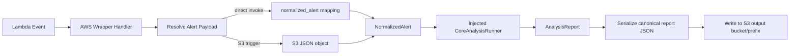

# AWS Deployment Architecture

## Status

This document is now active for Diff 4 AWS implementation.

It defines the first AWS wrapper shape for `updated_notable_analysis` around the existing shared `core` contracts.

## Purpose

Lock the AWS deployment architecture as a thin runtime wrapper around the shared core.

This architecture answers:

- what is deployment-specific in AWS
- what remains shared in `core`
- how Lambda image packaging and ECR fit the runtime
- how S3-triggered input and S3 report output are handled
- where future AWS integrations should attach without leaking into core logic

## Scope

### In scope

- AWS runtime wrapper under `updated_notable_analysis/aws/`
- Lambda handler entrypoint and event-shape handling
- S3 input payload retrieval and S3 report output write
- AWS config/env contract for wrapper concerns only
- fail-closed dependency wiring boundary for core analysis runner

### Out of scope

- moving current production runtime paths
- implementing Splunk MCP or Splunk REST query execution
- implementing ServiceNow writeback adapters
- implementing on-prem runtime wiring
- changing shared core business logic for AWS-specific behavior

## Locked Runtime Shape

The first AWS runtime shape is locked as:

- **Compute**: AWS Lambda
- **Packaging**: container image (`PackageType: Image`)
- **Registry**: ECR image URI passed to SAM template (`ImageUri`)
- **Infra path**: SAM / CloudFormation
- **Primary output sink**: S3 JSON report object
- **Wrapper style**: thin deployment adapter that invokes shared core contracts

This aligns with existing repository readiness artifacts in `s3_notable_pipeline` and `AIOPTIMIZED_SOC_ANALYSIS_AWS_READINESS_OVERVIEW.md`.

## Architecture Boundary

### Shared core owns

- canonical contracts (`NormalizedAlert`, `AnalysisReport`, policy models)
- prompt and context seams
- profile and bundle contract validation
- deterministic evidence and report semantics

### AWS wrapper owns

- Lambda event parsing and trigger interpretation
- loading alert payloads from S3 when invoked by S3 events
- selecting runtime defaults from env config
- writing final report JSON to S3
- wiring concrete transport and runtime dependencies

### AWS wrapper must not own

- canonical schema definitions
- policy rules that belong to shared validators
- deployment-agnostic report semantics
- customer-specific behavior branching in workflow code

## First AWS Wrapper Flow

## Event and I/O Contract

The first AWS wrapper supports two input paths:

1. **Direct invoke contract** with `normalized_alert` mapping in the Lambda event.
2. **S3 trigger contract** with `Records[0].s3.bucket.name` and `Records[0].s3.object.key`, where the object contains either:
   - a top-level `normalized_alert` mapping, or
   - a direct `NormalizedAlert`-compatible mapping.

Output is one JSON object in the configured report bucket and prefix.

## Config Contract (AWS Wrapper)

The wrapper config is intentionally narrow:

- `UPDATED_NOTABLE_AWS_REPORT_OUTPUT_BUCKET` (required)
- `UPDATED_NOTABLE_AWS_REPORT_OUTPUT_PREFIX` (optional; default `updated-notable-analysis/reports`)
- `UPDATED_NOTABLE_AWS_DEFAULT_PROFILE_NAME` (optional)
- `UPDATED_NOTABLE_AWS_DEFAULT_CUSTOMER_BUNDLE_NAME` (optional)

These values configure transport behavior only and do not redefine core contracts.

## Security and Operations Notes

- Fail closed when required config is missing (`report_output_bucket` required).
- Do not log or embed credentials in code; use Lambda IAM + environment/secret wiring.
- Keep S3 transport as a thin boundary that validates JSON payload shape.
- Keep core runner wiring explicit; default runtime path fails closed until a real core runner is injected.
- Keep report outputs deterministic and machine-readable for downstream audit and replay.

## Known Limitations for This Slice

- Default Lambda singleton intentionally raises until core runner wiring is provided.
- No live Splunk or ServiceNow adapters are wired in this AWS slice.
- No Step Functions/SQS fan-out in this first implementation.
- No deployment cutover from existing runtime paths in this repository.

## Build-Readiness Gate

AWS architecture is ready for this first implementation when:

- wrapper remains thin and deployment-specific
- core logic remains in shared `core` modules
- event parsing and S3 I/O are deterministic and test-covered
- config contract is explicit in code and example file

## One-Line Summary

Use a Lambda image on ECR as a thin AWS wrapper that loads alert payloads, calls the shared notable-analysis core through an injected runner seam, and writes canonical report JSON to S3 without moving business logic into deployment code.
