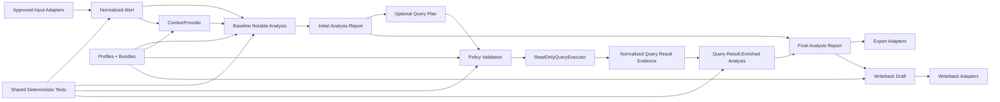

# Core Deployment Architecture

## Status

This document is the planning and architecture input for the shared core application state in `updated_notable_analysis`.

It is not the build-ready implementation contract.

When core planning decisions are locked, they should be translated into `../technical_specs/core_technical_spec.md` for the current implementation block and later into any broader core technical spec that supersedes it.

## Purpose

Use this document to define what the shared core application should look like before AWS and on-prem deployment extensions are added around it.

It should answer:

- what the shared core is by itself
- what belongs inside the shared core
- what must stay out of the core and live in deployment-specific adapters
- which core-specific decisions must be locked before implementation starts

## Why This Name

`core_deployment_architecture` is the right name for this document's purpose.

It pairs structurally with:

- `aws_deployment_architecture.md`
- `onprem_deployment_architecture.md`

while still describing the default application state that exists before those deployment-specific extensions are added.

## Relationship To Other Docs

- `../planning/domain_capability_map.md` defines capability boundaries and delivery sequencing across the product domain
- `../planning/implementation_tracker.md` will record what has and has not been implemented
- this document defines the baseline shared-core runtime and application shape
- `../technical_specs/core_technical_spec.md` is the current build-ready technical spec for the active core slice
- later AWS and on-prem architecture docs should define only the deployment-specific extensions around this same core

## Scope

### In scope

- the baseline shared application state before AWS or on-prem runtime extensions
- the environment-neutral runtime and adapter boundaries
- what the core must own directly
- what the core must leave to deployment-specific adapters
- what must be decided before writing or extending the core technical spec

### Out of scope

- AWS-specific runtime choices
- on-prem-specific runtime choices
- customer-specific mappings and credentials
- deployment-specific secrets or infrastructure wiring
- line-by-line implementation detail already owned by the technical spec

## Core Assumption

The core should remain the same application regardless of where it later runs.

That means the core owns:

- canonical schemas and models
- evidence separation rules
- parsing and validation rules
- bounded prompt contracts
- policy-gated read-only investigation flow
- writeback draft and approval contracts
- final report contracts
- shared deterministic fixtures and tests

Deployment-specific environments should wrap this core rather than redefine it.

## What The Core Includes

The baseline core includes:

- approved input normalization contracts
- normalized alert handling
- evidence-class handling
- baseline notable-analysis orchestration
- advisory-context handling behind a stable seam
- query-plan generation and validation contracts
- read-only query-result normalization
- report rendering from the canonical report record
- writeback draft generation contracts
- policy and approval validation
- environment-neutral services and domain/application modules

## What The Core Must Not Know

The core must not:

- know AWS runtime event objects, ARNs, bucket names, or queue URLs
- know on-prem directory layouts, systemd details, or host-specific paths
- know whether the on-prem runtime uses `LiteLLM`, direct `vLLM`, or another local OpenAI-compatible wrapper
- embed customer-specific mapping branches in code
- hard-code customer names, SIEM instance names, or ticket-routing rules
- change workflow behavior based on deployment target
- let deployment wiring redefine canonical schemas, evidence classes, or policy rules
- assume `MCP` is always available in customer environments

## Target Core Runtime Shape

Current intended direction:

- one shared application core with thin adapter boundaries
- local runnable and testable paths for development and validation
- reusable services that can later be invoked from local, AWS, or on-prem entrypoints
- deterministic behavior that remains stable across deployment targets
- explicit capability enablement rather than hidden feature flags scattered across runtime code

## Core Architecture Diagram

## Shared Core Layers

The shared core should be organized by responsibility rather than deployment target.

### Domain layer

Owns stable business objects and vocabulary such as:

- normalized alert objects
- evidence classes
- hypotheses
- query plans
- query-result evidence
- report objects
- writeback drafts

### Validation and policy layer

Owns:

- schema validation
- TTP and content validation
- query policy validation
- approval validation
- capability/profile validation

### Prompting and report layer

Owns:

- prompt-pack contracts
- prompt assembly inputs and output contracts
- report rendering contracts
- evidence and provenance display rules

### Workflow orchestration layer

Owns:

- baseline notable-analysis orchestration
- optional retrieval grounding orchestration
- optional read-only query orchestration
- optional query-result-enriched analysis orchestration
- writeback draft orchestration

### Adapter-interface layer

Owns only the interfaces and normalized request or response contracts for:

- `ContextProvider`
- `ReadOnlyQueryExecutor`
- `WritebackAdapter`
- `PromptPack`

The concrete implementations of those interfaces belong outside the core.

## Preferred Core Seams

### `ContextProvider`

Purpose:

- return normalized advisory context snippets with provenance

Core owns:

- request shape
- response shape
- provenance contract
- failure handling contract

Deployments or customer bundles own:

- backend selection
- `SQLite + FAISS` initialization
- later vector-store integrations
- source loading and credentials

### `ReadOnlyQueryExecutor`

Purpose:

- execute validated read-only queries and return normalized result evidence

Core owns:

- query-plan contract
- execution request shape
- normalized result shape
- policy inputs and denial result shape

Deployments or adapters own:

- `Splunk MCP` integration
- `Splunk REST API` integration
- connection details
- credentials
- rate-limit handling
- SDK or client specifics

### `WritebackAdapter`

Purpose:

- send bounded writeback payloads to approved downstream systems

Core owns:

- writeback draft contract
- approval requirements
- normalized writeback result contract

Deployments or adapters own:

- `Splunk` notable comment update details
- `ServiceNow` request construction
- credentials
- retries and HTTP specifics

### `PromptPack`

Purpose:

- provide customer-specific prompt text and report guidance while preserving stable output contracts

Core owns:

- prompt-pack contract
- required inputs
- required outputs
- fallback and repair behavior

Profiles or bundles own:

- customer-specific wording
- tone and escalation phrasing
- optional sections
- environment-specific guidance text

## What AWS Owns

The AWS deployment path should own only deployment-specific concerns such as:

- event or trigger handling
- S3 input and output wiring
- secrets retrieval
- AWS-specific packaging
- concrete adapter wiring for core interfaces

AWS must not redefine:

- canonical alert contracts
- prompt contracts
- policy behavior
- report contracts

## What On-Prem Owns

The on-prem deployment path should own only deployment-specific concerns such as:

- file-drop or local ingress handling
- local report-output wiring
- local secret and config loading
- local process and service wiring
- concrete adapter wiring for core interfaces
- runtime path details such as `LiteLLM -> vLLM -> gemma-4-31B-it`

On-prem must not redefine:

- canonical alert contracts
- prompt contracts
- policy behavior
- report contracts

## Config Boundary

The shared core should know the structure of the config, not the deployment retrieval mechanism.

Core should own config contracts for:

- capability profiles
- customer bundles
- prompt-pack selection
- context bundle selection
- query policy bundle selection
- sink bundle selection

Deployments should own:

- how env vars, files, secrets stores, or cloud config sources populate those contracts

## Output Boundary

The core should produce canonical report and writeback-draft objects.

The core should not own:

- S3 object naming
- local file paths
- Splunk endpoint URLs
- ServiceNow endpoint URLs

Those belong in the export or writeback adapters outside the core.

## Open Core Decisions To Lock Before Broadening The Technical Spec

- exact packaging boundary between shared core modules and deployment adapters
- exact first set of canonical domain objects to formalize in Diff 2
- exact policy object shape for read-only query validation and denial results
- exact prompt-pack contract boundary for baseline analysis vs query-result-enriched analysis
- exact writeback draft contract shared between `ServiceNow` and future ticketing adapters

## Build-Readiness Gate

This core architecture document is ready to feed or extend the core technical spec when:

- the shared core boundary is explicit
- deployment-specific concerns are clearly excluded from the core
- the active refactor slice is aligned with the intended long-term core shape
- the next core implementation block is specific enough to write as a build contract

## One-Line Summary

Use one shared environment-neutral notable-analysis core first, then extend it with thin AWS and on-prem deployment adapters so prompts, retrieval, read-only investigation, and writeback stay configurable without turning the codebase into a framework.
