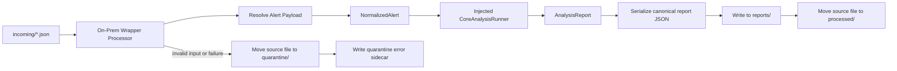

# On-Prem Deployment Architecture

## Status

This document is now active for Diff 4 on-prem implementation.

It defines the first on-prem wrapper shape for `updated_notable_analysis` around the existing shared `core` contracts.

## Purpose

Lock the on-prem deployment architecture as a thin local runtime wrapper around the shared core.

This architecture answers:

- what is deployment-specific in on-prem
- what remains shared in `core`
- how file-drop ingress and local report output are handled
- how the local runtime chain fits around the wrapper
- where later on-prem integrations should attach without leaking into core logic

## Scope

### In scope

- on-prem runtime wrapper under `updated_notable_analysis/onprem/`
- local file ingress from `incoming/`
- success archive to `processed/`
- failure quarantine to `quarantine/`
- local report JSON output to `reports/`
- on-prem config/env contract for wrapper concerns only
- fail-closed dependency wiring boundary for core analysis runner

### Out of scope

- moving current production runtime paths
- implementing direct vLLM client logic in this wrapper
- implementing Splunk MCP or Splunk REST query execution
- implementing ServiceNow writeback adapters
- changing shared core business logic for on-prem-specific behavior

## Locked Runtime Shape

The first on-prem runtime shape is locked as:

- **Ingress**: local file-drop JSON intake
- **Processing host**: single Linux host / `systemd` style runtime
- **Primary output sink**: local report JSON files
- **Wrapper style**: thin deployment adapter that invokes shared core contracts
- **Worker model**: long-running `systemd`-managed worker loop around the local file-ingest processor
- **Local inference direction**: `notable-analyzer -> LiteLLM -> vLLM -> gemma-4-31B-it`

This aligns with the existing on-prem repository direction already documented in `llm_notable_analysis_onprem_systemd/README.md` and `glab_vllm_litellm_kb_host_setup/HOST_DEPLOY_GLAB.md`.

## Architecture Boundary

### Shared core owns

- canonical contracts (`NormalizedAlert`, `AnalysisReport`, policy models)
- prompt and context seams
- profile and bundle contract validation
- deterministic evidence and report semantics

### On-prem wrapper owns

- scanning local input directory
- long-running worker-loop behavior under `systemd`
- loading alert payloads from JSON files
- selecting runtime defaults from env config
- writing final report JSON to local disk
- moving successful files to `processed/`
- moving invalid or failed files to `quarantine/`
- writing small quarantine reason sidecars
- wiring concrete transport and runtime dependencies

### On-prem wrapper must not own

- canonical schema definitions
- policy rules that belong to shared validators
- deployment-agnostic report semantics
- customer-specific behavior branching in workflow code

## Locked Service Topology

The intended on-prem deployment should run as three always-on local services:

1. `vllm.service`
   - serves `gemma-4-31B-it`
   - binds to loopback only
   - default local API target: `127.0.0.1:8000`
2. `litellm.service`
   - binds to loopback only
   - fronts `vllm.service`
   - default local API target for callers: `127.0.0.1:4000`
3. `notable-analyzer.service`
   - runs the long-lived worker loop
   - reads local files from `incoming/`
   - writes reports to `reports/`
   - calls LiteLLM, not vLLM directly, on the default path

Dependency order is locked as:

- `vllm.service` must become ready before `litellm.service`
- `litellm.service` must become ready before `notable-analyzer.service`

This keeps the analyzer talking to one stable local endpoint while leaving vLLM-specific serving details behind the LiteLLM boundary.

The provided analyzer service template depends on `litellm.service` and intentionally avoids direct `vllm.service` coupling. LiteLLM owns the vLLM dependency.

## First On-Prem Wrapper Flow

## Event and I/O Contract

The first on-prem wrapper supports two input shapes inside one local JSON file:

1. **Direct payload contract** where the file itself is a `NormalizedAlert`-compatible mapping.
2. **Wrapped payload contract** where the file contains:
   - `normalized_alert` mapping
   - optional top-level `profile_name`
   - optional top-level `customer_bundle_name`

Output is one JSON report file in the configured report directory.

## Config Contract (On-Prem Wrapper)

The wrapper config is intentionally narrow:

- `UPDATED_NOTABLE_ONPREM_INCOMING_DIR`
- `UPDATED_NOTABLE_ONPREM_PROCESSED_DIR`
- `UPDATED_NOTABLE_ONPREM_QUARANTINE_DIR`
- `UPDATED_NOTABLE_ONPREM_REPORT_OUTPUT_DIR`
- `UPDATED_NOTABLE_ONPREM_DEFAULT_PROFILE_NAME` (optional)
- `UPDATED_NOTABLE_ONPREM_DEFAULT_CUSTOMER_BUNDLE_NAME` (optional)
- `UPDATED_NOTABLE_ONPREM_ADVISORY_CONTEXT_DIR` (optional)
- `UPDATED_NOTABLE_ONPREM_LITELLM_BASE_URL` (optional, loopback default)
- `UPDATED_NOTABLE_ONPREM_LITELLM_READINESS_PATH` (optional)
- `UPDATED_NOTABLE_ONPREM_LITELLM_CHAT_COMPLETIONS_PATH` (optional)
- `UPDATED_NOTABLE_ONPREM_LITELLM_MODEL_NAME` (optional)
- `UPDATED_NOTABLE_ONPREM_READINESS_TIMEOUT_SECONDS` (optional)
- `UPDATED_NOTABLE_ONPREM_LITELLM_REQUEST_TIMEOUT_SECONDS` (optional)
- `UPDATED_NOTABLE_ONPREM_WORKER_IDLE_SLEEP_SECONDS` (optional)
- `UPDATED_NOTABLE_ONPREM_WORKER_MAX_FILES_PER_POLL` (optional)

These values configure transport behavior only and do not redefine core contracts.

## Runtime Chain Note

The intended inference/runtime direction for the on-prem deployment remains:

- `notable-analyzer.service` as the long-running worker under `systemd`
- LiteLLM on loopback/local host for caller-facing transport
- vLLM behind LiteLLM for model serving
- `gemma-4-31B-it` as the current target served model

The default analyzer call path is:

- analyzer -> `http://127.0.0.1:4000/v1/chat/completions`
- LiteLLM -> `http://127.0.0.1:8000/v1/chat/completions`

This wrapper now includes the LiteLLM-facing runner seam. Direct vLLM client logic remains out of scope so runtime transport wiring stays outside the shared core and outside the local file-ingest loop.

`OnPremLiteLlmCoreRunner` provides that first injected runner seam for this package. It targets LiteLLM's local chat-completions endpoint, assembles prompts through shared customer-bundle and prompt-pack contracts, and validates model output against `AnalysisReport`.

When `UPDATED_NOTABLE_ONPREM_ADVISORY_CONTEXT_DIR` is configured, the runner uses `LocalJsonAdvisoryContextProvider` to load advisory snippets from local JSON index files before prompt assembly. This is a deterministic bridge for approved local context, not the final SQLite + FAISS retrieval backend.

## Worker Loop Note

The currently implemented `OnPremNotableProcessor` is still the reusable processing unit for "process one file" behavior.

The implemented `OnPremWorker` places that processor inside a long-running loop that:

- scans `incoming/`
- processes one or more available files
- sleeps for a bounded interval when idle
- exits cleanly when `systemd` sends a stop signal

This preserves a clean seam between reusable file-processing logic and deployment-specific service lifecycle control.

## Security and Operations Notes

- Fail closed when config is missing or malformed.
- Keep local inference endpoints on loopback unless a documented edge listener is required.
- Health-gate the analyzer on LiteLLM availability rather than attempting best-effort degraded inference.
- Keep the analyzer unit dependent on LiteLLM rather than direct vLLM service internals.
- Keep vLLM hidden behind LiteLLM in runner code and service wiring.
- Keep advisory context separate from direct alert evidence, even when loaded locally.
- Keep wrapper filesystem responsibilities narrow and explicit.
- Quarantine invalid or failed files rather than silently dropping them.
- Run under a dedicated unprivileged service user where possible.
- Keep report outputs deterministic and machine-readable for downstream audit and replay.

## systemd Template Note

`onprem/systemd/notable-analyzer.service.example` documents the host service shape for this package.

The unit intentionally points `ExecStart` at a deployment-packaging-owned launcher instead of introducing a package CLI in this slice. That launcher must inject the real `CoreAnalysisRunner`, build the worker, install stop-signal handlers, and call `run_until_stopped()`.

## Known Limitations for This Slice

- Default processor intentionally raises until a real core runner is injected.
- No direct vLLM transport wiring is included.
- No parallel worker coordination or lock-file strategy in this first implementation.
- No deployment cutover from existing runtime paths in this repository.

## Build-Readiness Gate

On-prem architecture is ready for this first implementation when:

- wrapper remains thin and deployment-specific
- core logic remains in shared `core` modules
- file ingest, archive, and quarantine behavior are deterministic and test-covered
- worker-loop idle sleep, stop handling, and readiness failure behavior are deterministic and test-covered
- analyzer service dependency and hardening expectations are captured in a static systemd template
- config contract is explicit in code and example file

## One-Line Summary

Use a local file-drop processor as the thin on-prem wrapper that loads alert payload JSON, calls the shared notable-analysis core through an injected runner seam, writes canonical report JSON locally, and archives or quarantines source files without moving business logic into deployment code.
